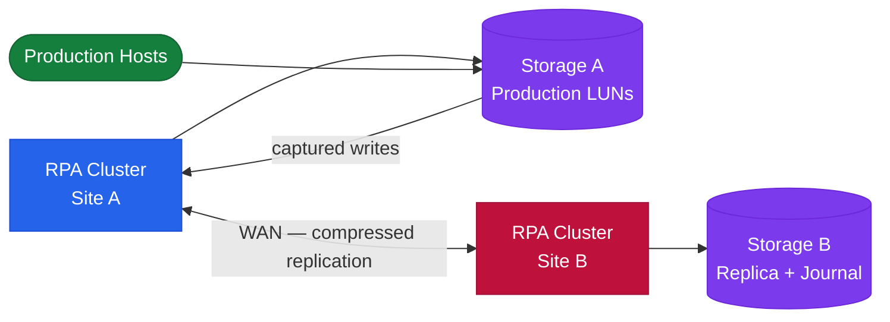

---
tags:
  - architecture
  - dell
---
# RecoverPoint — How It Works


<div class="kb-summary">
How It Works reference covering Overview, Topology, Journal Sizing, Journal Monitoring Thresholds, High Availability.

*Applies to: RecoverPoint 5.x*
</div>


```d2
direction: right

center: "RecoverPoint" {shape: hexagon}
topology: "Topology" {shape: rectangle}
journal_monitoring_thresholds: "Journal Monitoring Thresholds" {shape: rectangle}
high_availability: "High Availability" {shape: rectangle}

center -> topology
center -> journal_monitoring_thresholds
center -> high_availability
```

## Overview

Dell EMC RecoverPoint provides continuous data protection (CDP) and continuous remote replication (CRR) through journal-based replication. RPA (RecoverPoint Appliance) clusters at each site intercept writes via splitters and maintain a rolling journal enabling point-in-time recovery to any point within the journal window. All volumes that must be recovered together are grouped into a Consistency Group (CG).

## Topology




| Environment Write Rate | Minimum Journal Size | Recommended Retention |
|---|---|---|
| < 10 MB/s | 50 GB | 8 hours |
| 10–50 MB/s | 200–750 GB | 4–8 hours |
| 50–200 MB/s | 750 GB – 3 TB | 2–4 hours |

## Journal Monitoring Thresholds

| Threshold | Action |
|---|---|
| > 70% | Warning alert; review write rate and link bandwidth |
| > 80% | Critical alert; plan immediate journal expansion |
| > 90% | Emergency; expand journal before replication halts |
| 100% | Replication halted; full resync required after expansion |

## High Availability

- RPA clusters operate active-active within a site; an RPA failure causes automatic redistribution of CGs to surviving RPAs
- Quorum is maintained within the cluster; loss of majority halts replication to protect data consistency
- Minimum 2 RPAs per cluster for HA; 4+ for large environments

---

## See also

- [Recoverpoint — Design Standards](design-standards/)
- [Recoverpoint — Integrations](integrations/)
- [Recoverpoint — Deploy](../deploy/)
