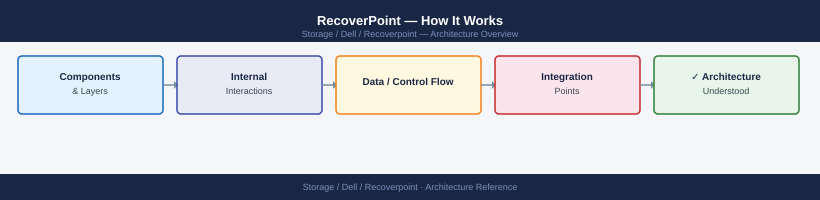
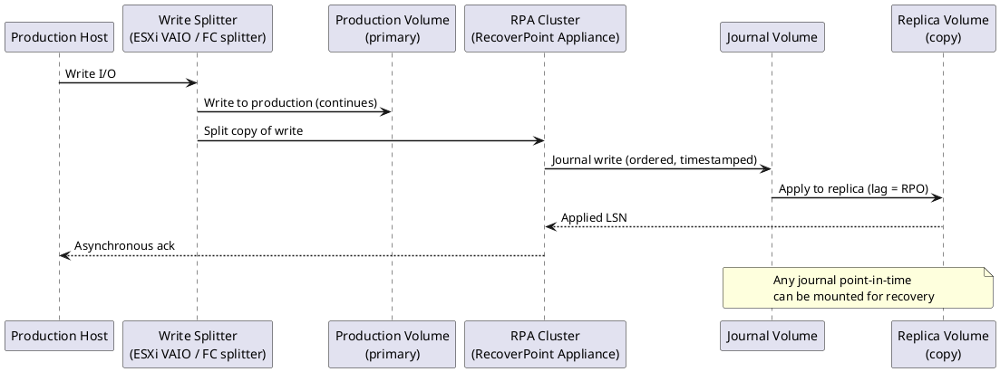

---
tags:
  - architecture
  - dell
---
# RecoverPoint — How It Works

<div class="kb-summary">
How It Works reference covering Overview, Topology, Journal Sizing, Journal Monitoring Thresholds, High Availability.

*Applies to: RecoverPoint 5.x*
</div>




```vegalite
{
  "$schema": "https://vega.github.io/schema/vega-lite/v5.json",
  "title": {
    "text": "How It Works \u2014 Thresholds",
    "fontSize": 13,
    "fontWeight": "normal"
  },
  "width": 480,
  "height": {
    "step": 26
  },
  "data": {
    "values": [
      {
        "metric": "> 70%",
        "zone": "Safe",
        "val": 70
      },
      {
        "metric": "> 70%",
        "zone": "Alert",
        "val": 30
      },
      {
        "metric": "> 80%",
        "zone": "Safe",
        "val": 80
      },
      {
        "metric": "> 80%",
        "zone": "Alert",
        "val": 20
      },
      {
        "metric": "> 90%",
        "zone": "Safe",
        "val": 90
      },
      {
        "metric": "> 90%",
        "zone": "Alert",
        "val": 10
      }
    ]
  },
  "mark": {
    "type": "bar",
    "cornerRadiusEnd": 3
  },
  "encoding": {
    "y": {
      "field": "metric",
      "type": "nominal",
      "axis": {
        "title": null,
        "labelLimit": 200
      },
      "sort": null
    },
    "x": {
      "field": "val",
      "type": "quantitative",
      "stack": "normalize",
      "axis": {
        "title": "Threshold boundary",
        "format": ".0%"
      }
    },
    "color": {
      "field": "zone",
      "type": "nominal",
      "scale": {
        "domain": [
          "Safe",
          "Alert"
        ],
        "range": [
          "#15803d",
          "#dc2626"
        ]
      },
      "legend": {
        "title": "Zone"
      }
    },
    "order": {
      "field": "zone",
      "sort": [
        "Safe",
        "Alert"
      ]
    },
    "tooltip": [
      {
        "field": "metric",
        "type": "nominal",
        "title": "Metric"
      },
      {
        "field": "zone",
        "type": "nominal",
        "title": "Zone"
      },
      {
        "field": "val",
        "type": "quantitative",
        "title": "Segment %",
        "format": ".0f"
      }
    ]
  }
}
```

## Overview

Dell EMC RecoverPoint provides continuous data protection (CDP) and continuous remote replication (CRR) through journal-based replication. RPA (RecoverPoint Appliance) clusters at each site intercept writes via splitters and maintain a rolling journal enabling point-in-time recovery to any point within the journal window. All volumes that must be recovered together are grouped into a Consistency Group (CG).

## Topology

```d2
direction: right

RPA1: "RPA Cluster\nSite A" {shape: rectangle}
STG_A: "Storage A\nProduction LUNs" {shape: rectangle}
RPA2: "RPA Cluster\nSite B" {shape: rectangle}
STG_B: "Storage B\nReplica + Journal" {shape: rectangle}
H_A: "Production Hosts" {shape: rectangle}

RPA1 -> STG_A
RPA2 -> STG_B
STG_A -> RPA1
H_A -> STG_A
```

| Environment Write Rate | Minimum Journal Size | Recommended Retention |
|---|---|---|
| < 10 MB/s | 50 GB | 8 hours |
| 10–50 MB/s | 200–750 GB | 4–8 hours |
| 50–200 MB/s | 750 GB – 3 TB | 2–4 hours |

## Journal Monitoring Thresholds

| Threshold | Action |
|---|---|
| > 70% | Warning alert; review write rate and link bandwidth |
| > 80% | Critical alert; plan immediate journal expansion |
| > 90% | Emergency; expand journal before replication halts |
| 100% | Replication halted; full resync required after expansion |

## High Availability

- RPA clusters operate active-active within a site; an RPA failure causes automatic redistribution of CGs to surviving RPAs
- Quorum is maintained within the cluster; loss of majority halts replication to protect data consistency
- Minimum 2 RPAs per cluster for HA; 4+ for large environments

---

## See also

- [Recoverpoint — Design Standards](../design-standards/)
- [Recoverpoint — Integrations](../integrations/)
- [Recoverpoint — Deploy](../../deploy/)
