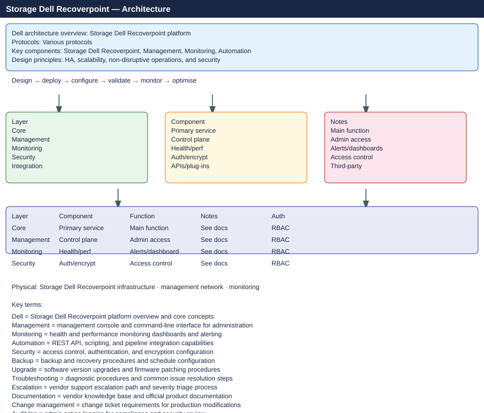

---
tags:
  - architecture
  - dell
---
# RecoverPoint — Architecture

Dell EMC RecoverPoint journal-based replication — RPA clusters intercept writes via splitters and maintain a rolling journal enabling point-in-time recovery across CDP, CRR, and CLR modes.

*Applies to: RecoverPoint 5.x*

<a class="kb-card" href="how-it-works/"><strong>How It Works</strong>RPA topology, splitter types, consistency groups, journal sizing, and HA model.</a>
<a class="kb-card" href="integrations/"><strong>Integrations</strong>PowerMax, Unity, VPLEX, and RecoverPoint for VMs (RP4VM).</a>
<a class="kb-card" href="design-standards/"><strong>Design Standards</strong>CG naming, journal sizing formula, RPO targets, and RPA cluster placement.</a>

| Mode | Description | RPO |
|---|---|---|
| CDP (Continuous Data Protection) | Local journal; recover to any point in time | ~0 seconds |
| CRR (Continuous Remote Replication) | Async replication to DR site | Seconds to minutes |
| CLR (Concurrent Local and Remote) | Simultaneous local CDP + remote CRR | Per-copy |

