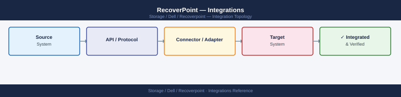
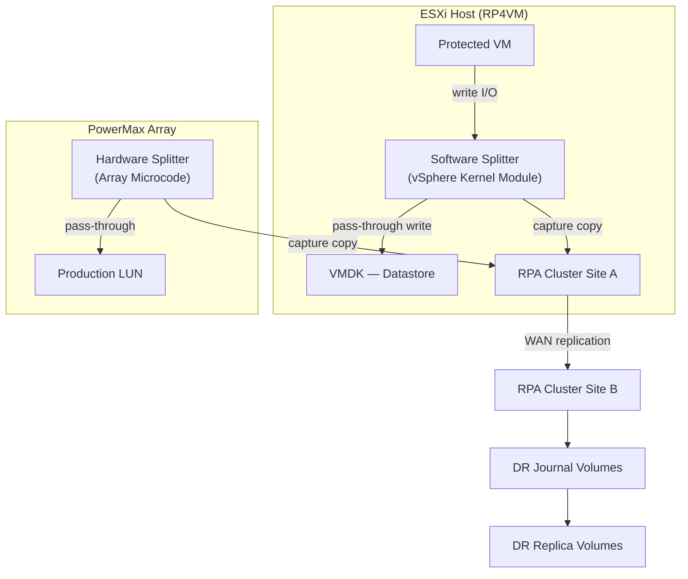

---
tags:
  - architecture
  - dell
---
# RecoverPoint — Integrations


<div class="kb-summary">
RecoverPoint integrations: vSphere plugin registration, VMAX and XtremIO production array pairing, SRDF coexistence, and management via Unisphere for RecoverPoint.

*Applies to: RecoverPoint 5.x*
</div>



---

```d2
direction: right

center: "RecoverPoint" {shape: hexagon}
splitter_topology: "Splitter Topology" {shape: rectangle}
vmware_srm_integration: "VMware SRM Integration" {shape: rectangle}
storage_array_integration: "Storage Array Integration" {shape: rectangle}
aria_operations_integration: "Aria Operations Integration" {shape: rectangle}
api_integration: "API Integration" {shape: rectangle}

center -> splitter_topology
center -> vmware_srm_integration
center -> storage_array_integration
center -> aria_operations_integration
center -> api_integration
```

## Splitter Topology




---

## VMware SRM Integration

The RecoverPoint SRA enables SRM to use RecoverPoint consistency groups as protection sources:

1. Download RecoverPoint SRA from Dell support portal
2. Install on each SRM server (both sites)
3. Register in SRM → Array Managers:
   - Manager type: EMC RecoverPoint
   - Management IP: `<rpa-cluster-ip>`
   - Username/password: dedicated svc_srm account

SRM recovery plans reference RecoverPoint CGs — failover steps include:
1. Enabling image access on the RecoverPoint CG (exposes the replica copy)
2. Registering VMs at the recovery site
3. Powering on VMs
4. Finalising the recovery (disabling image access, making replica writable)

---

## Storage Array Integration

| Array | Splitter Type | Notes | Why preferred |
|---|---|---|---|
| Dell PowerMax | Array-based (XtremIO or SRDF co-existence) | Integrates via Unisphere | No host agent overhead; best performance |
| Dell Unity | Array-based splitter | Native Unity support | Embedded in array; managed from Unity Unisphere |
| VMware vSphere | Software splitter (RP4VM) | VMDK-level — no array integration needed | Works with any underlying storage — most flexible |

---

## Aria Operations Integration

The RecoverPoint management pack surfaces:
- RPA health (CPU, memory, link state)
- CG lag per consistency group
- Journal fill level and utilisation
- Transfer rate and bandwidth utilisation

Install from Aria Marketplace: Solutions → Browse → "RecoverPoint" → Deploy.

---

## API Integration

RecoverPoint REST API for automation:

```bash
# Authenticate
curl -k -u admin:password -X POST https://<rpa-ip>/rest/users/sessions

# List consistency groups
GET /rest/consistency_groups

# Enable image access (for test failover)
PUT /rest/consistency_groups/{id}/clusters/{clusterId}/image_access/enable
Body: {"scenario": "LOGGED_ACCESS", "consistency": "CRASH_CONSISTENT"}
```

---

## See also

- [Recoverpoint — How It Works](how-it-works/)
- [Recoverpoint — Design Standards](design-standards/)
