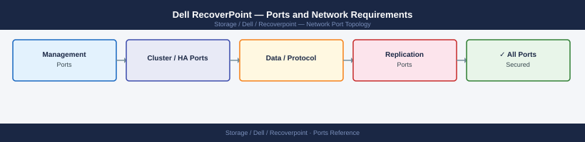

---
tags:
  - recoverpoint
  - dell
  - networking
  - firewall
  - ports
  - replication
  - dr
---
# Dell RecoverPoint — Ports and Network Requirements

<div class="kb-summary">
Firewall port reference for Dell RecoverPoint (RP). Covers Unisphere for RecoverPoint management, RPA (RecoverPoint Appliance) cluster communication, and WAN replication between sites.

*Applies to: RecoverPoint 5.x / 6.x*
</div>


## Inbound — Management

| Port | Protocol | Source | Purpose |
|---|---|---|---|
| 443 | TCP | Admin workstations | Unisphere for RecoverPoint web UI and REST API |
| 22 | TCP | Jump hosts | SSH — RPA CLI (admin/root access) |
| 7225 | TCP | RecoverPoint Management Application (boxmgmt) | RecoverPoint internal management (legacy CLI) |

## RPA Cluster Communication (Within Site)

| Port | Protocol | Between | Purpose |
|---|---|---|---|
| 7218 | TCP | RPA nodes (within site) | RPA internal cluster communication |
| 7225 | TCP | RPA nodes (within site) | RPA management channel |

## WAN Replication (Between Sites — Cross Firewall)

| Port | Protocol | Between | Purpose |
|---|---|---|---|
| 11111 | TCP | RPA (Site A) ↔ RPA (Site B) | RecoverPoint WAN replication data |
| 7218 | TCP | RPA (Site A) ↔ RPA (Site B) | RecoverPoint cross-site control channel |

## RecoverPoint to Storage (SAN)

RecoverPoint splitters intercept I/O at the storage or host level via FC or iSCSI — the storage side is typically FC fabric (no IP rules). For IP-based (Software Splitter on host):

| Port | Protocol | Source | Purpose |
|---|---|---|---|
| 443 | TCP | RPA → vCenter | vSphere integration (vRPA software splitter management) |

## Outbound — RPA to External

| Port | Protocol | Destination | Purpose |
|---|---|---|---|
| 162 | UDP | SNMP receiver | SNMP traps |
| 514 | UDP | Syslog server | RPA syslog |
| 123 | UDP | NTP | Time sync |
| 25 | TCP | SMTP relay | Alert email |
| 443 | TCP | esrs.dell.com | ESRS support |

## Firewall Zone Summary

| From | To | Ports | Notes |
|---|---|---|---|
| Admin clients | RecoverPoint mgmt IP | 443, 22 | Unisphere and CLI |
| RPA nodes (site) | RPA nodes (site) | 7218, 7225 | Local cluster — same VLAN preferred |
| RPA (Site A) | RPA (Site B) | 11111, 7218 | WAN replication — must cross inter-site firewall |

## Verify

```bash
# From admin workstation — test Unisphere for RP
curl -sk -o /dev/null -w "%{http_code}" https://<rp-mgmt-ip>/rest/v2/clusters

# From Site A RPA — test WAN replication port to Site B
nc -zv <site-b-rpa-ip> 11111

# From Site A RPA — test control channel to Site B
nc -zv <site-b-rpa-ip> 7218
```

## See also

- [Dell RecoverPoint — Architecture](../how-it-works/)
- [Dell RecoverPoint — Operations](../../operations/)
- [Dell SRDF-A — Ports](../../srdf-a/architecture/ports.md)
