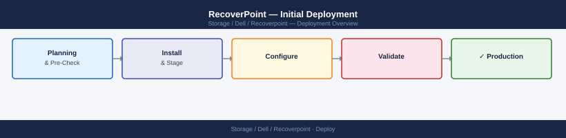
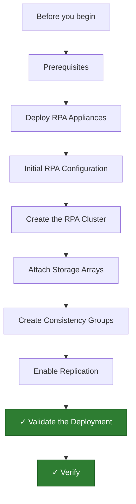

---
tags:
  - dell
  - deployment
search:
  boost: 1.5
---

```d2
direction: right

plan: "Plan" {shape: oval}
prerequisites: "Prerequisites" {shape: rectangle}
deploy_rpa_appliances: "Deploy RPA Appliances" {shape: rectangle}
initial_rpa_configuration: "Initial RPA Configuration" {shape: rectangle}
create_the_rpa_cluster: "Create the RPA Cluster" {shape: rectangle}
attach_storage_arrays: "Attach Storage Arrays" {shape: rectangle}
create_consistency_groups: "Create Consistency Groups" {shape: rectangle}
validate: "Validate" {shape: oval}

plan -> prerequisites
prerequisites -> deploy_rpa_appliances
deploy_rpa_appliances -> initial_rpa_configuration
initial_rpa_configuration -> create_the_rpa_cluster
create_the_rpa_cluster -> attach_storage_arrays
attach_storage_arrays -> create_consistency_groups
create_consistency_groups -> validate
```

## Before you begin

- **Access:** admin credentials for the target system and any upstream dependencies (DNS, NTP, vCenter, directory services)
- **Timing:** safe to run during a scheduled maintenance window; allow 1-2 hours for initial deployment
- **Dependencies:** network connectivity verified; DNS resolvable; NTP configured; any licence keys available
- **Logging:** record every IP address, hostname, and credential set assigned during this deployment

---

# RecoverPoint — Initial Deployment



This guide covers deploying Dell EMC RecoverPoint from bare metal appliance
installation through RPA cluster formation, storage array attachment, consistency
group creation, and first replication validation.

---




## Prerequisites

### RPA Appliances

- **Physical RPAs**: Dell EMC RPA hardware (Gen 6 or later) at each site
  (minimum 2 RPAs per site for HA)
- **Virtual RPAs (vRPA)**: vRPA OVA deployable on VMware vSphere 7.0 or 8.0
- Each RPA requires three separate network interfaces:
  - **Management** — for RecoverPoint UI and admin access
  - **WAN** — for inter-site replication traffic
  - **SAN / Data** — for storage array connectivity (iSCSI RPAs) or via FC zoning

### SAN Zoning (Physical RPAs with Fibre Channel)

- Zone each RPA at both sites to:
  - Source storage array (production) — RPAs need access to source LUNs to read data
  - Target storage array (DR) — RPAs write replica data to journal and copy LUNs
- Use single-initiator / single-target zoning for predictability
- Confirm HBA WWPNs for all RPAs before submitting zoning requests

### Network Connectivity

| Port | Protocol | Purpose |
|------|----------|---------|
| 443 | TCP | RecoverPoint Management Application (RPMA) UI |
| 7777 | TCP/UDP | RPA-to-RPA replication data (WAN link) |
| 6666 | TCP/UDP | RPA-to-RPA control traffic |
| 22 | TCP | SSH admin access to RPA CLI |
| 123 | UDP | NTP |
| 53 | UDP/TCP | DNS |

Ensure the WAN link ports (6666, 7777) are open bidirectionally between
all RPA management and WAN IPs at both sites.

### vCenter Access

For vRPA deployments and VMware-integrated replication:

- vCenter 7.0 or 8.0, with a service account having **vCenter Plugin User** role
  (minimum: datastore browse, VM power, snapshot management)
- ESXi hosts need access to the SAN/iSCSI network for vRPA data interfaces

### Licenses

- Obtain a RecoverPoint license file (`license.xml`) from Dell EMC
- License is keyed to the RPA cluster WWN; ensure the correct cluster WWN is
  provided when requesting the license
- License covers number of protected volumes (journals) per site

---

## Deploy RPA Appliances

### Physical RPA Deployment

1. Rack and cable the RPAs at each site per the Dell EMC hardware guide:
   - Management port → management switch VLAN
   - WAN port → WAN-facing switch or direct cross-connect (for lab)
   - FC HBAs → SAN fabric switches (A and B fabric for redundancy)
2. Power on the RPAs.
3. Connect a serial console or use iDRAC to access the initial configuration
   interface.
4. Note the default management IP assigned via DHCP or set via the serial console.

### Virtual RPA (vRPA) Deployment via vCenter

1. Log in to vCenter Web Client.
2. Right-click the target cluster or host → **Deploy OVF Template**.
3. Browse to the vRPA OVA file downloaded from the Dell EMC support portal.
4. Name the VM (e.g. `vRPA-Site1-01`) and select a compute resource.
5. Select a datastore for the vRPA VM disks (management VM only; data paths use
   separate iSCSI or FC connections).
6. **Network Mapping** — map the three OVA networks to the correct port groups:
   - `Management` → management port group
   - `WAN` → WAN/replication port group
   - `Data` → storage/iSCSI port group
7. Fill in the OVF properties:
   - Management IP, subnet mask, gateway
   - Hostname
   - NTP server
   - DNS servers
8. Click **Finish** and power on the vRPA VM.
9. Repeat for each vRPA at both sites (minimum 2 per site for HA).

---

## Initial RPA Configuration

### Step 1 — Connect to the RPA Management UI

1. Open a browser and navigate to `https://<rpa-management-ip>`.
2. Log in with the default credentials (`admin` / `admin` — change immediately
   after first login).

### Step 2 — Set Network Parameters

If network settings were not provided via OVF properties:

1. Go to **System Settings** → **Network**.
2. Set the Management IP, subnet mask, and default gateway.
3. Set the WAN IP (used for inter-site replication).
4. Set DNS server addresses.
5. Apply and verify connectivity with a ping test from the RPA CLI:
   ```bash
   ssh admin@<rpa-ip>
   ping <dns-server-ip>
   ```

### Step 3 — Set Hostname

Each RPA must have a unique, DNS-resolvable hostname.

```bash
set_hostname rpa1.site1.corp.local
```

Confirm forward and reverse DNS resolves correctly before proceeding.

### Step 4 — Configure NTP

- Via the UI: **System Settings** → **Time** → add NTP server addresses.
- Verify time is synchronized on all RPAs. Time skew between RPAs can cause
  cluster formation failures.

### Step 5 — Apply the License

1. Navigate to **System Settings** → **Licenses**.
2. Upload the `license.xml` file obtained from Dell EMC.
3. Verify the licensed volume count matches the expected environment size.

### Step 6 — Change Default Password

**System Settings** → **Users** → change the `admin` password to a strong
unique value. Store in the password vault.

---

## Create the RPA Cluster

RecoverPoint requires an RPA cluster at each site before replication can be configured.

### Step 1 — Open RecoverPoint Management Application (RPMA)

The RPMA is the primary management GUI, accessed at:
`https://<rpa-management-ip>/management`

Or via the standalone Java RPMA client (for older versions).

### Step 2 — Initialize the First Cluster (Site 1)

1. In RPMA, go to **Sites** → **Create Cluster**.
2. Add the RPAs for Site 1:
   - Enter each RPA's management IP.
   - RPMA discovers and validates connectivity to each RPA.
3. Name the cluster (e.g. `RPA-Cluster-Site1`).
4. Select the **management RPA** (the first RPA in the cluster acts as the initial
   coordinator).
5. Click **Create** and wait for the cluster to initialize (5–10 minutes).

### Step 3 — Initialize the Second Cluster (Site 2)

Repeat the process for Site 2 RPAs, naming the cluster `RPA-Cluster-Site2`.

### Step 4 — Configure the Inter-Site WAN Link

1. In RPMA, go to **Sites** → select Site 1 cluster → **Add Remote Site**.
2. Enter the management IP of any RPA in the Site 2 cluster.
3. RPMA establishes an inter-site management connection.
4. Under **WAN Settings**, configure:
   - WAN IP at Site 1 (used for port 7777 traffic)
   - WAN IP at Site 2
   - Bandwidth limit (optional; useful to prevent replication from saturating WAN)
   - Compression (recommended for WAN links < 1 Gbps)
5. Test the inter-site connection from RPMA — confirm latency and throughput.

---

## Attach Storage Arrays

RecoverPoint intercepts writes to production volumes via a splitter mechanism.

### Step 1 — Supported Splitter Types

| Splitter | Array / Platform |
|----------|-----------------|
| Array-based splitter | PowerMax, VMAX, Unity, VNX |
| VPLEX splitter | VPLEX in the data path |
| Fabric splitter | Brocade switches with RecoverPoint plug-in |
| ESX splitter | VMware-integrated (vRPA only, for VMDK replication) |

### Step 2 — Add the Storage Array

RPMA → **Storage** → **Arrays** → **Add Array**:

1. Select the array type (e.g. PowerMax, Unity).
2. Enter the array management IP and credentials.
3. RecoverPoint discovers the array and lists available LUNs.

### Step 3 — Enable the Array-Based Splitter

For PowerMax/VMAX:

1. RPMA → **Storage** → select the array → **Enable Splitter**.
2. RecoverPoint deploys a Solutions Enabler (SYMAPI) connection to the array.
3. The splitter registers with the array; all writes to designated LUNs are
   intercepted and sent to both the production target and the RecoverPoint journal.

For Unity:

1. RPMA → **Storage** → select Unity array → **Configure Splitter**.
2. Install the RecoverPoint plug-in on the Unity array (done via Unisphere or CLI).

### Step 4 — Verify Splitter Status

RPMA → **Storage** → **Splitters** — confirm all splitters show **Active** status.
A degraded splitter will prevent new CG creation.

---

## Create Consistency Groups

Consistency Groups (CGs) define the replication relationship between
production and DR volumes.

### Step 1 — New Consistency Group

RPMA → **Consistency Groups** → **+ Add**.

### Step 2 — Add Production Copies (Source)

1. Name the CG (e.g. `CG-SQL-Cluster01`).
2. Under **Production Copy**:
   - Select the array and LUNs to protect (source / production volumes).
   - RecoverPoint verifies the splitter is active for these LUNs.

### Step 3 — Add Replica Copies (DR Target)

1. Under **Replica Copies**, click **Add Copy**.
2. Select the Site 2 RPA cluster.
3. Select the target LUNs on the DR array (must be equal or larger in size
   to the source LUNs).
4. Select the journal LUNs at Site 2:
   - Journal stores the write history that allows point-in-time recovery.
   - Sizing: journal should be 10–20% of the total protected volume size,
     or sized to hold the expected amount of change data for the RPO window.

### Step 4 — Set RPO Target

Under **Replication Settings**:

- Set the **RPO target** (e.g. 15 minutes, 1 hour).
- RecoverPoint will alert if actual RPO exceeds this threshold.
- For synchronous replication (within campus / low-latency link), set
  RPO to 0 (write-splitting with synchronous acknowledgement).

### Step 5 — Review and Save

Review the CG configuration summary and click **Create**. The CG is created
in a **Stopped** state — initialization has not yet begun.

---

## Enable Replication

### Step 1 — Initialize the Consistency Group

RPMA → select the CG → **Enable** → **Initialize Now**.

RecoverPoint begins a **full sweep** — copying all source LUN data to the
replica LUNs. For large volumes, this can take hours to days depending on
data size and link bandwidth.

Monitor progress in RPMA → **CG Status** → **Transfer Rate** and
**Estimated Time to Complete**.

### Step 2 — Monitor Initial Sync

During initial sync, the state shows **Initializing**. Once complete,
the state transitions to **Active**.

Key metrics to observe:

- **Lag**: how far behind the replica is relative to the source
- **RPO**: current measured RPO vs. the configured target
- **Transfer rate**: throughput on the WAN link

### Step 3 — Validate RPO is Being Met

After the state transitions to **Active**:

1. RPMA → **Consistency Groups** → open the CG.
2. Verify the **Current RPO** is below the configured RPO target.
3. Confirm **Lag** is within acceptable bounds (should be near 0 for
   synchronous; within RPO window for asynchronous).
4. Check the WAN link utilization — if consistently near 100%, consider
   increasing bandwidth or enabling compression.

---

## Validate the Deployment

### Step 1 — Perform an Image Access Test (Test Failover)

Image Access allows reading DR copy data without disrupting replication.

1. RPMA → select the CG → **Actions** → **Enable Image Access**.
2. Choose a bookmark or the most recent point in time.
3. Select which replica copy to expose (Site 2 copy).
4. Mount the volumes to a test host at Site 2 (or use the vCenter integration
   to mount to a VM).
5. Verify the data is readable and consistent:
   - For database LUNs: mount the filesystem, check database files are intact.
   - For VMware: use the RecoverPoint for VMs plug-in to power on a test VM.

### Step 2 — Verify Data Consistency

- Check filesystem integrity on exposed volumes:
  ```bash
  fsck /dev/sdX    # Linux
  chkdsk D:        # Windows
  ```
- Open and query a test database to confirm transactional consistency.
- Document the state of the data (timestamp, LSN for SQL, SCN for Oracle).

### Step 3 — Clean Up the Image Access

1. RPMA → select the CG → **Actions** → **Disable Image Access**.
2. RecoverPoint resumes normal replication.
3. Confirm the CG returns to **Active** state and RPO is being met again.

### Step 4 — Document RTO / RPO Achieved

From the test, record:

- **RPO achieved**: the actual data lag at the point of image access
- **RTO measured**: time from initiating image access to application readiness
- Compare against the business continuity requirements and adjust
  RecoverPoint settings or WAN capacity if targets are not being met

### Step 5 — Document the Deployment

Record the following for the operations runbook:

- RPA cluster names, management IPs, and site assignments
- WAN link IPs and configured bandwidth limits
- Storage array names, splitter types, and splitter status
- Consistency Group names, source LUNs, replica LUNs, journal LUNs
- Configured RPO targets per CG
- License file location and licensed volume count
- Admin account and password vault reference
- Escalation contact for RecoverPoint support (Dell EMC ESRS or SE contact)

---

## Verify

- **Cluster health:** all nodes show online in the management UI
- **Volume access:** mount a test LUN/NFS export from a host and confirm read/write
- **Replication:** confirm replication partner shows last-sync within RPO window

---

## See also

- [Recoverpoint — Procedures](../operations/procedures/)
- [Recoverpoint — Common Issues](../troubleshooting/common-issues/)
- [Recoverpoint — How It Works](../architecture/how-it-works/)
