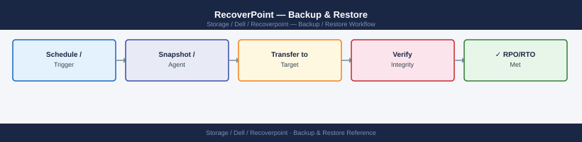
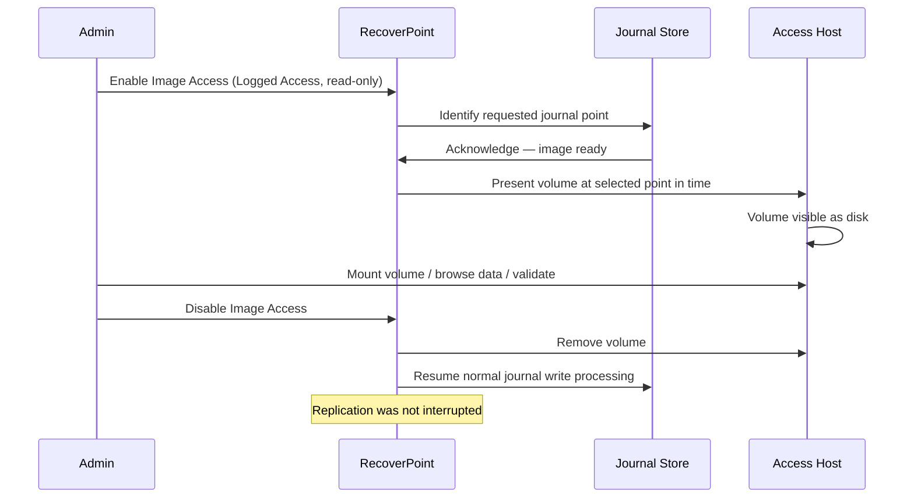

---
tags:
  - dell
  - operations
---
# RecoverPoint — Backup & Restore



```bash
# Connect to RecoverPoint appliance
ssh admin@rpa01.example.com

# List consistency groups
get_consistency_groups

# Add a bookmark to a specific CG
add_bookmark --cg "CG_PROD_SQL" --name "Pre-Patch-2026-05-08" --type CRASH_CONSISTENT

# List bookmarks for a CG
get_bookmarks --cg "CG_PROD_SQL"
```



## Before you begin

- **Access:** Storage admin credentials (cluster admin or equivalent)
- **Timing:** safe to run during business hours unless a step is marked ⚠ (causes interruption)
- **Dependencies:** no active upgrades or migrations on the same infrastructure
- **Logging:** capture command output — paste into the change record on completion

---

---

## Verify

- Confirm the operation completed without errors in the log or management UI
- Verify the expected state change is visible (service running, object created, config applied)
- Document the outcome in the change record

---

## See also

- [Recoverpoint — Procedures](procedures/)
- [Recoverpoint — Health Checks](health-checks/)
- [Recoverpoint — Common Issues](../troubleshooting/common-issues/)
