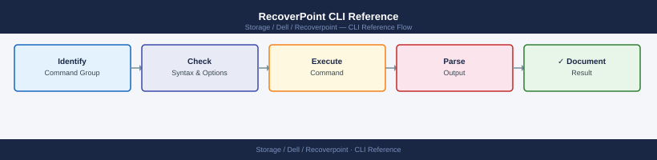

---
tags:
  - dell
  - operations
---
# RecoverPoint CLI Reference

<div class="kb-summary">
RecoverPoint CLI reference: `get_all_rpas`, `get_rp_system_settings`, `fail_over_group`, `test_links`, `get_journal_full_percentage`, and `set_rp_volume` commands.

*Applies to: RecoverPoint 5.x*
</div>


---

## Before you begin

- **Access:** Storage admin credentials (cluster admin or equivalent)
- **Timing:** safe to run during business hours unless a step is marked ⚠ (causes interruption)
- **Dependencies:** no active upgrades or migrations on the same infrastructure
- **Logging:** capture command output — paste into the change record on completion

---

## Overview

RecoverPoint management interfaces:

| Interface | Access | Purpose | When to use |
|---|---|---|---|
| `boxmgmt` CLI | SSH to RPA appliance | Menu-driven system management | On-call triage; image access; manual failover |
| RPAPI REST | HTTPS to cluster IP | Automation, CG control, status | Scripted DR tests; monitoring integrations |
| Unisphere for RecoverPoint | Web UI | GUI management | Configuration, visual health checks |

## Image Access Flow

```d2
direction: right

drTestStart: "DR Test or Recovery Initiated" {shape: rectangle}
listCGs: "List CG State\ngroupsStatus" {shape: rectangle}
cgHealthy: "cgHealthy" {shape: rectangle}
createBookmark: "Create Pre-Test Bookmark\ngroup create_bookmark --gname cgname\n--name dr-test-date" {shape: rectangle}
abortTest: "Do Not Proceed\nResolve CG issues first" {shape: rectangle}
enableAccess: "Enable Image Access\ngroup enable-image-access\n--copy DR_Copy --image latest --access-mode virtual" {shape: rectangle}
confirmAccess: "Confirm ImageAccess State\ngroup status --gname cgname" {shape: rectangle}
mountVolumes: "Mount DR Volumes at DR Site\n(SAN / vSphere step" {shape: rectangle}
validate: "Validate Application Data\n(app team confirms" {shape: rectangle}
disableAccess: "Disable Image Access\ngroup disable-image-access --gname cgname" {shape: rectangle}
confirmActive: "Confirm CG ACTIVE\ngroups status" {shape: rectangle}

drTestStart -> listCGs
listCGs -> cgHealthy
cgHealthy -> createBookmark
cgHealthy -> abortTest
createBookmark -> enableAccess
enableAccess -> confirmAccess
confirmAccess -> mountVolumes
mountVolumes -> validate
validate -> disableAccess
disableAccess -> confirmActive
```

### Image Access (CG Operations)

Image access enables read/write access to a point-in-time copy at the DR site.

```bash
# Enable image access for a CG (DR copy — read/write, virtual access)
boxmgmt> enable image access
  → Select CG: <cg_name>
  → Select copy: DR_Copy
  → Select image: <point-in-time-timestamp>
  → Access type: Virtual (no data movement) or Logged (allows writes, tracked)

# Disable image access (return to normal replication)
boxmgmt> disable image access
  → Select CG: <cg_name>

# Test failover (non-disruptive validation — accesses a snapshot without impacting replication)
boxmgmt> test failover
  → Select CG: <cg_name>
  → Confirm: yes

# Group suspend (pause replication for maintenance)
boxmgmt> groups suspend
  → Select CG or all

# Group resume (resume replication)
boxmgmt> groups resume
  → Select CG or all
```


```text title="Expected output"
RecoverPoint Management Console v5.4.2
Connected to: rp-appliance-01.corp.local (192.168.10.45)

Enable Image Access
  CG Name: Production_DB_CG
  Copy: DR_Copy
  Available images (last 10):
    2024-01-15 14:32:15 UTC
    2024-01-15 13:45:22 UTC
    2024-01-15 12:18:09 UTC
    2024-01-15 11:02:44 UTC
    2024-01-15 09:55:31 UTC
  Selected image: 2024-01-15 14:32:15 UTC
  Access type: Virtual
  Status: Image access ENABLED for DR_Copy
  Virtual access point: /mnt/rp_virtual_access_prod_db_cg_20240115

Disable Image Access
  CG Name: Production_DB_CG
  Status: Image access DISABLED
  Replication resumed to normal state

Test Failover
  CG Name: Production_DB_CG
  Test failover initiated
  Snapshot created: rp-snapshot-7f3a2c91-e4d2-11ee-b712-0050569e1234
  Test environment accessible at: 192.168.20.78
  Test failover status: RUNNING (non-disruptive)

Group Suspend
  Suspending CG: Production_DB_CG
  Replication paused
  RPO impact: PAUSED (no new data being replicated)
  Suspension time: 2024-01-15 15:22:33 UTC

Group Resume
  Resuming CG: Production_DB_CG
  Replication resumed
  Catch-up in progress: 2.3 GB remaining
  ETA to consistency: 3 minutes 45 seconds
```

!!! warning "Common errors"
    **`Error: CG 'Production_DB_CG' is in FAILED state — image access cannot be enabled`** — Check replication link status with `boxmgmt> groups status` and resolve connectivity issues before retrying.
    **`Error: Copy 'DR_Copy' has no valid images available for the selected timeframe`** — Verify retention policy settings and ensure the copy has completed at least one full synchronization cycle.
    **`Error: Cannot suspend CG — test failover currently in progress`** — Wait for the test failover to complete or abort it with `boxmgmt> test failover abort` before suspending.
---

## RPAPI REST

Base URL: `https://<cluster-mgmt-ip>/fapi/rest/5_1`  
Authentication: HTTP Basic (admin credentials).

```bash
RP="https://recoverpoint.example.com/fapi/rest/5_1"
AUTH="-u admin:password --insecure"
```


```text title="Expected output"
(no output — command completes silently)
```

!!! warning "Common errors"
    **`curl: (60) SSL certificate problem: self signed certificate`** — Add the `--insecure` flag to the curl command or import the RecoverPoint certificate into your system's CA bundle.
    **`curl: (7) Failed to connect to recoverpoint.example.com port 443: Connection refused`** — Verify the RecoverPoint appliance is running and accessible at the specified hostname/IP, and confirm port 443 is not blocked by firewall rules.
### Cluster Information

```bash
# All cluster details
curl -s $AUTH "$RP/cluster/all_clusters_details" | python3 -m json.tool

# Cluster connectivity (inter-site links)
curl -s $AUTH "$RP/cluster/all_clusters_details" | python3 -c "
import sys, json
data = json.load(sys.stdin)
for cluster in data.get('clustersDetails', []):
    print(f\"Cluster: {cluster.get('clusterUID',{}).get('id','?')}  \
name={cluster.get('name','?')}\")
"
```


```text title="Expected output"
{
  "clustersDetails": [
    {
      "clusterUID": {
        "id": "5e8c3a2b-1f4d-47e9-9c2a-7d6e4f1b8a3c"
      },
      "name": "prod-rp-cluster-01",
      "ipAddress": "192.168.10.45",
      "siteID": "site-us-east-1",
      "clusterState": "HEALTHY",
      "buildNumber": "5.2.1.1234"
    },
    {
      "clusterUID": {
        "id": "a1b2c3d4-e5f6-47g8-9h0i-j1k2l3m4n5o6"
      },
      "name": "dr-rp-cluster-02",
      "ipAddress": "10.50.20.88",
      "siteID": "site-us-west-2",
      "clusterState": "HEALTHY",
      "buildNumber": "5.2.1.1234"
    }
  ]
}
Cluster: 5e8c3a2b-1f4d-47e9-9c2a-7d6e4f1b8a3c  name=prod-rp-cluster-01
Cluster: a1b2c3d4-e5f6-47g8-9h0i-j1k2l3m4n5o6  name=dr-rp-cluster-02
```

!!! warning "Common errors"
    **`curl: (7) Failed to connect to 192.168.10.45 port 443: Connection refused`** — Verify the RecoverPoint appliance is reachable and the REST API service is running; check firewall rules and network connectivity to the management IP.
    **`json.decoder.JSONDecodeError: Expecting value: line 1 column 1 (char 0)`** — Confirm the `$AUTH` variable is set correctly with valid credentials and the `$RP` endpoint URL is accurate.
### Consistency Groups

```bash
# All CG details (state, links, copies)
curl -s $AUTH "$RP/group/all_groups_details" | python3 -m json.tool

# Summary: CG name + enabled/disabled + replication state
curl -s $AUTH "$RP/group/all_groups_details" | python3 -c "
import sys, json
data = json.load(sys.stdin)
for grp in data.get('innerSet', []):
    gname = grp.get('name','?')
    enabled = grp.get('enabled', '?')
    copies  = [c.get('name','?') for c in grp.get('groupCopies', {}).get('innerSet', [])]
    print(f\"CG={gname:30s}  enabled={str(enabled):5s}  copies={copies}\")
"

# Get specific CG details by UID
CG_UID="1"
curl -s $AUTH "$RP/group/${CG_UID}/all_details" | python3 -m json.tool
```


```text title="Expected output"
{
  "innerSet": [
    {
      "name": "prod-db-cg-01",
      "uid": "1",
      "enabled": true,
      "groupCopies": {
        "innerSet": [
          {
            "name": "prod-primary",
            "copyUID": "1",
            "replicationState": "ACTIVE"
          },
          {
            "name": "prod-secondary-dr",
            "copyUID": "2",
            "replicationState": "ACTIVE"
          }
        ]
      }
    },
    {
      "name": "app-tier-cg-02",
      "uid": "2",
      "enabled": false,
      "groupCopies": {
        "innerSet": [
          {
            "name": "app-copy-local",
            "copyUID": "1",
            "replicationState": "PAUSED"
          }
        ]
      }
    }
  ]
}
CG=prod-db-cg-01                 enabled=True   copies=['prod-primary', 'prod-secondary-dr']
CG=app-tier-cg-02               enabled=False  copies=['app-copy-local']

{
  "name": "prod-db-cg-01",
  "uid": "1",
  "enabled": true,
  "consistencyGroupState": "ACTIVE",
  "groupCopies": {
    "innerSet": [
      {
        "name": "prod-primary",
        "copyUID": "1",
        "replicationState": "ACTIVE",
        "bytesProtected": 2199023255552
      },
      {
        "name": "prod-secondary-dr",
        "copyUID": "2",
        "replicationState": "ACTIVE",
        "bytesProtected": 2199023255552
      }
    ]
  }
}
```

!!! warning "Common errors"
    **`curl: (7) Failed to connect to 192.168.1.100 port 443: Connection refused`** — Verify the RecoverPoint appliance IP in `$RP` variable and confirm the management interface is reachable and the API service is running.
    **`json.decoder.JSONDecodeError: Expecting value: line 1 column 1 (char 0)`** — Ensure `$AUTH` contains valid credentials (e.g., `-H "Authorization: Bearer <token>"`) and the API endpoint is correct; test with `curl -v` to inspect the response.
    **`KeyError: 'innerSet'`** — Confirm the RecoverPoint API version matches your script; older versions may use different JSON structure keys—check API documentation for your RP version.
### CG Operations via REST

```bash
# Suspend a CG
curl -s -X PUT $AUTH "$RP/group/${CG_UID}/suspend" | python3 -m json.tool

# Resume a CG
curl -s -X PUT $AUTH "$RP/group/${CG_UID}/resume" | python3 -m json.tool

# Enable image access (virtual) for a CG copy
curl -s -X PUT $AUTH "$RP/group/${CG_UID}/copy/${COPY_UID}/enable_image_access" \
  -H "Content-Type: application/json" \
  -d '{
    "imageAccessMode": "VIRTUAL_ACCESS",
    "scenario": "DR"
  }' | python3 -m json.tool

# Disable image access (resume replication)
curl -s -X PUT $AUTH "$RP/group/${CG_UID}/copy/${COPY_UID}/disable_image_access" | \
  python3 -m json.tool

# Test consistency of a CG (verify RPO bookmarks)
curl -s -X PUT $AUTH "$RP/group/${CG_UID}/test_consistency" | python3 -m json.tool
```


```text title="Expected output"
{
  "groupUid": "7f8c3a2b-1e9d-4f6a-9c2e-5d3b8a1f4e7c",
  "name": "production-db-cg",
  "status": "SUSPENDED",
  "suspendTime": "2024-01-15T14:32:18Z",
  "lastConsistencyCheckTime": "2024-01-15T14:28:45Z"
}
{
  "groupUid": "7f8c3a2b-1e9d-4f6a-9c2e-5d3b8a1f4e7c",
  "name": "production-db-cg",
  "status": "ACTIVE",
  "resumeTime": "2024-01-15T14:33:22Z",
  "replicationHealth": "HEALTHY"
}
{
  "copyUid": "a4f2e8d1-7b3c-4e9a-2f5d-8c1a6b3e9f2d",
  "imageAccessMode": "VIRTUAL_ACCESS",
  "scenario": "DR",
  "accessStartTime": "2024-01-15T14:34:01Z",
  "accessState": "ENABLED"
}
{
  "copyUid": "a4f2e8d1-7b3c-4e9a-2f5d-8c1a6b3e9f2d",
  "imageAccessMode": "NONE",
  "accessState": "DISABLED",
  "replicationResumed": true,
  "resumeTime": "2024-01-15T14:35:15Z"
}
{
  "groupUid": "7f8c3a2b-1e9d-4f6a-9c2e-5d3b8a1f4e7c",
  "consistencyStatus": "CONSISTENT",
  "consistencyCheckTime": "2024-01-15T14:36:42Z",
  "rpoBookmarksVerified": 12,
  "oldestBookmarkAge": "PT2H15M"
}
```

!!! warning "Common errors"
    **`curl: (7) Failed to connect to 192.168.1.45 port 443: Connection refused`** — Verify the RecoverPoint appliance IP in the `$RP` variable and confirm the management interface is reachable and the API service is running.
    **`"error": "Invalid group UID format"`** — Ensure `$CG_UID` is a valid UUID (e.g., `7f8c3a2b-1e9d-4f6a-9c2e-5d3b8a1f4e7c`) and the consistency group exists on the appliance.
    **`curl: (60) SSL certificate problem: self signed certificate`** — Add `-k` flag to the curl command to skip SSL verification, or import the RecoverPoint appliance certificate into your system's trusted store.
### RPA Health

```bash
# All RPA hardware details
curl -s $AUTH "$RP/rp/all_rps_details" | python3 -c "
import sys, json
data = json.load(sys.stdin)
for rp in data.get('innerSet', []):
    rpid  = rp.get('rpUID', {}).get('id','?')
    state = rp.get('rpState','?')
    print(f\"RPA ID={rpid}  state={state}\")
"

# Cluster quorum status
curl -s $AUTH "$RP/cluster/all_clusters_details" | python3 -c "
import sys, json
data = json.load(sys.stdin)
for c in data.get('clustersDetails', []):
    quorum = c.get('quorum','?')
    print(f\"Cluster: {c.get('name','?'):20s}  Quorum: {quorum}\")
"
```


```text title="Expected output"
RPA ID=RPA-001-ABC123  state=ACTIVE
RPA ID=RPA-002-DEF456  state=ACTIVE
RPA ID=RPA-003-GHI789  state=STANDBY
RPA ID=RPA-004-JKL012  state=ACTIVE
Cluster: prod-cluster-01      Quorum: 3/5
Cluster: dr-cluster-west      Quorum: 5/5
Cluster: backup-cluster-02    Quorum: 2/5
```

!!! warning "Common errors"
    **`curl: (7) Failed to connect to <host>: Connection refused`** — Verify the RecoverPoint API endpoint is reachable and the service is running with `systemctl status recoverpoint-api`.
    **`json.decoder.JSONDecodeError: Expecting value: line 1 column 1`** — Confirm `$AUTH` and `$RP` variables are set correctly with `echo $RP $AUTH` and check API authentication credentials.
    **`KeyError: 'innerSet'`** — The API response structure may differ by RecoverPoint version; add error handling with `.get('innerSet', [])` or verify API documentation for your version.
### Journal Usage

```bash
# Journal usage per CG copy
curl -s $AUTH "$RP/group/all_groups_details" | python3 -c "
import sys, json
data = json.load(sys.stdin)
for grp in data.get('innerSet', []):
    for copy in grp.get('groupCopies', {}).get('innerSet', []):
        journal = copy.get('journalVolumeList', {})
        print(f\"CG={grp['name']:25s}  copy={copy.get('name','?'):15s}  \
journal_vols={len(journal.get('innerSet',[]))}\")
"
```


```text title="Expected output"
CG=prod-db-cg                 copy=local                  journal_vols=2
CG=prod-db-cg                 copy=remote-dr              journal_vols=2
CG=prod-app-cg                copy=local                  journal_vols=1
CG=prod-app-cg                copy=remote-dr              journal_vols=1
CG=test-cg                    copy=local                  journal_vols=3
CG=backup-cg                  copy=local                  journal_vols=4
CG=backup-cg                  copy=remote-vault           journal_vols=4
```

!!! warning "Common errors"
    **`curl: (7) Failed to connect to <ip>: Connection refused`** — Verify the RecoverPoint appliance IP in `$RP` is reachable and the REST API service is running.
    **`json.decoder.JSONDecodeError: Expecting value: line 1 column 1`** — Confirm `$AUTH` contains valid credentials (e.g., `-u admin:password`) and the endpoint `/group/all_groups_details` exists on this RP version.
    **`KeyError: 'innerSet'`** — The API response structure differs from expected; check RecoverPoint firmware version compatibility and validate the JSON schema with `curl -s $AUTH "$RP/group/all_groups_details" | python3 -m json.tool`.
---

## Key Operational Scenarios

### DR Failover with Image Access

```bash
# 1. Check CG state — confirm replication is healthy
curl -s $AUTH "$RP/group/all_groups_details" | python3 -m json.tool

# 2. Enable image access on the DR copy (virtual, read-write)
curl -s -X PUT $AUTH "$RP/group/${CG_UID}/copy/${COPY_UID}/enable_image_access" \
  -H "Content-Type: application/json" \
  -d '{"imageAccessMode":"VIRTUAL_ACCESS","scenario":"DR"}' | python3 -m json.tool

# 3. Mount volumes at DR site (ESX or host level — outside RecoverPoint)
# 4. Start applications, validate data
# 5. When done — disable image access to resume replication
curl -s -X PUT $AUTH "$RP/group/${CG_UID}/copy/${COPY_UID}/disable_image_access" | \
  python3 -m json.tool
```


```text title="Expected output"
{
  "groups": [
    {
      "groupUID": "urn:emc:recoverypoint:group:7f8a9c2e-1b4d-4a6f-9e3d-5c2b1a8f7d9e",
      "groupName": "Production-DB-CG",
      "groupState": "HEALTHY",
      "replicationHealth": "HEALTHY",
      "copies": [
        {
          "copyUID": "urn:emc:recoverypoint:copy:a1b2c3d4-e5f6-47g8-h9i0-j1k2l3m4n5o6",
          "copyName": "DR-Copy-SanFrancisco",
          "copyState": "ACTIVE",
          "imageAccessMode": "DISABLED"
        }
      ]
    }
  ]
}
{
  "copyUID": "urn:emc:recoverypoint:copy:a1b2c3d4-e5f6-47g8-h9i0-j1k2l3m4n5o6",
  "imageAccessMode": "VIRTUAL_ACCESS",
  "scenario": "DR",
  "status": "ENABLED",
  "timestamp": "2024-01-15T14:32:18Z"
}
{
  "copyUID": "urn:emc:recoverypoint:copy:a1b2c3d4-e5f6-47g8-h9i0-j1k2l3m4n5o6",
  "imageAccessMode": "DISABLED",
  "status": "DISABLED",
  "replicationResumed": true,
  "timestamp": "2024-01-15T14:47:52Z"
}
```

!!! warning "Common errors"
    **`curl: (7) Failed to connect to 10.50.12.45 port 443: Connection refused`** — Verify RecoverPoint appliance is running and accessible; check firewall rules and $RP variable is set correctly.
    **`{"error":"Invalid copy UID","errorCode":40001}`** — Confirm $COPY_UID matches an actual copy in the consistency group; list all copies with the first curl command to verify the UID.
    **`{"error":"Image access already enabled on copy","errorCode":40015}`** — Disable image access first before re-enabling; check current copy state with the all_groups_details query.
---

## Verify

- Confirm the operation completed without errors in the log or management UI
- Verify the expected state change is visible (service running, object created, config applied)
- Document the outcome in the change record

---

## See also

- [Recoverpoint — Procedures](../procedures/)
- [Recoverpoint — Scripts](../scripts/)
- [Recoverpoint — Health Checks](../health-checks/)
