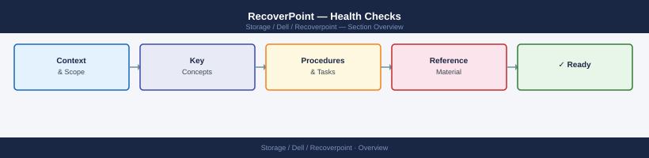

---
tags:
  - dell
  - operations
---
# RecoverPoint — Health Checks



```bash
# SSH to RPA cluster management IP
ssh admin@<rpa-cluster-ip>

# RPA cluster and node health
system status

# All CGs — expect ACTIVE for all production CGs
groups status

# Detailed CG view including lag, RPO, and journal fill
groups status detail

# Journal utilization for all CGs
journals list

# Active alarms (hardware and software)
alarms list

# Inter-site link statistics (latency, bandwidth)
links statistics

# Cluster quorum state
cluster quorum check
```


## Before you begin

- **Access:** Storage admin credentials (cluster admin or equivalent)
- **Timing:** safe to run during business hours unless a step is marked ⚠ (causes interruption)
- **Dependencies:** no active upgrades or migrations on the same infrastructure
- **Logging:** capture command output — paste into the change record on completion

---

## Run This Routine

Run these commands via SSH to the RPA cluster management IP each day for a complete RecoverPoint health snapshot.

1. **RPA cluster health** — confirm all RPA nodes are Online and cluster is healthy:
   ```bash
   get_system_settings
   ```
   Or review the health dashboard in Unisphere for RecoverPoint.
2. **Replication link status** — all links must show Status: Active:
   ```bash
   get_links
   ```
3. **Consistency group health** — all CGs must show Protection Status: Active:
   ```bash
   get_groups
   ```
4. **RPO compliance** — review each CG's displayed RPO lag; flag any CG reporting "RPO Violated" and escalate immediately.
5. **Journal space** — verify journal free space is above 20 % per CG:
   ```bash
   get_journal_capacity
   ```
6. **Splitter connectivity** — all splitters must show Status: Connected:
   ```bash
   get_splitters
   ```
7. **WAN link bandwidth** — check replication throughput against link capacity; sustained >80 % utilisation requires investigation:
   ```bash
   get_statistics
   ```
8. **RPA firmware consistency** — confirm all RPAs in the cluster run the same firmware version:
   ```bash
   get_rpa_settings
   ```
9. **RecoverPoint alerts** — review open alerts; acknowledge known ones and investigate any new alerts:
   ```bash
   get_alerts
   ```
10. **Fan-out replication** (if configured) — verify all target copies are current within their configured RPO; flag any copy lagging beyond target.

```bash
# List journal volumes with utilization
journals list

# Expected output columns:
#   Journal Name   CG Name         Used%   Free%   Status
#   JRN-CG-ORA-DR  CG-ORACLE-PROD  34%     66%     OK
```
```bash
# Confirm splitter health (for RP4VM software splitters on ESXi)
esxcli software vib list | grep -i rp

# Confirm RPA software versions are consistent across cluster
boxmgmt verify_rpa_version

# Review audit log for unexpected operations (logins, image access events)
get_audit_log -last 500

# Confirm DR site RPA cluster is also healthy
ssh admin@<dr-rpa-cluster-ip> "system status"
ssh admin@<dr-rpa-cluster-ip> "groups status"
```

---

## Verify

- Confirm the operation completed without errors in the log or management UI
- Verify the expected state change is visible (service running, object created, config applied)
- Document the outcome in the change record

---

## See also

- [Recoverpoint — Procedures](procedures/)
- [Recoverpoint — CLI Reference](cli-reference/)
- [Recoverpoint — Common Issues](../troubleshooting/common-issues/)
