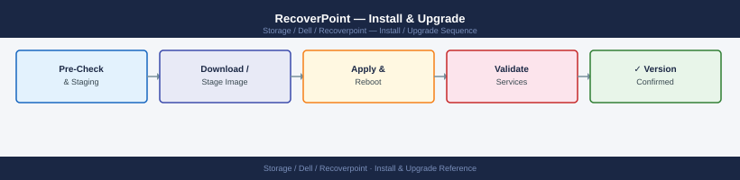
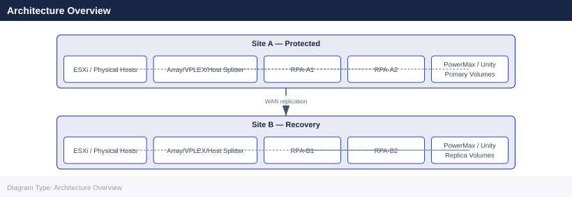
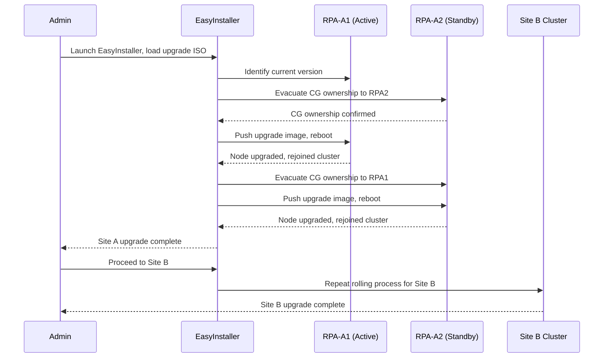

---
tags:
  - dell
  - operations
---
# RecoverPoint — Install & Upgrade

<div class="kb-summary">
RecoverPoint install and upgrade: `rcpcli` upgrade workflow, quiesce consistency groups before upgrade, cluster rolling upgrade, and post-upgrade health validation.

*Applies to: RecoverPoint 5.x*
</div>


> Part of the [RecoverPoint](../index.md) > [Operations](index.md) reference.

Dell RecoverPoint (RP/CL) provides continuous data protection and replication using dedicated RecoverPoint Appliances (RPAs) at each site. This page covers physical RPA deployment, cluster configuration, all splitter types, the upgrade procedure, and post-upgrade validation.

---

## Before you begin

- **Access:** Storage admin credentials (cluster admin or equivalent)
- **Timing:** safe to run during business hours unless a step is marked ⚠ (causes interruption)
- **Dependencies:** no active upgrades or migrations on the same infrastructure
- **Logging:** capture command output — paste into the change record on completion

---

## Version Matrix

| RecoverPoint Version | PowerMaxOS Splitter Support | vSphere Support | Status |
|---|---|---|---|
| 6.0.x (RP4VM) | N/A (vRPA-based) | 8.0, 7.x | Current GA |
| 5.3.x | 5978.x, 10.x | 7.0 U3+ | Current (RP/CL) |
| 5.2.x | 5978.x | 7.0 | Limited support |
| 5.1.x | 5977.x, 5978.x | 6.7 U3+ | End of support |
| 5.0.x | 5977.x | 6.7 | End of life |

Always verify the compatibility matrix in the Dell Simple Support Matrix (SSM) tool before planning any upgrade.

---

## Architecture Overview



---

## Splitter Types

RecoverPoint uses a write-splitter to intercept host I/O and send a copy to the RPA for journal-based replication. Three splitter architectures are supported:

### Array-Based Splitter (PowerMax / Unity / VNX)

The array firmware natively splits writes inside the storage controller. No host-side software is required.

| Array | Splitter Type | Configuration Method |
|---|---|---|
| Dell PowerMax | Embedded SRDF/RP splitter (microcode) | Enabled via PowerMax Service; zone RPAs to array |
| Dell Unity | Embedded splitter | Enabled in Unity management via RecoverPoint registration |
| Dell VNX/VNXe | Embedded CLARiiON splitter | Enabled via Navisphere; legacy — EOS |
| Dell SC Series | Embedded splitter | Enabled via Dell Storage Manager |

**PowerMax array-based splitter workflow:**

```text
1. RPAs zoned to PowerMax fabric zone.
2. RPA WWNs added to a storage group via Unisphere.
3. RecoverPoint Deployment Manager registers the array.
4. PowerMax microcode activates the RP splitter for designated volumes.
5. No host agent or driver changes required.
```

### VPLEX-Based Splitter

Used when hosts access storage through VPLEX (the VPLEX director intercepts the write and forwards a copy to the RPA cluster).

```d2
direction: right

HOST: "Host\n(ESXi / Physical" {shape: rectangle}
VPLEX: "VPLEX Director\n(Splitter embedded" {shape: rectangle}
RPA: "RPA Cluster" {shape: rectangle}
PMAX: "PowerMax\nBackend" {shape: rectangle}

HOST -> VPLEX
VPLEX -> RPA
VPLEX -> PMAX
```

Key VPLEX splitter requirements:

- VPLEX GeoSynchrony 6.0 or later recommended
- RPAs must be in a dedicated VPLEX initiator group
- VPLEX virtual volumes (not backend volumes) are the RP source volumes
- VPLEX splitter is configured automatically when the RPA cluster discovers the VPLEX management station

```bash
# Verify VPLEX splitter registration from boxmgmt
boxmgmt splitter list
# Expected output shows VPLEX splitter entries with status "Connected"
```


```text title="Expected output"
Splitter ID                          Status      Version      Last Heartbeat
================================================================================
splitter-vplex-01.prod.local         Connected   5.2.1.1234   2024-01-15 14:32:18
splitter-vplex-02.prod.local         Connected   5.2.1.1234   2024-01-15 14:32:15
splitter-vplex-03.prod.local         Connected   5.2.1.1234   2024-01-15 14:32:19
splitter-vplex-04.prod.local         Connected   5.2.1.1234   2024-01-15 14:32:17

Total Splitters: 4 | Connected: 4 | Disconnected: 0
```

!!! warning "Common errors"
    **`boxmgmt: command not found`** — Ensure you are running this command on a RecoverPoint appliance with boxmgmt CLI installed, or source the appropriate environment setup script.
    **`Error: Unable to connect to splitter splitter-vplex-01.prod.local - Connection timeout`** — Verify network connectivity and that the VPLEX splitter is powered on and reachable from the RecoverPoint appliance.
    **`Error: Authentication failed - Invalid credentials`** — Confirm your boxmgmt user account has sufficient privileges; re-authenticate or check the RecoverPoint user role permissions.
!!! warning "VPLEX Splitter Auto-Attach"
    VPLEX splitters attach to all eligible RPA clusters automatically when zoning and masking are configured. Verify that only the intended RPA clusters are attached to avoid unexpected replication paths.

### Host-Based Splitter (RP4VM — ESXi)

Used with RecoverPoint for Virtual Machines. A kernel module (VIB) installed on each ESXi host acts as the splitter, intercepting VMDK-level writes.

| Component | Location | Notes |
|---|---|---|
| JIRAF VIB | Each ESXi host | Installed via vCenter (VUM or manually) |
| vRPA cluster | VMware cluster as VMs | 2–4 vRPAs per cluster |
| Splitter trust | VIB ↔ vRPA | Certificate-based trust established at deployment |

Installing the ESXi splitter VIB:

```bash
# Method 1 — via ESXCLI on the ESXi host
esxcli software vib install -v /tmp/RecoverPoint-*.vib --no-sig-check

# Method 2 — via vCenter (preferred for scale)
# Use vSphere Lifecycle Manager baseline with the RP VIB URL
# URL format: https://<vRPA-cluster-IP>/splitter_vib/vmware/RecoverPoint-*.vib

# Verify VIB installation
esxcli software vib list | grep -i recoverpoint
```


```text title="Expected output"
Installation Result
   Message: The update completed successfully, but the system needs to be rebooted for the changes to take effect.
   Reboot Required: true

VIB Installation Status:
   Vendor: Dell
   Name: RecoverPoint
   Version: 5.4.2.1
   Acceptance Level: PartnerSupported

RecoverPoint                                    5.4.2.1                PartnerSupported   2024-01-15
```

!!! warning "Common errors"
    **`VIB signature verification failed. Use --no-sig-check to override.`** — Add the `--no-sig-check` flag to the esxcli command as shown in the documentation.
    **`Error: Could not find a matching VIB package at /tmp/RecoverPoint-*.vib`** — Verify the VIB file exists in /tmp/ by running `ls -la /tmp/RecoverPoint*.vib` and confirm the filename matches the glob pattern.
    **`HTTP 403 Forbidden` when accessing the vRPA cluster VIB URL`** — Ensure the vRPA cluster IP is correct and reachable from vCenter, and verify network connectivity with `ping <vRPA-cluster-IP>`.
After VIB installation, trust the splitter from the vRPA cluster UI or via REST API:

```bash
# From vRPA management (REST API example)
curl -sk -X POST "https://<vRPA-IP>/api/splitters/trust" \
  -H "Content-Type: application/json" \
  -u admin:<password> \
  -d '{"esxiHost": "<ESXi-FQDN>"}'
```


```text title="Expected output"
{
  "id": "splitter-7f4a2c91",
  "status": "success",
  "message": "Trust relationship established",
  "esxiHost": "esx-prod-04.datacenter.local",
  "timestamp": "2024-01-15T14:32:18Z",
  "certificateThumbprint": "A1:B2:C3:D4:E5:F6:7G:8H:9I:0J:1K:2L:3M:4N:5O:6P",
  "trustedAt": "2024-01-15T14:32:18.451Z"
}
```

!!! warning "Common errors"
    **`curl: (60) SSL certificate problem: self signed certificate`** — Add `-k` flag to skip certificate verification (already present; if still failing, verify vRPA IP is correct and accessible).
    **`curl: (7) Failed to connect to <vRPA-IP> port 443: Connection refused`** — Confirm vRPA management interface is running and listening on port 443 with `netstat -tlnp | grep 443` on the vRPA appliance.
    **`{"status":"error","message":"Invalid credentials"}`** — Verify the admin password is correct and URL-encoded if it contains special characters; test with `curl -sk -u admin:password https://<vRPA-IP>/api/health` first.
---

## Consistency Group Configuration

After splitters are configured, create Consistency Groups (CGs) to define what is replicated and how:

```text
1. Unisphere for RecoverPoint → Add Consistency Group
2. Name: CG-<app>-<source-site>-<target-site> (e.g., CG-ORACLE-DC1-DC2)
3. Replication set: select source volumes (PowerMax LUNs or vRPA VMDKs)
4. Add target copy: select target site cluster and target volumes
5. Journal: assign pre-created journal volume(s) at both source and target
6. Replication mode: CDP (synchronous) or CRR/CLR (asynchronous)
7. RPO target: set in seconds (0 for CDP; 30–900 seconds for async)
8. Enable CG — verify state transitions to "Enabled / Replicating"
```

---

## Upgrade Procedure

### Pre-Upgrade Checklist

- [ ] Review target version release notes for known issues
- [ ] Confirm splitter compatibility matrix for target RP version against array microcode
- [ ] Verify all CGs are in `Enabled` / `Active` / `Replicating` state — no degraded CGs
- [ ] Export cluster configuration backup: `boxmgmt system export_config`
- [ ] Verify journal is not full (< 80% utilisation on all journals)
- [ ] Open Dell Support case for upgrade supervision
- [ ] Download upgrade ISO from Dell Support (dell.com/support)
- [ ] Notify application owners of the maintenance window
- [ ] Confirm WAN bandwidth is not saturated (replicated backlog = 0)

```bash
# Pre-upgrade health checks from boxmgmt
boxmgmt system status
boxmgmt list cg
boxmgmt cg check_all
boxmgmt journal check_all
```


```text title="Expected output"
System Status Report
====================
System Name: RecoverPoint-RPA-01
System ID: 5a3c8b2f-9e1d-47c2-b4a9-2c7d1e5f8a3b
Software Version: 5.4.2.1
Build: 20231015-001
Uptime: 45 days 12 hours 23 minutes
Cluster Status: HEALTHY
Replication Status: ACTIVE
Journal Usage: 62%
Cache Usage: 48%

Consistency Groups
==================
CG-PROD-DB-01 (ID: cg-001) — Status: PROTECTED — RPO: 5m
CG-PROD-APP-02 (ID: cg-002) — Status: PROTECTED — RPO: 15m
CG-DEV-TEST-03 (ID: cg-003) — Status: PROTECTED — RPO: 30m
CG-ARCHIVE-04 (ID: cg-004) — Status: PROTECTED — RPO: 1h
...

Consistency Group Health Check
===============================
CG-PROD-DB-01: PASS (last check: 2024-01-15 14:32:15 UTC)
CG-PROD-APP-02: PASS (last check: 2024-01-15 14:32:18 UTC)
CG-DEV-TEST-03: PASS (last check: 2024-01-15 14:32:21 UTC)
CG-ARCHIVE-04: PASS (last check: 2024-01-15 14:32:24 UTC)
All consistency groups: HEALTHY

Journal Health Check
====================
Journal Volume 1: HEALTHY (Used: 58%, Errors: 0)
Journal Volume 2: HEALTHY (Used: 65%, Errors: 0)
Journal Volume 3: HEALTHY (Used: 61%, Errors: 0)
All journals: OPERATIONAL
```

!!! warning "Common errors"
    **`boxmgmt: command not found`** — Ensure the RecoverPoint management CLI is installed and the PATH includes the boxmgmt binary directory (typically `/opt/RecoverPoint/bin`).
    **`Error: Unable to connect to cluster — Connection refused on port 7225`** — Verify the RecoverPoint cluster is running and accessible; check network connectivity and firewall rules for the management port.
    **`CG-PROD-DB-01: FAIL — Journal write error detected`** — Run `boxmgmt journal repair` on the affected journal volume and verify storage array connectivity before proceeding with upgrade.
### Rolling Upgrade Sequence

RecoverPoint upgrades use EasyInstaller and are performed in a rolling fashion — one RPA node at a time within each cluster, maintaining replication continuity throughout.



1. Boot EasyInstaller (ISO) on the management station.
2. Connect to Site A cluster management IP.
3. EasyInstaller evacuates CG ownership from RPA-A1, upgrades it, waits for re-join.
4. Repeat for each remaining RPA node in Site A.
5. Validate all CGs are replicating after Site A upgrade.
6. Connect to Site B cluster management IP; repeat rolling upgrade.
7. Upgrade splitters after both RPA clusters are upgraded.

!!! note "Splitter Upgrade Sequence"
    Always upgrade RPA clusters **before** upgrading splitter packages. The RPA supports running a splitter one minor version behind. Upgrading the splitter before the RPA is unsupported.

### Splitter Upgrade

**Array-based (PowerMax):** The splitter is embedded in the array microcode. It updates automatically when the PowerMaxOS is upgraded. No manual step is required, but verify RPA-to-array connectivity after the array upgrade.

**VPLEX-based:** Upgrade the GeoSynchrony code as a separate VPLEX upgrade. Coordinate with the VPLEX upgrade window.

**Host-based (RP4VM VIB):**

```bash
# Upgrade VIB on a single ESXi host
# Step 1 — vMotion all VMs off the host
# Step 2 — Put host in maintenance mode
esxcli system maintenanceMode set --enable true

# Step 3 — Remove old VIB
esxcli software vib remove -n RecoverPoint-splitter

# Step 4 — Install new VIB
esxcli software vib install -v /tmp/RecoverPoint-<new-version>.vib --no-sig-check

# Step 5 — Exit maintenance mode
esxcli system maintenanceMode set --enable false

# Step 6 — Re-trust the splitter from vRPA UI
```


```text title="Expected output"
Entering maintenance mode...
(no output — command completes silently)
Removal Result
   Message: The update completed successfully, but the system needs to be rebooted.
   Reboot Required: true
   VIBs Installed: RecoverPoint-splitter-8.2.1.0-12345678
   VIBs Removed: RecoverPoint-splitter-8.2.0.5-87654321
   VIBs Skipped: 
   VIBs Obsoleted: 
   VIBs Rolled Back: 
   Reboot Required: true
Installation Result
   Message: The update completed successfully, but the system needs to be rebooted.
   Reboot Required: true
   VIBs Installed: RecoverPoint-splitter-8.2.1.0-12345678
   VIBs Removed: 
   VIBs Skipped: 
   VIBs Obsoleted: 
   VIBs Rolled Back: 
Exiting maintenance mode...
(no output — command completes silently)
```

!!! warning "Common errors"
    **`VIB RecoverPoint-splitter not installed`** — Verify the VIB name matches the installed package using `esxcli software vib list | grep -i recoverpoint` before removal.
    **`[Errno 2] No such file or directory: /tmp/RecoverPoint-<new-version>.vib`** — Confirm the VIB file exists and the version placeholder is replaced with the actual version number (e.g., `RecoverPoint-8.2.1.0.vib`).
    **`Host has running virtual machines`** — Complete vMotion of all VMs to other hosts before entering maintenance mode, or use `esxcli vm process list` to verify the host is empty.
!!! warning "Minimum Splitter Redundancy"
    Keep at least 2 ESXi hosts per cluster with a working splitter active at all times. Single-host splitter maintenance is safe only if at least one other host in the cluster still has an active splitter.

---

## Post-Upgrade Validation

```bash
# 1. Verify RPA software versions
boxmgmt system version

# 2. Check cluster health
boxmgmt system status

# 3. List all CGs and confirm state
boxmgmt list cg

# 4. Verify each CG is replicating with healthy RPO
boxmgmt cg check_all

# 5. Check journal utilisation
boxmgmt journal check_all

# 6. Confirm splitter connectivity
boxmgmt splitter list
```


```text title="Expected output"
RPA Software Version: 5.4.2.1 (Build 12847)
Firmware Version: 8.1.5
System Status: HEALTHY
Cluster Mode: Active-Active
Node 1 (rpa-prod-01.dc1): ONLINE
Node 2 (rpa-prod-02.dc1): ONLINE
Replication Link Status: ACTIVE

CG Name                    State         Type        RTO(min)  RPO(sec)
cg-db-prod-01              REPLICATING   Synchronous 5         0
cg-app-tier-02             REPLICATING   Asynchronous 60        30
cg-fileserver-backup       REPLICATING   Synchronous 5         0
cg-vm-cluster-03           REPLICATING   Asynchronous 120       45
cg-archive-data            REPLICATING   Asynchronous 180       60

CG Check Summary: 5 CGs checked
  HEALTHY: 5
  WARNING: 0
  CRITICAL: 0
All CGs replicating with acceptable RPO.

Journal Utilization Report:
  Journal 1: 62% utilized (4.2 GB / 6.8 GB)
  Journal 2: 58% utilized (3.9 GB / 6.8 GB)
  Journal 3: 71% utilized (4.8 GB / 6.8 GB)
All journals operating within normal parameters.

Splitter Connectivity Status:
  Splitter ID: splitter-emc-01 | IP: 192.168.50.41 | Status: CONNECTED | Link: 10Gbps
  Splitter ID: splitter-emc-02 | IP: 192.168.50.42 | Status: CONNECTED | Link: 10Gbps
  Splitter ID: splitter-netapp-01 | IP: 192.168.51.33 | Status: CONNECTED | Link: 1Gbps
All splitters healthy and communicating.
```

!!! warning "Common errors"
    **`ERROR: RPA cluster unreachable — verify network connectivity to the RPA management IP and confirm firewall rules allow port 7225.`**
    **`WARNING: Journal utilization above 85% on Journal 2 — increase journal size or reduce replication load to prevent RPO violations.`**
    **`ERROR: Splitter splitter-emc-02 status DISCONNECTED — check physical network cable, verify splitter IP configuration, and restart the splitter management service.`**
Validation checklist after upgrade:

- [ ] All RPA nodes show correct new software version
- [ ] All CGs in `Enabled` / `Replicating` state
- [ ] No CG in `Paused`, `Initializing`, or `Error` state
- [ ] All splitters show `Connected` status
- [ ] RPO compliance restored on all Tier 1 CGs (verify in Unisphere for RecoverPoint dashboard)
- [ ] No active alerts in Unisphere for RecoverPoint
- [ ] Run test image access on at least one Tier 1 CG to confirm failover image is recoverable

```bash
# Enable image access for a test (non-disruptive — creates a point-in-time snapshot mount)
boxmgmt cg enable_image_access <CG-name> latest

# Verify image is accessible, then disable
boxmgmt cg disable_image_access <CG-name>
```


```text title="Expected output"
Enabling image access for consistency group 'prod-db-cg'...
Image access enabled successfully.
Mount point: /mnt/recoverpoint/prod-db-cg-snapshot-20240115T143022Z
Snapshot ID: rp-img-7f4a2c91-e8d9-4b12-9c3f-5d8e1a2b3c4d
Access expires in: 24 hours
Status: ACTIVE

Disabling image access for consistency group 'prod-db-cg'...
Image access disabled successfully.
Cleanup completed. Snapshot unmounted from /mnt/recoverpoint/prod-db-cg-snapshot-20240115T143022Z
```

!!! warning "Common errors"
    **`Error: Consistency group 'prod-db-cg' not found or offline`** — Verify the CG name matches exactly and check cluster connectivity with `boxmgmt cluster status`.
    **`Error: Image access already enabled for this CG. Disable existing access before enabling new access.`** — Run `boxmgmt cg disable_image_access <CG-name>` first, then retry the enable command.
---

## Refresh Planning

- Hardware RPA appliances (PowerEdge-based) follow a 5-year refresh cycle aligned with Dell hardware support timelines.
- Plan RP upgrades alongside PowerMax / Unity microcode upgrades to keep splitter compatibility current.
- Track EOL dates in the CMDB with a 12-month lead time for refresh project initiation.
- For RP/CL: Dell publishes the RecoverPoint hardware end-of-life notices via the Dell Lifecycle Policy pages.

| Hardware Generation | Typical EOSL | Action |
|---|---|---|
| Gen 5 RPA (R630-based) | 2024 | Replace immediately if still in service |
| Gen 6 RPA (R640-based) | ~2027 | Plan replacement by 2026 |
| Gen 7 RPA (R650-based) | ~2029 | Current recommendation for new deployments |

---

## Compatibility References

- Dell RecoverPoint compatibility matrix: [Dell Simple Support Matrix](https://elabnavigator.dell.com/eln/elnHomeSSM)
- RP4VM installation and deployment guide: dell.com/support → RecoverPoint for Virtual Machines
- SRA version compatibility (if SRM integration is in use): verify via VMware Compatibility Guide

---

## Verify

- Confirm the operation completed without errors in the log or management UI
- Verify the expected state change is visible (service running, object created, config applied)
- Document the outcome in the change record

---

## See also

- [Recoverpoint — Procedures](../procedures/)
- [Recoverpoint — Health Checks](../health-checks/)
- [Recoverpoint — Deploy](../../deploy/)
