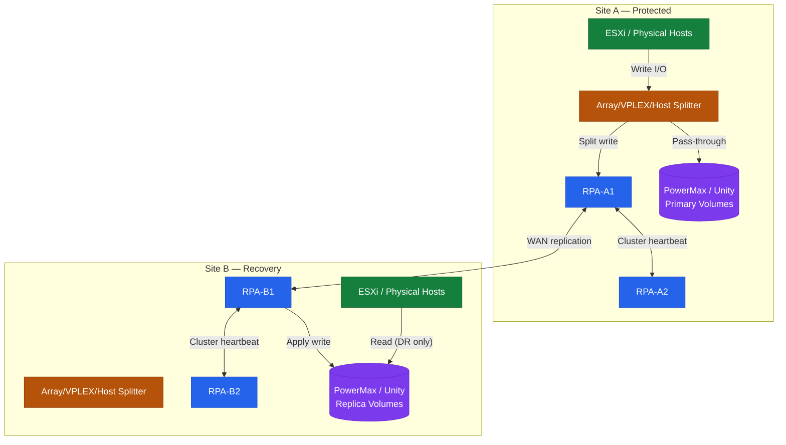
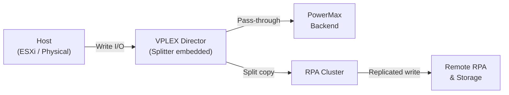
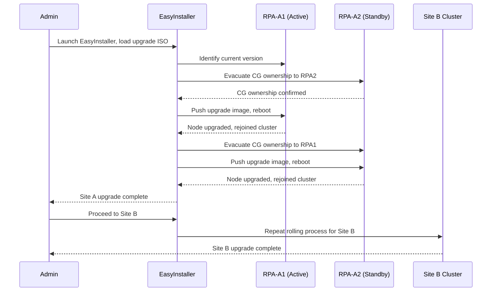

---
tags:
  - dell
  - operations
---
# RecoverPoint — Install & Upgrade


<div class="kb-summary">
Part of the [RecoverPoint](../../index.md) > [Operations](../index.md) reference. Dell RecoverPoint (RP/CL) provides continuous data protection and replication using dedicated RecoverPoint Appliances (RPAs) at each site.
</div>

> Part of the [RecoverPoint](../../index.md) > [Operations](../index.md) reference.

Dell RecoverPoint (RP/CL) provides continuous data protection and replication using dedicated RecoverPoint Appliances (RPAs) at each site. This page covers physical RPA deployment, cluster configuration, all splitter types, the upgrade procedure, and post-upgrade validation.

---

## Version Matrix

| RecoverPoint Version | PowerMaxOS Splitter Support | vSphere Support | Status |
|---|---|---|---|
| 6.0.x (RP4VM) | N/A (vRPA-based) | 8.0, 7.x | Current GA |
| 5.3.x | 5978.x, 10.x | 7.0 U3+ | Current (RP/CL) |
| 5.2.x | 5978.x | 7.0 | Limited support |
| 5.1.x | 5977.x, 5978.x | 6.7 U3+ | End of support |
| 5.0.x | 5977.x | 6.7 | End of life |

Always verify the compatibility matrix in the Dell Simple Support Matrix (SSM) tool before planning any upgrade.

---

## Architecture Overview


```text
┌────────────────────────────────── RecoverPoint — Install & Upgrade ───────────────────────────────────┐
│                                                                                                       │
│   ┌───────────────────────────────────────────────────────────────────────────────────────────────┐   │
│   │Install order: deploy RPA OVF → configure network → pair sites → install splitter on ESXi hosts│   │
│   │       Pre-req: vCenter credentials, management VLAN, replication VLAN, journal datastore      │   │
│   │      Upgrade: rolling RPA upgrade (one node at a time); CGs remain active during upgrade      │   │
│   │         Splitter upgrade: done via VIB update on ESXi; requires host maintenance mode         │   │
│   └───────────────────────────────────────────────────────────────────────────────────────────────┘   │
│                                                                                                       │
│    Deploy RPA OVF ──► network config ──► site pairing ──► install splitter ──► create CGs             │
│                                                                                                       │
│                          ▼                                                 ▼                          │
│                                                                                                       │
│   ┌──────────────────────────────────────────────┐  ┌─────────────────────────────────────────────┐   │
│   │             Fresh Install Steps              │  │                Upgrade Steps                │   │
│   │          1. Deploy RPA OVF per site          │  │          1. Download new RPA image          │   │
│   │          2. Configure mgmt/repl IPs          │  │            2. Upload to Unisphere           │   │
│   │          3. Pair protected/recovery          │  │           3. Rolling node upgrade           │   │
│   │         4. Install ESXi splitter VIB         │  │           4. Upgrade splitter VIBs          │   │
│   │         5. Create consistency groups         │  │          5. Validate all CGs active         │   │
│   └──────────────────────────────────────────────┘  └─────────────────────────────────────────────┘   │
│                                                                                                       │
│    Physical: RPA VMs need 4 vCPU, 8 GB RAM, 3 vNICs (mgmt, replication, data); use anti-affinity rules│
│                                                                                                       │
│    Key terms:                                                                                         │
│                                                                                                       │
│    OVF deploy       = Deploy RPA as virtual appliance from OVF template in vCenter                    │
│    Site pairing     = Connect protected site RPA cluster to recovery site RPA cluster over IP         │
│    Splitter VIB     = VMware Installation Bundle; installed on ESXi via esxcli software vib install   │
│    Management IP    = RPA vNIC for Unisphere access and admin CLI; on management VLAN                 │
│    Replication IP   = RPA vNIC for site-to-site journal replication traffic; on replication VLAN      │
│    Data IP          = RPA vNIC for write split data from ESXi splitter to RPA; on storage VLAN        │
│    Rolling upgrade  = Upgrade one RPA node at a time; surviving node handles all CGs during upgrade   │
│    VIB update       = ESXi host in maintenance mode; esxcli updates splitter kernel module            │
│    Post-upgrade     = Verify all CGs Active; check lag; confirm splitter version per host             │
│    License          = Apply RP4VM licence in Unisphere before creating first CG                       │
│    Compatibility    = Check RP4VM compatibility matrix; ESXi version must match supported list        │
│    Journal datastore= Dedicated datastore for journal VMDKs; separate from production datastores      │
│                                                                                                       │
└───────────────────────────────────────────────────────────────────────────────────────────────────────┘
```

---

## Splitter Types

RecoverPoint uses a write-splitter to intercept host I/O and send a copy to the RPA for journal-based replication. Three splitter architectures are supported:

### Array-Based Splitter (PowerMax / Unity / VNX)

The array firmware natively splits writes inside the storage controller. No host-side software is required.

| Array | Splitter Type | Configuration Method |
|---|---|---|
| Dell PowerMax | Embedded SRDF/RP splitter (microcode) | Enabled via PowerMax Service; zone RPAs to array |
| Dell Unity | Embedded splitter | Enabled in Unity management via RecoverPoint registration |
| Dell VNX/VNXe | Embedded CLARiiON splitter | Enabled via Navisphere; legacy — EOS |
| Dell SC Series | Embedded splitter | Enabled via Dell Storage Manager |

**PowerMax array-based splitter workflow:**

```text
1. RPAs zoned to PowerMax fabric zone.
2. RPA WWNs added to a storage group via Unisphere.
3. RecoverPoint Deployment Manager registers the array.
4. PowerMax microcode activates the RP splitter for designated volumes.
5. No host agent or driver changes required.
```

### VPLEX-Based Splitter

Used when hosts access storage through VPLEX (the VPLEX director intercepts the write and forwards a copy to the RPA cluster).



Key VPLEX splitter requirements:

- VPLEX GeoSynchrony 6.0 or later recommended
- RPAs must be in a dedicated VPLEX initiator group
- VPLEX virtual volumes (not backend volumes) are the RP source volumes
- VPLEX splitter is configured automatically when the RPA cluster discovers the VPLEX management station

```bash
# Verify VPLEX splitter registration from boxmgmt
boxmgmt splitter list
# Expected output shows VPLEX splitter entries with status "Connected"
```

!!! warning "VPLEX Splitter Auto-Attach"
    VPLEX splitters attach to all eligible RPA clusters automatically when zoning and masking are configured. Verify that only the intended RPA clusters are attached to avoid unexpected replication paths.

### Host-Based Splitter (RP4VM — ESXi)

Used with RecoverPoint for Virtual Machines. A kernel module (VIB) installed on each ESXi host acts as the splitter, intercepting VMDK-level writes.

| Component | Location | Notes |
|---|---|---|
| JIRAF VIB | Each ESXi host | Installed via vCenter (VUM or manually) |
| vRPA cluster | VMware cluster as VMs | 2–4 vRPAs per cluster |
| Splitter trust | VIB ↔ vRPA | Certificate-based trust established at deployment |

Installing the ESXi splitter VIB:

```bash
# Method 1 — via ESXCLI on the ESXi host
esxcli software vib install -v /tmp/RecoverPoint-*.vib --no-sig-check

# Method 2 — via vCenter (preferred for scale)
# Use vSphere Lifecycle Manager baseline with the RP VIB URL
# URL format: https://<vRPA-cluster-IP>/splitter_vib/vmware/RecoverPoint-*.vib

# Verify VIB installation
esxcli software vib list | grep -i recoverpoint
```

After VIB installation, trust the splitter from the vRPA cluster UI or via REST API:

```bash
# From vRPA management (REST API example)
curl -sk -X POST "https://<vRPA-IP>/api/splitters/trust" \
  -H "Content-Type: application/json" \
  -u admin:<password> \
  -d '{"esxiHost": "<ESXi-FQDN>"}'
```

---

## Consistency Group Configuration

After splitters are configured, create Consistency Groups (CGs) to define what is replicated and how:

```text
1. Unisphere for RecoverPoint → Add Consistency Group
2. Name: CG-<app>-<source-site>-<target-site> (e.g., CG-ORACLE-DC1-DC2)
3. Replication set: select source volumes (PowerMax LUNs or vRPA VMDKs)
4. Add target copy: select target site cluster and target volumes
5. Journal: assign pre-created journal volume(s) at both source and target
6. Replication mode: CDP (synchronous) or CRR/CLR (asynchronous)
7. RPO target: set in seconds (0 for CDP; 30–900 seconds for async)
8. Enable CG — verify state transitions to "Enabled / Replicating"
```

---

## Upgrade Procedure

### Pre-Upgrade Checklist

- [ ] Review target version release notes for known issues
- [ ] Confirm splitter compatibility matrix for target RP version against array microcode
- [ ] Verify all CGs are in `Enabled` / `Active` / `Replicating` state — no degraded CGs
- [ ] Export cluster configuration backup: `boxmgmt system export_config`
- [ ] Verify journal is not full (< 80% utilisation on all journals)
- [ ] Open Dell Support case for upgrade supervision
- [ ] Download upgrade ISO from Dell Support (dell.com/support)
- [ ] Notify application owners of the maintenance window
- [ ] Confirm WAN bandwidth is not saturated (replicated backlog = 0)

```bash
# Pre-upgrade health checks from boxmgmt
boxmgmt system status
boxmgmt list cg
boxmgmt cg check_all
boxmgmt journal check_all
```

### Rolling Upgrade Sequence

RecoverPoint upgrades use EasyInstaller and are performed in a rolling fashion — one RPA node at a time within each cluster, maintaining replication continuity throughout.



1. Boot EasyInstaller (ISO) on the management station.
2. Connect to Site A cluster management IP.
3. EasyInstaller evacuates CG ownership from RPA-A1, upgrades it, waits for re-join.
4. Repeat for each remaining RPA node in Site A.
5. Validate all CGs are replicating after Site A upgrade.
6. Connect to Site B cluster management IP; repeat rolling upgrade.
7. Upgrade splitters after both RPA clusters are upgraded.

!!! note "Splitter Upgrade Sequence"
    Always upgrade RPA clusters **before** upgrading splitter packages. The RPA supports running a splitter one minor version behind. Upgrading the splitter before the RPA is unsupported.

### Splitter Upgrade

**Array-based (PowerMax):** The splitter is embedded in the array microcode. It updates automatically when the PowerMaxOS is upgraded. No manual step is required, but verify RPA-to-array connectivity after the array upgrade.

**VPLEX-based:** Upgrade the GeoSynchrony code as a separate VPLEX upgrade. Coordinate with the VPLEX upgrade window.

**Host-based (RP4VM VIB):**

```bash
# Upgrade VIB on a single ESXi host
# Step 1 — vMotion all VMs off the host
# Step 2 — Put host in maintenance mode
esxcli system maintenanceMode set --enable true

# Step 3 — Remove old VIB
esxcli software vib remove -n RecoverPoint-splitter

# Step 4 — Install new VIB
esxcli software vib install -v /tmp/RecoverPoint-<new-version>.vib --no-sig-check

# Step 5 — Exit maintenance mode
esxcli system maintenanceMode set --enable false

# Step 6 — Re-trust the splitter from vRPA UI
```

!!! warning "Minimum Splitter Redundancy"
    Keep at least 2 ESXi hosts per cluster with a working splitter active at all times. Single-host splitter maintenance is safe only if at least one other host in the cluster still has an active splitter.

---

## Post-Upgrade Validation

```bash
# 1. Verify RPA software versions
boxmgmt system version

# 2. Check cluster health
boxmgmt system status

# 3. List all CGs and confirm state
boxmgmt list cg

# 4. Verify each CG is replicating with healthy RPO
boxmgmt cg check_all

# 5. Check journal utilisation
boxmgmt journal check_all

# 6. Confirm splitter connectivity
boxmgmt splitter list
```

Validation checklist after upgrade:

- [ ] All RPA nodes show correct new software version
- [ ] All CGs in `Enabled` / `Replicating` state
- [ ] No CG in `Paused`, `Initializing`, or `Error` state
- [ ] All splitters show `Connected` status
- [ ] RPO compliance restored on all Tier 1 CGs (verify in Unisphere for RecoverPoint dashboard)
- [ ] No active alerts in Unisphere for RecoverPoint
- [ ] Run test image access on at least one Tier 1 CG to confirm failover image is recoverable

```bash
# Enable image access for a test (non-disruptive — creates a point-in-time snapshot mount)
boxmgmt cg enable_image_access <CG-name> latest

# Verify image is accessible, then disable
boxmgmt cg disable_image_access <CG-name>
```

---

## Refresh Planning

- Hardware RPA appliances (PowerEdge-based) follow a 5-year refresh cycle aligned with Dell hardware support timelines.
- Plan RP upgrades alongside PowerMax / Unity microcode upgrades to keep splitter compatibility current.
- Track EOL dates in the CMDB with a 12-month lead time for refresh project initiation.
- For RP/CL: Dell publishes the RecoverPoint hardware end-of-life notices via the Dell Lifecycle Policy pages.

| Hardware Generation | Typical EOSL | Action |
|---|---|---|
| Gen 5 RPA (R630-based) | 2024 | Replace immediately if still in service |
| Gen 6 RPA (R640-based) | ~2027 | Plan replacement by 2026 |
| Gen 7 RPA (R650-based) | ~2029 | Current recommendation for new deployments |

---

## Compatibility References

- Dell RecoverPoint compatibility matrix: [Dell Simple Support Matrix](https://elabnavigator.dell.com/eln/elnHomeSSM)
- RP4VM installation and deployment guide: dell.com/support → RecoverPoint for Virtual Machines
- SRA version compatibility (if SRM integration is in use): verify via VMware Compatibility Guide
