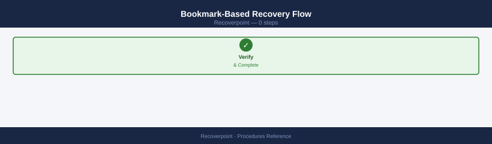
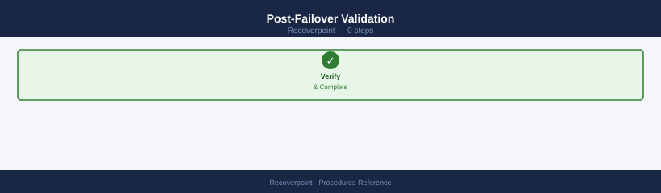
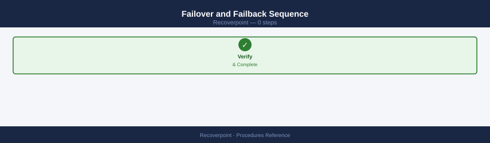
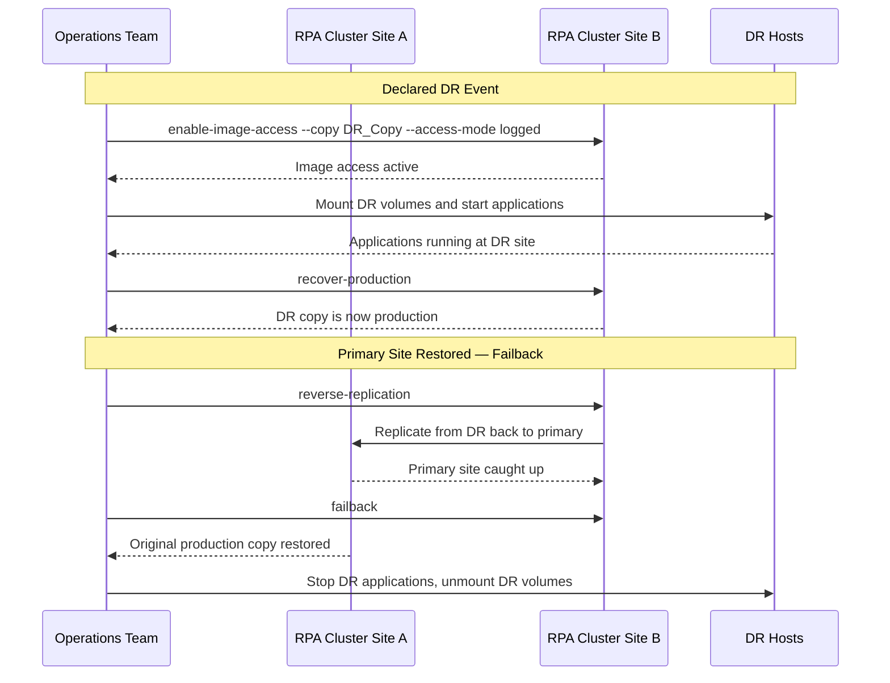
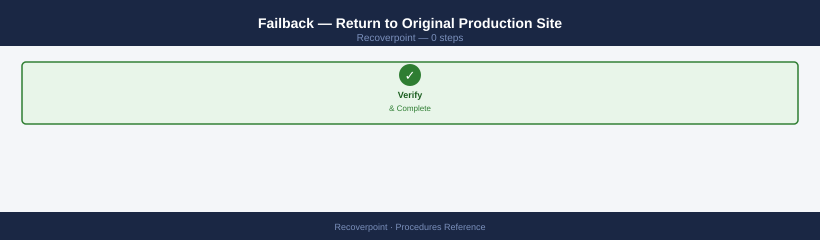
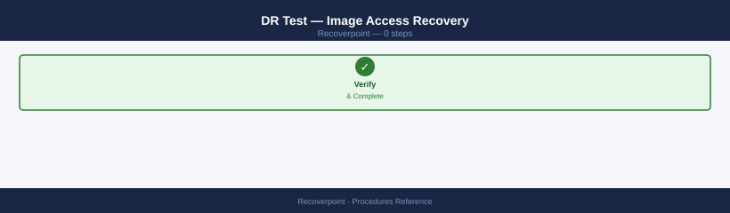
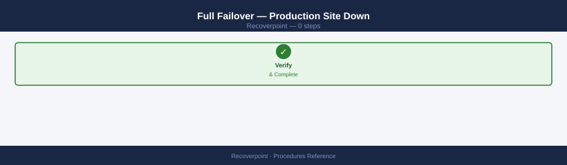
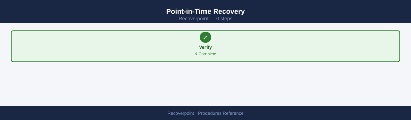
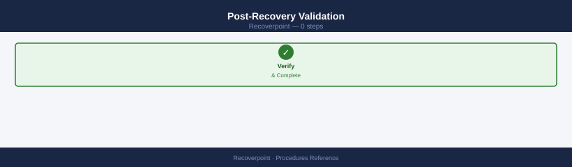
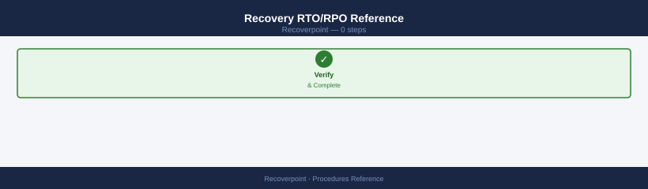

---
tags:
  - dell
  - operations
---
# RecoverPoint — Procedures

<div class="kb-summary">
RecoverPoint procedures: adding consistency groups, bookmarking for CDP recovery, image access (enable test copy), failover, and image disable procedure.

*Applies to: RecoverPoint 5.x*
</div>

---

## Before you begin

- **Access:** Storage admin credentials (cluster admin or equivalent)
- **Timing:** safe to run during business hours unless a step is marked ⚠ (causes interruption)
- **Dependencies:** no active upgrades or migrations on the same infrastructure
- **Logging:** capture command output — paste into the change record on completion

---

## Change Readiness

- [ ] All CGs are in a Consistent state before beginning any storage-side or server-side maintenance
- [ ] Current RPO for each production CG has been noted as a pre-change baseline
- [ ] Journal capacity has sufficient headroom to absorb the expected I/O during the maintenance window (rule of thumb: journal should be < 50% at start of window)
- [ ] RecoverPoint CLI access (SSH to RPA) is confirmed and credentials are available
- [ ] DR site RecoverPoint cluster is reachable and healthy
- [ ] Maintenance window duration has been agreed and does not exceed the journal protection window

| Item | Status | Notes |
|---|---|---|
| All CGs in Consistent state | | |
| Pre-change RPO baseline recorded | | |
| Journal headroom sufficient (< 50% at window start) | | |
| RPA CLI access confirmed | | |
| DR site cluster healthy and reachable | | |
| Window duration within journal protection window | | |

---

## Incident Triage

**On alert or issue:**
1. SSH to the RPA cluster and run `groups status detail` to identify which CGs are not replicating and their current error state
2. Run `alarms list` to check for active hardware or software alarms on the RPA nodes
3. Run `links statistics` to check for inter-site network issues (high latency, packet loss, zero bandwidth)
4. If a journal is full (`journals list`), the CG replication will be paused — immediately reduce I/O to the protected volumes or increase journal allocation
5. If image access is left on from a previous DR test, disable it immediately: `group disable-image-access --gname <cg_name>`
6. If an RPA node is down, check the RPA hardware health and the underlying network/storage connectivity for that node

| Symptom | Likely Cause | Action |
|---|---|---|
| CG in ERROR or PAUSED state (not manually paused) | Journal full, network failure, or storage issue | Run `journals list` to check journal; run `links statistics` to check network; check RPA alarms |
| Journal above 80% | Write rate exceeding journal drain rate or link down | Check link bandwidth with `links statistics`, reduce write I/O if possible, expand journal allocation |
| RPO breach alert (lag > SLA threshold) | Link congestion or insufficient bandwidth | Check `links statistics`, check WAN QoS for RP replication traffic on port 4460 |
| Image access left active after DR test | DR test was not properly cleaned up | Run `group disable-image-access --gname <cg_name>` immediately, then verify CG returns to ACTIVE |
| RPA node down | Hardware failure or network issue | Check RPA hardware state with `system status`, check physical/VM health, open Dell support case |
| CG in MIXED state | Partial subset of volumes replicating | Run `groups status detail` to identify affected volumes, check initiator zones and storage connectivity |

---

## Maintenance Window

**Pausing replication for a storage or server maintenance window:**

1. Confirm all CGs are in Consistent state before pausing
2. Pause the relevant CGs:
   ```bash
   # Pause a specific CG
   group disable-replication --gname <cg_name>

   # Or pause all CGs in a group set
   groups disable-replication
   ```
3. Perform the maintenance on the protected storage or servers
4. Resume replication after maintenance is complete:
   ```bash
   group enable-replication --gname <cg_name>
   ```
5. Monitor replication resync — watch `groups status detail` until all CGs return to ACTIVE/Consistent state
6. Confirm RPO returns to within SLA after resync

**DR test image access procedure:**

1. Enable image access on the target copy at the desired point-in-time bookmark:
   ```bash
   group enable-image-access --gname <cg_name> --copy DR --image <bookmark_or_timestamp>
   ```
2. Perform DR test workload validation
3. Disable image access immediately after testing is complete:
   ```bash
   group disable-image-access --gname <cg_name>
   ```
4. Confirm CG returns to ACTIVE replication state

---

## Post-Change Validation

- [ ] All CGs have returned to ACTIVE replication state (`groups status`)
- [ ] RPO for all production CGs is back within SLA threshold (typically < 15 minutes)
- [ ] Journal consumption has returned to the pre-change baseline (`journals list`)
- [ ] No image access sessions are active
- [ ] `alarms list` shows no new active alarms
- [ ] DR site cluster is healthy and reachable

---

## Failover

RecoverPoint supports two failover modes:

| Mode | Description | Impact on Replication | When to use |
|---|---|---|---|
| Image Access (DR Test) | Non-disruptive — accesses a DR copy snapshot; production replication continues | Replication paused during image access; resumes on disable | Quarterly DR tests; point-in-time validation |
| Failover (Production DR) | Disruptive — production copy is demoted; DR copy becomes production | Requires failback procedure to restore normal replication direction | Declared DR events; production site failure |

For planned DR tests, use Image Access. Invoke a full failover only on declared DR events.

### Bookmark-Based Recovery Flow



```d2
direction: right

listBookmarks: "List Available Bookmarks\ngroup list_bookmarks --gname cgname" {shape: rectangle}
selectBookmark: "Select Target Bookmark\n(or timestamp" {shape: rectangle}
enableImageAccess: "Enable Image Access\ngroup enable-image-access --gname cgname\n--copy DR_Copy --image bookmark --access-mode virtual" {shape: rectangle}
confirmImageAccess: "Confirm Image Access Active\ngroup status --gname cgname" {shape: rectangle}
mountVolumes: "Mount DR Volumes\n(host-level step — SAN zoning / masking" {shape: rectangle}
validateApp: "Validate Application Data\n(app team confirms" {shape: rectangle}
disableImageAccess: "Disable Image Access\ngroup disable-image-access --gname cgname" {shape: rectangle}
confirmActive: "Confirm CG Returns to ACTIVE\ngroups status" {shape: rectangle}

listBookmarks -> selectBookmark
selectBookmark -> enableImageAccess
enableImageAccess -> confirmImageAccess
confirmImageAccess -> mountVolumes
mountVolumes -> validateApp
validateApp -> disableImageAccess
disableImageAccess -> confirmActive
```

### Post-Failover Validation



```bash
# Confirm DR copy is now in production role
groups status detail

# Confirm no stale image access sessions
groups status | grep -i "image access"

# Check journal state at new production site
journals list

# Check for any active alarms
alarms list
```


```text title="Expected output"
Production RPA Group Status:
  Group ID: 7a3f8c2e-91b4-4d2a-b6f1-2c5e9d1a4b7f
  Role: Production
  Status: Online
  Replication Status: Healthy
  Last Consistency Point: 2024-01-15 14:32:18 UTC
  Copy Count: 3

Image Access Sessions:
  (no active sessions)

Journal Status:
  Journal ID: jnl-prod-01
  State: Active
  Used Capacity: 67.3%
  Oldest Consistency Point: 2024-01-15 08:15:22 UTC
  Journal ID: jnl-prod-02
  State: Active
  Used Capacity: 54.8%

Active Alarms:
  (no alarms)
```

!!! warning "Common errors"
    **`Error: Unable to connect to RPA cluster at 192.168.42.10`** — Verify network connectivity and that the RecoverPoint management interface is accessible on port 7225.
    **`Error: Group 7a3f8c2e-91b4-4d2a-b6f1-2c5e9d1a4b7f is in Paused state`** — Resume replication using `groups resume <group-id>` before confirming production role transition.
    **`Error: Stale image access session detected on copy copy-dr-02`** — Disconnect the session with `image access disconnect <session-id>` before proceeding with failover.
| Check | Expected Result |
|---|---|
| DR copy role | Now marked as Production |
| CG state | ACTIVE (replicating back to original site, or paused) |
| Image access | None active |
| Journal | < 70% utilization |
| Alarms | No critical alarms |

### Failover and Failback Sequence





### Failback — Return to Original Production Site



After DR operations are complete and the primary site is restored:

```bash
# Step 1 — Ensure primary site storage is ready
# Step 2 — Initiate reverse replication (DR → Production)
group reverse-replication --gname <cg_name>

# Step 3 — Wait for primary site to catch up (monitor lag)
group status --gname <cg_name>

# Step 4 — Enable image access at primary site and validate
group enable-image-access --gname <cg_name> --copy PROD_Copy \
  --image latest --access-mode virtual

# Step 5 — Fail back — restore original replication direction
group failback --gname <cg_name>

# Step 6 — Confirm ACTIVE state with correct production copy
groups status
```


```text title="Expected output"
Initiating reverse replication for consistency group: app-db-cg
Reverse replication started successfully
Replication direction: DR → Production
Current RPO lag: 2.3 seconds
Consistency group: app-db-cg
Status: ACTIVE
Production copy: PROD_Copy
DR copy: DR_Copy
Last image timestamp: 2024-01-15T14:32:18Z
Replication lag: 1.8 seconds
Image access enabled on PROD_Copy
Virtual image mounted at: /mnt/recoverpoint/app-db-cg/latest
Access mode: virtual
Failback initiated for consistency group: app-db-cg
Replication direction restored: Production → DR
Failback completed successfully
Consistency Group Status Summary:
  app-db-cg          ACTIVE      PROD_Copy    0.9s lag
  web-tier-cg        ACTIVE      PROD_Copy    1.2s lag
  cache-cg           ACTIVE      PROD_Copy    0.7s lag
```

!!! warning "Common errors"
    **`Error: Consistency group '<cg_name>' not found`** — Replace `<cg_name>` with the actual consistency group name from your RecoverPoint configuration.
    **`Error: Reverse replication failed — primary site storage capacity exceeded`** — Verify primary site has sufficient free storage capacity before initiating reverse replication.
    **`Error: Image access denied — copy is currently in use by another operation`** — Wait for any ongoing snapshots or replications to complete before enabling image access.
---

## Recovery

RecoverPoint supports three recovery scenarios, each using the journal to restore data to a consistent point in time:

| Scenario | Description | Disruption |
|---|---|---|
| DR Test (Image Access) | Mount DR copy at a point in time; validate without impacting replication | Minimal — replication pauses during access |
| Full Failover | Production site unavailable; DR copy becomes new production | Disruptive — requires failback to restore direction |
| Point-in-Time Recovery | Recover to a specific bookmark or timestamp (e.g., before ransomware or corruption) | Targeted — only affects the specific CG |

### DR Test — Image Access Recovery



```bash
# SSH to RPA cluster
ssh admin@<rpa-cluster-ip>

# Step 1 — List available bookmarks for the CG
group list_bookmarks --gname <cg_name>

# Step 2 — Enable image access at a specific bookmark (virtual — no data movement)
group enable-image-access --gname <cg_name> --copy DR_Copy \
  --image <bookmark_name_or_timestamp> --access-mode virtual

# Step 3 — Confirm image access is active
group status --gname <cg_name>

# Step 4 — Mount volumes at DR site and validate application (host-level step)
# Step 5 — After validation: disable image access to resume replication
group disable-image-access --gname <cg_name>

# Step 6 — Confirm CG returns to ACTIVE
groups status
```


```text title="Expected output"
admin@rpa-cluster-01:~$ ssh admin@192.168.50.45
Password:
admin@rpa-01:~$ group list_bookmarks --gname Production_DB
Bookmark Name                          Timestamp            Size (GB)  Type
prod_db_hourly_2024_01_15_0600        2024-01-15 06:00:12  450.2      Manual
prod_db_hourly_2024_01_15_0500        2024-01-15 05:00:08  450.2      Manual
prod_db_hourly_2024_01_15_0400        2024-01-15 04:00:15  450.2      Manual
prod_db_daily_2024_01_14              2024-01-14 23:59:44  450.2      Scheduled
...

admin@rpa-01:~$ group enable-image-access --gname Production_DB --copy DR_Copy --image prod_db_hourly_2024_01_15_0600 --access-mode virtual
Image access enabled for CG 'Production_DB' at bookmark 'prod_db_hourly_2024_01_15_0600' (virtual mode)
Access ID: img-acc-7f2e9c41-b3d2-4a8f-9e1c-5d6a2b8c0f3a

admin@rpa-01:~$ group status --gname Production_DB
CG Name: Production_DB
Status: ACTIVE_IMAGE_ACCESS
Replication Status: PAUSED (image access active)
Copy: DR_Copy | State: VIRTUAL_ACCESS | Bookmark: prod_db_hourly_2024_01_15_0600
Last Sync: 2024-01-15 06:00:12 UTC

admin@rpa-01:~$ group disable-image-access --gname Production_DB
Image access disabled for CG 'Production_DB'
Replication resuming...

admin@rpa-01:~$ groups status
CG Name                    Status         Replication    Last Sync
Production_DB              ACTIVE         CONSISTENT     2024-01-15 06:15:33 UTC
Finance_Ledger             ACTIVE         CONSISTENT     2024-01-15 06:14:22 UTC
HR_Systems                 ACTIVE         CONSISTENT     2024-01-15 06:13:45 UTC
```

!!! warning "Common errors"
    **`Error: CG 'Production_DB' not found or invalid copy name 'DR_Copy'`** — Verify the consistency group name and copy name match exactly using `group list_bookmarks --gname <cg_name>` and check for typos.
    **`Error: Image access already active on CG 'Production_DB'. Disable current access before enabling new access.`** — Run `group disable-image-access --gname Production_DB` first, then retry the enable command.
    **`Error: Bookmark 'prod_db_hourly_2024_01_15_0600' is older than RPO window and unavailable`** — Select a more recent bookmark from the list or wait for newer snapshots to be created.
### Full Failover — Production Site Down



```bash
# Step 1 — Confirm production site is unreachable (not a false alarm)
# Step 2 — Enable image access on DR copy (logged mode — allows writes)
group enable-image-access --gname <cg_name> --copy DR_Copy \
  --image latest --access-mode logged

# Step 3 — Confirm image access is active and volumes are accessible
group status --gname <cg_name>

# Step 4 — Mount and start applications at DR site
# Step 5 — Recover production (promote DR copy to production role)
group recover-production --gname <cg_name>

# Step 6 — Confirm DR copy is now in production role
groups status detail
```


```text title="Expected output"
Enabling image access on copy DR_Copy for consistency group prod_db_01...
Image access enabled successfully in logged mode.
Access mode: logged (read-write)
Image timestamp: 2024-01-15T09:47:33Z

Consistency Group: prod_db_01
Status: image_access_enabled
Copy: DR_Copy
Access Mode: logged
Volumes Accessible: yes
Volume Count: 4
Last Sync: 2024-01-15T09:47:12Z

Promoting DR_Copy to production role...
Production recovery initiated for consistency group prod_db_01
Previous production copy: PROD_Copy (disabled)
New production copy: DR_Copy (active)
Recovery completed successfully

Consistency Group Status Detail:
  Name: prod_db_01
  Production Copy: DR_Copy
  Production Status: active
  DR Copy: PROD_Copy
  DR Status: paused
  Replication Direction: PROD_Copy <- DR_Copy
  Last Update: 2024-01-15T09:48:51Z
```

!!! warning "Common errors"
    **`Error: Production copy still reachable. Disable before recovery.`** — Verify production site is truly offline before attempting recovery, or use `--force-recovery` flag if confirmed unreachable.
    **`Error: Image access mode 'logged' requires sufficient journal capacity. Current: 87%.`** — Expand the journal volume or wait for synchronization to reduce journal usage before enabling logged access.
    **`Error: Consistency group prod_db_01 has pending writes. Cannot promote to production.`** — Flush all pending writes with `group flush --gname prod_db_01` before initiating recovery.
| Step | Command | Verification |
|---|---|---|
| Enable image access | `group enable-image-access` | State: ImageAccess |
| Validate application | Host-level validation | App responds correctly |
| Recover production | `group recover-production` | DR copy = Production |
| Check CG state | `groups status detail` | ACTIVE with correct roles |

### Point-in-Time Recovery



Recover to a specific point in time — for example, before a ransomware event or a bad database transaction.

```bash
# Step 1 — List journals and bookmarks to identify the target time
group list_bookmarks --gname <cg_name>
journals list

# Step 2 — Enable image access at the target timestamp (virtual mode)
group enable-image-access --gname <cg_name> --copy DR_Copy \
  --image "2026-05-06 14:30:00" --access-mode virtual

# Step 3 — Mount volumes in read-only mode and copy/validate data
# Step 4 — If recovered data is good, switch to logged access to allow writes
group enable-image-access --gname <cg_name> --copy DR_Copy \
  --image "2026-05-06 14:30:00" --access-mode logged

# Step 5 — When done: disable image access
group disable-image-access --gname <cg_name>
```


```text title="Expected output"
Bookmarks for consistency group 'prod-db-cg':
  Bookmark ID: BM-2026-05-06-143000 | Timestamp: 2026-05-06 14:30:00 | Size: 847.3 GB
  Bookmark ID: BM-2026-05-06-120000 | Timestamp: 2026-05-06 12:00:00 | Size: 847.1 GB
  Bookmark ID: BM-2026-05-05-180000 | Timestamp: 2026-05-05 18:00:00 | Size: 846.8 GB

Journal information:
  Journal ID: JNL-DR_Copy-001 | State: Active | Used: 92% | Capacity: 2.1 TB
  Journal ID: JNL-DR_Copy-002 | State: Active | Used: 87% | Capacity: 2.1 TB

Image access enabled for copy 'DR_Copy' at 2026-05-06 14:30:00 (virtual mode)
Access Mode: Virtual | State: Enabled | Mount Point: /dev/rpdx-virt-001

Image access mode switched to logged for copy 'DR_Copy'
Access Mode: Logged | State: Enabled | Writes Permitted: Yes

Image access disabled for consistency group 'prod-db-cg'
```

!!! warning "Common errors"
    **`Error: consistency group '<cg_name>' not found`** — Replace `<cg_name>` with the actual consistency group name from the `group list_bookmarks` output.
    **`Error: image timestamp '2026-05-06 14:30:00' does not exist for copy 'DR_Copy'`** — Verify the timestamp matches exactly one of the available bookmarks listed by `journals list` and use the correct date-time format.
    **`Error: cannot enable image access — copy 'DR_Copy' is already in use`** — Wait for any ongoing recovery operations to complete or disable access on the copy first with `group disable-image-access`.
### Post-Recovery Validation



```bash
# Confirm no image access sessions remain active
groups status | grep -i "image"

# Confirm CG is ACTIVE and replicating
groups status detail

# Confirm RPO is back within SLA
group status --gname <cg_name>

# Confirm journal utilization has returned to normal
journals list

# Confirm no active alarms
alarms list
```


```text title="Expected output"
IMAGE_ACCESS_SESSIONS: 0 active sessions
IMAGE_ACCESS_SESSIONS: 0 pending sessions

Group Name: production-db-cg
Status: ACTIVE
Replication Status: IN_SYNC
Last Consistency Point: 2024-01-15 14:32:18 UTC
RPO: 45 seconds
Throughput: 2.3 GB/s

Group Name: production-db-cg
Status: ACTIVE
Current RPO: 45 seconds
SLA Target RPO: 300 seconds
Replication Health: HEALTHY

Journal Name: journal-01
Utilization: 62%
Available Space: 18.5 GB
Journal Name: journal-02
Utilization: 58%
Available Space: 19.2 GB

Alarm Count: 0
No active alarms detected
Last Check: 2024-01-15 14:35:42 UTC
```

!!! warning "Common errors"
    **`groups: command not found`** — Verify you are logged into the RecoverPoint CLI console or source the appropriate environment setup script.
    **`Group <cg_name> not found or invalid`** — Replace `<cg_name>` with the actual consistency group name (e.g., `production-db-cg`) and verify the group exists with `groups list`.
    **`RPO threshold exceeded: current 450s > SLA 300s`** — Check replication link bandwidth and target array performance; if persistent, increase journal size or adjust SLA target.
### Recovery RTO/RPO Reference



| Recovery Type | Typical RTO | RPO |
|---|---|---|
| DR Test (image access) | 15–30 minutes | RPO at time of bookmark |
| Full failover | 30–90 minutes (plus app validation) | RPO at last journal point |
| Point-in-time recovery | 30–60 minutes | Any point within journal window |

---

## Add Volumes to a Consistency Group

Use the RecoverPoint CLI to add new volumes to an existing consistency group:

```bash
add_volumes_to_group -g <cg-name> -v <volume-id>
```


```text title="Expected output"
Adding volumes to consistency group 'prod-db-cg'...
Volume ID: vol-0a7f2c9e1b3d5f8g added successfully
Consistency group 'prod-db-cg' updated
Current group members: 8 volumes
Replication status: ACTIVE
Last sync: 2024-01-15 14:32:18 UTC
```

!!! warning "Common errors"
    **`Error: Consistency group 'prod-db-cg' not found`** — Verify the consistency group name with `list_consistency_groups` and use the exact name in the `-g` parameter.
    **`Error: Volume vol-0a7f2c9e1b3d5f8g is already a member of group 'backup-cg'`** — Remove the volume from its current consistency group first using `remove_volumes_from_group` before adding it to a different group.
    **`Error: Cannot add volume to group during active replication`** — Wait for the current replication cycle to complete or pause replication with `pause_replication -g <cg-name>` before adding volumes.
After adding volumes, verify the CG protection status to confirm the new volumes are being replicated:

```bash
group status --gname <cg-name>
```


```text title="Expected output"
Group Status Report for: production-db-cg
Group Name: production-db-cg
Group ID: 7a3f8c2e-91b4-4d2a-b5e1-6c9d2f4a8b1c
Status: HEALTHY
Replication Status: ACTIVE
Last Consistency Point: 2024-01-15 14:32:18 UTC
RPO (Recovery Point Objective): 5 minutes
RTO (Recovery Time Objective): 15 minutes
Protected VMs: 12
Replication Lag: 2.3 seconds
Bandwidth Usage: 450 MB/s
Last Successful Backup: 2024-01-15 14:30:00 UTC
Failover Ready: YES
```

!!! warning "Common errors"
    **`Error: Group '<cg-name>' not found`** — Verify the group name with `group list` and use the exact name from the output.
    **`Error: Connection timeout to RecoverPoint appliance`** — Check network connectivity to the RecoverPoint management interface and verify credentials are still valid.
    **`Error: Insufficient permissions to query group status`** — Ensure your user account has the appropriate role assigned in RecoverPoint's access control settings.
Confirm the CG returns to ACTIVE state with all volumes included before closing the change. If the CG shows a degraded state after adding volumes, check storage connectivity and journal capacity.

---

## Perform an Image Access (Test Failover)

Image Access allows a point-in-time copy of a CG to be mounted at the recovery site for testing without impacting production replication.

1. In the RecoverPoint UI, navigate to the Consistency Group and select **Image Access**
2. Select the desired point in time — choose a bookmark or specify a timestamp within the journal window
3. Click **Enable Image Access** — RecoverPoint presents the DR copy volumes at the selected point in time
4. Mount the volumes at the recovery site and run application tests to validate data integrity
5. Once testing is complete, click **Disable Image Access** (or **Unmount** from the UI) to release the image
6. Confirm the CG returns to ACTIVE replication state and RPO is back within SLA

---

## Change RPO Target

Modify the synchronisation interval for a Consistency Group to adjust the RPO target:

1. In the RecoverPoint UI, navigate to the Consistency Group and open **Settings**
2. Select **Protection Policy**
3. Modify the synchronisation interval — lower values reduce RPO but increase journal write rate and bandwidth consumption
4. Click **Apply** to save the new policy
5. Monitor the CG cycle time after the change to confirm the new interval is being achieved — check **group status** to verify the actual RPO matches the new target

---

## Verify

- Confirm the operation completed without errors in the log or management UI
- Verify the expected state change is visible (service running, object created, config applied)
- Document the outcome in the change record

---

## See also

- [Recoverpoint — Health Checks](../health-checks/)
- [Recoverpoint — CLI Reference](../cli-reference/)
- [Recoverpoint — Common Issues](../../troubleshooting/common-issues/)
