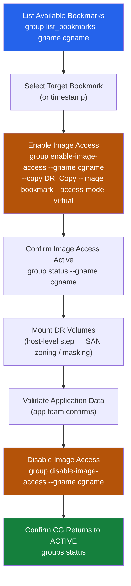
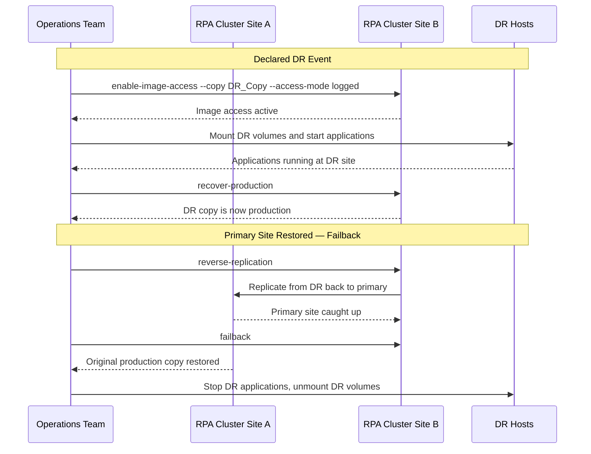

---
tags:
  - dell
  - operations
---
# RecoverPoint — Procedures


<div class="kb-summary">
Part of the [RecoverPoint](../../index.md) > [Operations](../index.md) reference.
</div>

---

## Before you begin

- **Access:** Storage admin credentials (cluster admin or equivalent)
- **Timing:** safe to run during business hours unless a step is marked ⚠ (causes interruption)
- **Dependencies:** no active upgrades or migrations on the same infrastructure
- **Logging:** capture command output — paste into the change record on completion

---

## Change Readiness

- [ ] All CGs are in a Consistent state before beginning any storage-side or server-side maintenance
- [ ] Current RPO for each production CG has been noted as a pre-change baseline
- [ ] Journal capacity has sufficient headroom to absorb the expected I/O during the maintenance window (rule of thumb: journal should be < 50% at start of window)
- [ ] RecoverPoint CLI access (SSH to RPA) is confirmed and credentials are available
- [ ] DR site RecoverPoint cluster is reachable and healthy
- [ ] Maintenance window duration has been agreed and does not exceed the journal protection window

| Item | Status | Notes |
|---|---|---|
| All CGs in Consistent state | | |
| Pre-change RPO baseline recorded | | |
| Journal headroom sufficient (< 50% at window start) | | |
| RPA CLI access confirmed | | |
| DR site cluster healthy and reachable | | |
| Window duration within journal protection window | | |

---

## Incident Triage

**On alert or issue:**
1. SSH to the RPA cluster and run `groups status detail` to identify which CGs are not replicating and their current error state
2. Run `alarms list` to check for active hardware or software alarms on the RPA nodes
3. Run `links statistics` to check for inter-site network issues (high latency, packet loss, zero bandwidth)
4. If a journal is full (`journals list`), the CG replication will be paused — immediately reduce I/O to the protected volumes or increase journal allocation
5. If image access is left on from a previous DR test, disable it immediately: `group disable-image-access --gname <cg_name>`
6. If an RPA node is down, check the RPA hardware health and the underlying network/storage connectivity for that node

| Symptom | Likely Cause | Action |
|---|---|---|
| CG in ERROR or PAUSED state (not manually paused) | Journal full, network failure, or storage issue | Run `journals list` to check journal; run `links statistics` to check network; check RPA alarms |
| Journal above 80% | Write rate exceeding journal drain rate or link down | Check link bandwidth with `links statistics`, reduce write I/O if possible, expand journal allocation |
| RPO breach alert (lag > SLA threshold) | Link congestion or insufficient bandwidth | Check `links statistics`, check WAN QoS for RP replication traffic on port 4460 |
| Image access left active after DR test | DR test was not properly cleaned up | Run `group disable-image-access --gname <cg_name>` immediately, then verify CG returns to ACTIVE |
| RPA node down | Hardware failure or network issue | Check RPA hardware state with `system status`, check physical/VM health, open Dell support case |
| CG in MIXED state | Partial subset of volumes replicating | Run `groups status detail` to identify affected volumes, check initiator zones and storage connectivity |

---

## Maintenance Window

**Pausing replication for a storage or server maintenance window:**

1. Confirm all CGs are in Consistent state before pausing
2. Pause the relevant CGs:
   ```bash
   # Pause a specific CG
   group disable-replication --gname <cg_name>

   # Or pause all CGs in a group set
   groups disable-replication
   ```
3. Perform the maintenance on the protected storage or servers
4. Resume replication after maintenance is complete:
   ```bash
   group enable-replication --gname <cg_name>
   ```
5. Monitor replication resync — watch `groups status detail` until all CGs return to ACTIVE/Consistent state
6. Confirm RPO returns to within SLA after resync

**DR test image access procedure:**

1. Enable image access on the target copy at the desired point-in-time bookmark:
   ```bash
   group enable-image-access --gname <cg_name> --copy DR --image <bookmark_or_timestamp>
   ```
2. Perform DR test workload validation
3. Disable image access immediately after testing is complete:
   ```bash
   group disable-image-access --gname <cg_name>
   ```
4. Confirm CG returns to ACTIVE replication state

---

## Post-Change Validation

- [ ] All CGs have returned to ACTIVE replication state (`groups status`)
- [ ] RPO for all production CGs is back within SLA threshold (typically < 15 minutes)
- [ ] Journal consumption has returned to the pre-change baseline (`journals list`)
- [ ] No image access sessions are active
- [ ] `alarms list` shows no new active alarms
- [ ] DR site cluster is healthy and reachable

---

## Failover

RecoverPoint supports two failover modes:

| Mode | Description | Impact on Replication | When to use |
|---|---|---|---|
| Image Access (DR Test) | Non-disruptive — accesses a DR copy snapshot; production replication continues | Replication paused during image access; resumes on disable | Quarterly DR tests; point-in-time validation |
| Failover (Production DR) | Disruptive — production copy is demoted; DR copy becomes production | Requires failback procedure to restore normal replication direction | Declared DR events; production site failure |

For planned DR tests, use Image Access. Invoke a full failover only on declared DR events.

### Bookmark-Based Recovery Flow


```text
┌────────────────────────────────────── RecoverPoint — Procedures ──────────────────────────────────────┐
│                                                                                                       │
│   ┌───────────────────────────────────────────────────────────────────────────────────────────────┐   │
│   │      Standard procedures: failover, failback, test copy, image access, bookmark creation      │   │
│   │   Always set a bookmark before any maintenance or planned failover for clean recovery point   │   │
│   │      Failover pre-check: confirm lag, journal %, network readiness, VM power state at DR      │   │
│   │   Failback pre-check: production site healthy, reverse replication established, data synced   │   │
│   └───────────────────────────────────────────────────────────────────────────────────────────────┘   │
│                                                                                                       │
│                  ▼                                ▼                                ▼                  │
│                                                                                                       │
│   ┌─────────────────────────────┐  ┌─────────────────────────────┐  ┌─────────────────────────────┐   │
│   │           Failover          │  │           Failback          │  │          Test Copy          │   │
│   │       1. Set bookmark       │  │      1. Verify prod OK      │  │     1. Create bubble net    │   │
│   │     2. Disable prod VMs     │  │     2. Reverse replicate    │  │      2. Select bookmark     │   │
│   │        3. Failover CG       │  │       3. Wait for sync      │  │      3. Start test copy     │   │
│   │      4. Power on DR VMs     │  │        4. Failback CG       │  │     4. Power on test VMs    │   │
│   │     5. Redirect traffic     │  │       5. Re-enable CG       │  │    5. Validate & end test   │   │
│   └─────────────────────────────┘  └─────────────────────────────┘  └─────────────────────────────┘   │
│                                                                                                       │
│    Physical: test VMs on bubble portgroup (no uplinks); DR network must be pre-configured             │
│                                                                                                       │
│    Key terms:                                                                                         │
│                                                                                                       │
│    Failover         = Commit journal image; power on VMs at DR site; production traffic moves         │
│    Failback         = Reverse replication; sync DR changes back to prod; cut over to prod             │
│    Reverse replicate= After failover; replication runs DR→prod direction; syncs delta writes          │
│    Test copy        = Non-disruptive; replica boots on bubble VLAN; no prod impact                    │
│    Image access     = Read-only or r/w mount; source continues; no VM power-on at DR                  │
│    Bookmark         = Set before maintenance; provides clean point for any recovery type              │
│    Pre-check        = Verify lag, journal fill, DR network config, and ESXi connectivity              │
│    Bubble network   = Isolated portgroup created for test; removed after test ends                    │
│    Traffic redirect = DNS/load balancer update to point to DR site IP addresses                       │
│    Resync           = After failback; establishes forward replication again (prod → DR)               │
│    CG disable       = Pause replication before planned failover; prevents writes during cutover       │
│    Post-failover    = Confirm all VMs running; validate application; set new bookmark                 │
│                                                                                                       │
└───────────────────────────────────────────────────────────────────────────────────────────────────────┘
```

### Post-Failover Validation

```bash
# Confirm DR copy is now in production role
groups status detail

# Confirm no stale image access sessions
groups status | grep -i "image access"

# Check journal state at new production site
journals list

# Check for any active alarms
alarms list
```

| Check | Expected Result |
|---|---|
| DR copy role | Now marked as Production |
| CG state | ACTIVE (replicating back to original site, or paused) |
| Image access | None active |
| Journal | < 70% utilization |
| Alarms | No critical alarms |

### Failover and Failback Sequence



### Failback — Return to Original Production Site

After DR operations are complete and the primary site is restored:

```bash
# Step 1 — Ensure primary site storage is ready
# Step 2 — Initiate reverse replication (DR → Production)
group reverse-replication --gname <cg_name>

# Step 3 — Wait for primary site to catch up (monitor lag)
group status --gname <cg_name>

# Step 4 — Enable image access at primary site and validate
group enable-image-access --gname <cg_name> --copy PROD_Copy \
  --image latest --access-mode virtual

# Step 5 — Fail back — restore original replication direction
group failback --gname <cg_name>

# Step 6 — Confirm ACTIVE state with correct production copy
groups status
```

---

## Recovery

RecoverPoint supports three recovery scenarios, each using the journal to restore data to a consistent point in time:

| Scenario | Description | Disruption |
|---|---|---|
| DR Test (Image Access) | Mount DR copy at a point in time; validate without impacting replication | Minimal — replication pauses during access |
| Full Failover | Production site unavailable; DR copy becomes new production | Disruptive — requires failback to restore direction |
| Point-in-Time Recovery | Recover to a specific bookmark or timestamp (e.g., before ransomware or corruption) | Targeted — only affects the specific CG |

### DR Test — Image Access Recovery

```bash
# SSH to RPA cluster
ssh admin@<rpa-cluster-ip>

# Step 1 — List available bookmarks for the CG
group list_bookmarks --gname <cg_name>

# Step 2 — Enable image access at a specific bookmark (virtual — no data movement)
group enable-image-access --gname <cg_name> --copy DR_Copy \
  --image <bookmark_name_or_timestamp> --access-mode virtual

# Step 3 — Confirm image access is active
group status --gname <cg_name>

# Step 4 — Mount volumes at DR site and validate application (host-level step)
# Step 5 — After validation: disable image access to resume replication
group disable-image-access --gname <cg_name>

# Step 6 — Confirm CG returns to ACTIVE
groups status
```

### Full Failover — Production Site Down

```bash
# Step 1 — Confirm production site is unreachable (not a false alarm)
# Step 2 — Enable image access on DR copy (logged mode — allows writes)
group enable-image-access --gname <cg_name> --copy DR_Copy \
  --image latest --access-mode logged

# Step 3 — Confirm image access is active and volumes are accessible
group status --gname <cg_name>

# Step 4 — Mount and start applications at DR site
# Step 5 — Recover production (promote DR copy to production role)
group recover-production --gname <cg_name>

# Step 6 — Confirm DR copy is now in production role
groups status detail
```

| Step | Command | Verification |
|---|---|---|
| Enable image access | `group enable-image-access` | State: ImageAccess |
| Validate application | Host-level validation | App responds correctly |
| Recover production | `group recover-production` | DR copy = Production |
| Check CG state | `groups status detail` | ACTIVE with correct roles |

### Point-in-Time Recovery

Recover to a specific point in time — for example, before a ransomware event or a bad database transaction.

```bash
# Step 1 — List journals and bookmarks to identify the target time
group list_bookmarks --gname <cg_name>
journals list

# Step 2 — Enable image access at the target timestamp (virtual mode)
group enable-image-access --gname <cg_name> --copy DR_Copy \
  --image "2026-05-06 14:30:00" --access-mode virtual

# Step 3 — Mount volumes in read-only mode and copy/validate data
# Step 4 — If recovered data is good, switch to logged access to allow writes
group enable-image-access --gname <cg_name> --copy DR_Copy \
  --image "2026-05-06 14:30:00" --access-mode logged

# Step 5 — When done: disable image access
group disable-image-access --gname <cg_name>
```

### Post-Recovery Validation

```bash
# Confirm no image access sessions remain active
groups status | grep -i "image"

# Confirm CG is ACTIVE and replicating
groups status detail

# Confirm RPO is back within SLA
group status --gname <cg_name>

# Confirm journal utilization has returned to normal
journals list

# Confirm no active alarms
alarms list
```

### Recovery RTO/RPO Reference

| Recovery Type | Typical RTO | RPO |
|---|---|---|
| DR Test (image access) | 15–30 minutes | RPO at time of bookmark |
| Full failover | 30–90 minutes (plus app validation) | RPO at last journal point |
| Point-in-time recovery | 30–60 minutes | Any point within journal window |

---

## Add Volumes to a Consistency Group

Use the RecoverPoint CLI to add new volumes to an existing consistency group:

```bash
add_volumes_to_group -g <cg-name> -v <volume-id>
```

After adding volumes, verify the CG protection status to confirm the new volumes are being replicated:

```bash
group status --gname <cg-name>
```

Confirm the CG returns to ACTIVE state with all volumes included before closing the change. If the CG shows a degraded state after adding volumes, check storage connectivity and journal capacity.

---

## Perform an Image Access (Test Failover)

Image Access allows a point-in-time copy of a CG to be mounted at the recovery site for testing without impacting production replication.

1. In the RecoverPoint UI, navigate to the Consistency Group and select **Image Access**
2. Select the desired point in time — choose a bookmark or specify a timestamp within the journal window
3. Click **Enable Image Access** — RecoverPoint presents the DR copy volumes at the selected point in time
4. Mount the volumes at the recovery site and run application tests to validate data integrity
5. Once testing is complete, click **Disable Image Access** (or **Unmount** from the UI) to release the image
6. Confirm the CG returns to ACTIVE replication state and RPO is back within SLA

---

## Change RPO Target

Modify the synchronisation interval for a Consistency Group to adjust the RPO target:

1. In the RecoverPoint UI, navigate to the Consistency Group and open **Settings**
2. Select **Protection Policy**
3. Modify the synchronisation interval — lower values reduce RPO but increase journal write rate and bandwidth consumption
4. Click **Apply** to save the new policy
5. Monitor the CG cycle time after the change to confirm the new interval is being achieved — check **group status** to verify the actual RPO matches the new target

---

## Verify

- Confirm the operation completed without errors in the log or management UI
- Verify the expected state change is visible (service running, object created, config applied)
- Document the outcome in the change record
