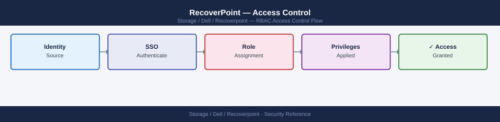

---
tags:
  - dell
  - security
---
# RecoverPoint — Access Control

Access Control reference covering Role-Based Access Control.

*Applies to: RecoverPoint 5.x*

## Before you begin

- **Access:** Storage admin credentials (cluster admin or equivalent)
- **Change management:** security changes require CAB approval in most environments
- **Rollback plan:** document current state before any security control change
- **Testing:** validate in a non-production environment first where possible

---

---

## See also

- [Recoverpoint — Authentication](../authentication/)
- [Recoverpoint — Hardening](../hardening/)
- [Recoverpoint — Encryption](../encryption/)
