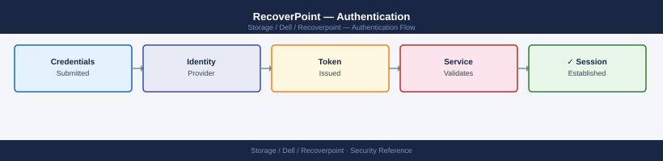

---
tags:
  - dell
  - security
---
# RecoverPoint — Authentication


<div class="kb-summary">
RecoverPoint authentication: local account management via Unisphere, API token generation and rotation, LDAP integration via `set_ldap_config`, and session timeout.

*Applies to: RecoverPoint 5.x*
</div>



Forward to SIEM via syslog: Management Console → System Settings → Syslog Notifications. Alert on:
- Any admin account login outside business hours
- `enable_image_access` events (indicates failover test or actual DR)
- User account creation or role changes

```d2
direction: down

external: External / Untrusted {shape: rectangle}
perimeter_controls: "Perimeter Controls" {shape: rectangle}
identity_access: "Identity & Access" {shape: rectangle}
audit_logging: "Audit & Logging" {shape: rectangle}
core: "RecoverPoint Core" {shape: hexagon}

external -> perimeter_controls: traffic in
perimeter_controls -> identity_access
identity_access -> audit_logging
audit_logging -> core: secured path
```

## Before you begin

- **Access:** Storage admin credentials (cluster admin or equivalent)
- **Change management:** security changes require CAB approval in most environments
- **Rollback plan:** document current state before any security control change
- **Testing:** validate in a non-production environment first where possible

---

---

## See also

- [Recoverpoint — Access Control](access-control/)
- [Recoverpoint — Hardening](hardening/)
- [Recoverpoint — Encryption](encryption/)
