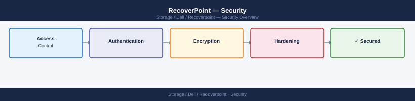

---
tags:
  - dell
  - security
---
# RecoverPoint — Security

RecoverPoint hardening — management access control, user roles, TLS configuration, and audit logging.

*Applies to: RecoverPoint 5.x*

<a class="kb-card" href="authentication/">
  <strong>Authentication</strong>
  Authentication configuration and identity management.
</a>

<a class="kb-card" href="access-control/">
  <strong>Access Control</strong>
  Roles, permissions, and least privilege access.
</a>

<a class="kb-card" href="encryption/">
  <strong>Encryption</strong>
  Data encryption and secure communication.
</a>

<a class="kb-card" href="hardening/">
  <strong>Hardening</strong>
  Security baselines and compliance configuration.
</a>

