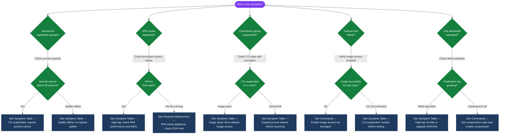

---
tags:
  - dell
  - troubleshooting
search:
  boost: 1.5
---
# RecoverPoint — Common Issues

```bash
# Via boxmgmt SSH to RPA
boxmgmt cg check_cg <CG-name>
boxmgmt list cg
boxmgmt system status
```
```text
┌──────────────────────────────────── RecoverPoint — Common Issues ─────────────────────────────────────┐
│                                                                                                       │
│   │     Symptom      │   Likely Cause   │    First Check    │       Fix        │      Verify      │   │
│   │     High lag     │  WAN congestion  │ get compression s │throttle or upgra │   get all rpas   │   │
│   │   CG suspended   │   journal full   │ check journal cap │expand journal vo │  get journal st  │   │
│   │ Splitter offline │ESXi host restart │ vSphere events lo │re-register split │  get splitter i  │   │
│   │   Image stuck    │stale image acces │ image access disa │  force release   │  get all groups  │   │
│   └───────────────────────────────────────────────────────────────────────────────────────────────┘   │
│                                                                                                       │
│   ┌───────────────────────────────────────────────────────────────────────────────────────────────┐   │
│   │                                     General Triage Pattern                                    │   │
│   │          Is the issue new or recurring? New = recent change; Recurring = config problem       │   │
│   │             Is it isolated to one source or all? Isolated = agent; All = server/repo          │   │
│   │                          Check logs first: image access enable/disable                        │   │
│   │                    If unresolved in 2h: open vendor case with full log bundle                 │   │
│   └───────────────────────────────────────────────────────────────────────────────────────────────┘   │
│                                                                                                       │
│  Physical Infrastructure:                                                                             │
│  RPA virtual appliances on ESXi · Journal volumes on storage array · WAN link between sites           │
│  Key terms:                                                                                           │
│                                                                                                       │
│  RPA           = RecoverPoint Appliance — virtual appliance managing journal and replication          │
│  Splitter      = intercepts host I/O at hypervisor or array level; sends copy to RPA                  │
│  Journal       = write-order-consistent storage capturing all writes for point-in-time access         │
│  Consistency Group= set of volumes protected together; writes are applied in order across all         │
│  Bookmark      = named marker in journal; enables deterministic recovery to a known state             │
│  Image Access  = mounting a journal point-in-time image to a host for testing or recovery             │
│  Failover      = activating the replica at the recovery site; breaks replication relationship         │
│  Test Copy     = non-disruptive image access for validation without breaking replication              │
│  RPO           = Recovery Point Objective; how much data loss is acceptable; CDP = near-zero          │
│  RTO           = Recovery Time Objective; time from failover to service restored                      │
│  Reverse       = after failover, replicates from recovery site back to re-sync production             │
│  Splitter Lag  = delay between host write and journal commit; monitor for replication health          │
│  CDP           = Continuous Data Protection; every write journaled, not just scheduled snaps          │
│  Distributed CG= consistency group spanning volumes on multiple storage arrays                        │
│                                                                                                       │
└───────────────────────────────────────────────────────────────────────────────────────────────────────┘
```
```bash
boxmgmt cg check_cg <CG-name>
boxmgmt system performance
```
```bash
boxmgmt cg enable_image_access <CG-name> <copy-name>
boxmgmt cg recover_production <CG-name>
```

## Diagnostic Flow



---

## Before you begin

- **Access:** Storage admin credentials (cluster admin or equivalent)
- **Gather first:** recent error message text, event timestamps, and affected object names
- **Scope:** confirm whether the issue affects a single object, host, cluster, or site
- **Escalation:** open a vendor support ticket before running any destructive step
- **Logging:** document each command and output — required if escalation is needed

---

---

## Verify resolution

- Confirm the original symptom no longer occurs
- Check logs for any residual errors related to the issue
- Monitor for 10–15 minutes to confirm the fix is stable

---

## See also

- [Recoverpoint — Diagnostics](diagnostics/)
- [Recoverpoint — Escalation](escalation/)
- [Recoverpoint — Health Checks](../operations/health-checks/)
