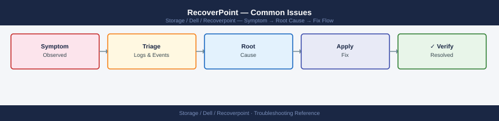

---
tags:
  - dell
  - troubleshooting
search:
  boost: 1.5
---
# RecoverPoint — Common Issues

*Applies to: Dell EMC Storage*


```bash
# Via boxmgmt SSH to RPA
boxmgmt cg check_cg <CG-name>
boxmgmt list cg
boxmgmt system status
```


```text title="Expected output"
Consistency Group: prod-db-cg
  Status: HEALTHY
  RPOs: 4
  Replicas: 2
  Last Sync: 2024-01-15 14:32:18 UTC
  Replication Rate: 2.3 GB/min

Consistency Groups:
  prod-db-cg          HEALTHY      2 replicas
  backup-vm-cg        HEALTHY      1 replica
  archive-cg          WARNING      2 replicas
  test-cg             HEALTHY      1 replica

System Status Report - RPA-001 (10.45.120.88)
  Firmware: 8.2.1.4521
  Uptime: 247 days 14:32:18
  CPU Usage: 34%
  Memory Usage: 68%
  Disk Usage: 71%
  Network: OPERATIONAL
  Replication Engine: RUNNING
```

!!! warning "Common errors"
    **`boxmgmt: command not found`** — Ensure you are connected via SSH to the RPA appliance and not a local workstation.
    **`Error: Consistency Group '<CG-name>' not found`** — Replace `<CG-name>` with an actual consistency group name from the `boxmgmt list cg` output.
    **`Connection refused on port 22`** — Verify the RPA hostname/IP is reachable and SSH service is running with `ping` and check firewall rules.
```bash
boxmgmt cg check_cg <CG-name>
boxmgmt system performance
```

```text title="Expected output"
Consistency Group: prod-db-cg
Status: HEALTHY
RTO: 4 minutes
RPO: 2 minutes
Replication Link: ACTIVE
Last Sync: 2024-01-15 14:32:18 UTC
Protected VMs: 8
Replicated Data: 847.3 GB

System Performance Report
CPU Usage: 34%
Memory Usage: 62%
Network Throughput: 1.2 Gbps
Disk I/O: 4,521 IOPS
Cache Hit Ratio: 87.3%
```

!!! warning "Common errors"
    **`boxmgmt: command not found`** — Ensure the RecoverPoint management tools are installed and the PATH includes the boxmgmt binary location (typically `/opt/emc/recoverpoint/bin`).
    **`Error: CG '<CG-name>' not found or inaccessible`** — Replace `<CG-name>` with the actual consistency group name and verify you have sufficient permissions to query it.
    **`Connection refused: Unable to reach appliance at <IP>`** — Verify the RecoverPoint appliance is running and network connectivity exists from your management host to the appliance management interface.
```bash
boxmgmt cg enable_image_access <CG-name> <copy-name>
boxmgmt cg recover_production <CG-name>
```

```d2
direction: down

symptom: Identify Symptom {shape: diamond}
diagnostic_flow: "Diagnostic Flow" {shape: rectangle}
verify_resolution: "Verify resolution" {shape: rectangle}
resolution: Resolve or Escalate {shape: oval}

symptom -> diagnostic_flow: investigate
symptom -> verify_resolution: investigate
diagnostic_flow -> resolution
verify_resolution -> resolution
```

## Diagnostic Flow

```d2
direction: right

D1: "D1" {shape: rectangle}
R1: "See Symptom Table —\nCG suspended: expand journal volume" {shape: rectangle}
R2: "See Symptom Table —\nSplitter offline: re-register splitter" {shape: rectangle}
D2: "D2" {shape: rectangle}
R3: "See Symptom Table —\nHigh lag: check RPA performance and WAN" {shape: rectangle}
R4: "See Physical Infrastructure —\nRPA virtual appliance: check ESXi host" {shape: rectangle}
D3: "D3" {shape: rectangle}
R5: "See Symptom Table —\nImage stuck: force release image access" {shape: rectangle}
R6: "See Symptom Table —\nExpand journal volume before resuming" {shape: rectangle}
D4: "D4" {shape: rectangle}
R7: "See Commands —\nEnable image access via boxmgmt" {shape: rectangle}
R8: "See Symptom Table —\nCG suspended: resolve before testing" {shape: rectangle}
D5: "D5" {shape: rectangle}
R9: "See Symptom Table —\nHigh lag: throttle or upgrade WAN link" {shape: rectangle}
R10: "See Commands —\nGet compression stats and enable compression" {shape: rectangle}
S: "What is the symptom?" {shape: rectangle}
B1: "B1" {shape: rectangle}
B2: "B2" {shape: rectangle}
B3: "B3" {shape: rectangle}
B4: "B4" {shape: rectangle}
B5: "B5" {shape: rectangle}

D1 -> R1
D1 -> R2
D2 -> R3
D2 -> R4
D3 -> R5
D3 -> R6
D4 -> R7
D4 -> R8
D5 -> R9
D5 -> R10
```

---

## Before you begin

- **Access:** Storage admin credentials (cluster admin or equivalent)
- **Gather first:** recent error message text, event timestamps, and affected object names
- **Scope:** confirm whether the issue affects a single object, host, cluster, or site
- **Escalation:** open a vendor support ticket before running any destructive step
- **Logging:** document each command and output — required if escalation is needed

---

---

## Verify resolution

- Confirm the original symptom no longer occurs
- Check logs for any residual errors related to the issue
- Monitor for 10–15 minutes to confirm the fix is stable

---

## See also

- [Recoverpoint — Diagnostics](../diagnostics/)
- [Recoverpoint — Escalation](../escalation/)
- [Recoverpoint — Health Checks](../../operations/health-checks/)
