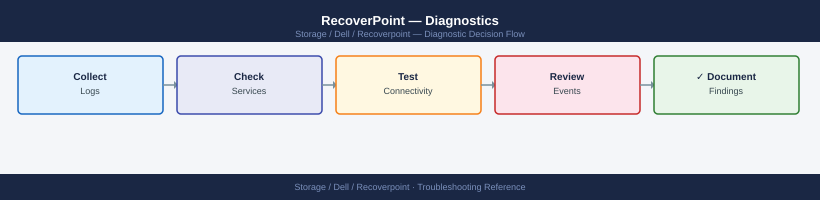

---
tags:
  - dell
  - troubleshooting
search:
  boost: 1.5
---
# RecoverPoint — Diagnostics

<div class="kb-summary">
RecoverPoint diagnostic commands: RPA health, consistency group state, journal utilization, splitter status, and support bundle collection via SSH CLI and the management web interface.

*Applies to: Dell RecoverPoint 5.x / 6.x*
</div>


```d2
direction: right

A: "Issue Reported" {shape: rectangle}
B: "SSH to RPA\nget system status" {shape: rectangle}
C: "C" {shape: rectangle}
D: "Check alerts\nget alerts" {shape: rectangle}
E: "Check CG states\nget cg list" {shape: rectangle}
F: "F" {shape: rectangle}
G: "get cg detailed_state\nIdentify affected CG" {shape: rectangle}
H: "Monitor sync progress\nget journal stats" {shape: rectangle}
I: "I" {shape: rectangle}
J: "Check link bandwidth\nget link stats" {shape: rectangle}
K: "Collect support bundle\nsupport collect bundle" {shape: rectangle}
L: "Open Dell SR\nAttach bundle" {shape: rectangle}

A -> B
C -> D
C -> E
F -> G
F -> H
H -> I
I -> J
I -> K
J -> K
D -> K
K -> L
```

```d2
direction: down

symptom: Identify Symptom {shape: diamond}
step_1_check_overall_system_status: "Step 1 — Check overall system status" {shape: rectangle}
step_2_check_consistency_group_state: "Step 2 — Check consistency group states" {shape: rectangle}
step_3_check_journal_utilization_and: "Step 3 — Check journal utilization and lag" {shape: rectangle}
step_4_check_network_connectivity_be: "Step 4 — Check network connectivity between sites" {shape: rectangle}
step_5_check_splitter_status: "Step 5 — Check splitter status" {shape: rectangle}
step_6_collect_support_bundle: "Step 6 — Collect support bundle" {shape: rectangle}
resolution: Resolve or Escalate {shape: oval}

symptom -> step_1_check_overall_system_status: investigate
symptom -> step_2_check_consistency_group_state: investigate
symptom -> step_3_check_journal_utilization_and: investigate
symptom -> step_4_check_network_connectivity_be: investigate
symptom -> step_5_check_splitter_status: investigate
symptom -> step_6_collect_support_bundle: investigate
step_1_check_overall_system_status -> resolution
step_2_check_consistency_group_state -> resolution
step_3_check_journal_utilization_and -> resolution
step_4_check_network_connectivity_be -> resolution
step_5_check_splitter_status -> resolution
step_6_collect_support_bundle -> resolution
```

## Before you begin

- **Access:** SSH to the RecoverPoint management IP as `admin`; or log in to the RecoverPoint management web UI
- **Gather first:** which consistency group is affected, current RPO lag values, and the exact error shown in the management web UI
- **Scope:** confirm whether the issue affects a single CG, all CGs at one cluster, or all CGs across both clusters
- **Do not fail over:** do not initiate image access or failover without confirming the root cause — image access on a CG breaks the active replication link for that group
- **Logging:** run each diagnostic command and save the output before calling Dell support

---

## Step 1 — Check overall system status

```bash
# SSH to the RecoverPoint management appliance
ssh admin@<rpa-management-ip>

# System-wide health summary
get system status
# Expected output (healthy):
#   System health status: OK
#   Number of RPAs: 2
#   System alerts: 0 active

# Check active alerts
get alerts
# Output includes: Alert time, Severity (WARNING/ERROR), description
# Note the alert text verbatim — include in SR description

# Check each RPA appliance health
get rpa status
# Expected: all RPAs show STATUS=Active; no communication errors
```


```text title="Expected output"
admin@rpa-mgmt-01:~> get system status
System health status: OK
Number of RPAs: 2
System alerts: 0 active
Last system check: 2024-01-15 14:32:18 UTC
Cluster mode: Active-Active

admin@rpa-mgmt-01:~> get alerts
No active alerts found.
Last alert cleared: 2024-01-15 09:47:22 UTC by admin

admin@rpa-mgmt-01:~> get rpa status
RPA-01 (10.45.12.33):
  STATUS: Active
  Role: Primary
  Replication links: 4/4 healthy
  Last heartbeat: 2024-01-15 14:32:15 UTC

RPA-02 (10.45.12.34):
  STATUS: Active
  Role: Secondary
  Replication links: 4/4 healthy
  Last heartbeat: 2024-01-15 14:32:16 UTC
```

!!! warning "Common errors"
    **`Connection refused — check that the RecoverPoint management appliance is powered on and SSH is enabled on port 22.`** — Verify network connectivity and appliance status with `ping <rpa-management-ip>` first.
    **`Authentication failed for user admin`** — Confirm credentials with your RecoverPoint administrator or reset the admin password via the appliance console.
    **`RPA-02 STATUS: Unreachable — communication error`** — Check network connectivity between management appliance and RPA-02, and verify no firewall rules are blocking the replication network.
**If output shows:**
- `System health status: ERROR` → check `get alerts` for the specific fault
- One RPA offline → check ESXi host where the RPA VM runs; verify power state and datastore access
- `Connectivity ERROR` between RPAs → network issue between sites; proceed to Step 4

---

## Step 2 — Check consistency group states

```bash
# List all CGs and their current state
get cg list
# Expected output columns: CG Name, Protection State, RPO, Lag
# Healthy state: Protection State = Active
# Problem states: Paused, Error, Initializing, Image Access

# Detailed state for a specific CG
get cg detailed_state "<cg-name>"
# Shows: R/W state per copy, journal utilization %, current lag, last bookmark time

# If the CG is in Error state — look for the error string in output
# Common errors:
#   "Journal utilization > 80%" = writes filling journal faster than draining to DR
#   "Splitter connectivity lost" = hypervisor/array splitter not delivering I/O to RPA
#   "Link communication error" = network path between sites is degraded
```


```text title="Expected output"
get cg list
CG Name                    Protection State    RPO        Lag
prod-db-01                 Active              00:05:00   00:00:12
prod-app-tier              Active              00:15:00   00:00:45
dr-sync-test               Paused              00:10:00   00:02:30
backup-archive-cg          Error               00:30:00   00:45:15
legacy-vm-pool             Initializing        01:00:00   N/A

get cg detailed_state "prod-db-01"
CG Name: prod-db-01
Protection State: Active
R/W State (Production Copy): Write Enabled
R/W State (DR Copy): Read Only
Journal Utilization: 62%
Current Lag: 00:00:12
Last Bookmark Time: 2024-01-15 14:32:18 UTC
Replication Link Status: Connected
```

!!! warning "Common errors"
    **`Journal utilization > 80%`** — Increase journal size on the RPA or reduce write rate to the protected volume by identifying and throttling heavy workloads.
    **`Splitter connectivity lost`** — Verify the hypervisor/array splitter is running and has network connectivity to the RPA by checking splitter logs and restarting the splitter service if needed.
    **`Link communication error`** — Check network connectivity between sites using `ping` and `traceroute` to the DR site IP, and verify firewall rules allow RPA replication ports (typically 7105-7110).
**Decision flow:**
- `Active` with high lag → proceed to journal and link diagnostics (Steps 3–4)
- `Paused` → identify who paused it; check for maintenance windows; resume only after confirming data is consistent
- `Error` → get the full error string and match to Common Issues
- `Initializing` → monitor sync progress with `get journal stats`

---

## Step 3 — Check journal utilization and lag

```bash
# Journal statistics for a specific CG
get journal stats "<cg-name>"
# Key fields to review:
#   Production journal utilization: should be < 20%
#   Remote journal utilization:     should be < 20%
#   Lag (seconds): acceptable < RPO; alert if > 50% of RPO target
#   Min/Avg RPO: actual RPO achieved; compare to required SLA

# All-CG journal summary
get all journal stats
# Review each CG row for utilization; highlight any > 50%
```


```text title="Expected output"
Journal Statistics for CG: prod-db-01
Production Journal Utilization: 18.5%
Remote Journal Utilization: 12.3%
Lag (seconds): 8.2
Min RPO (seconds): 5.1
Avg RPO (seconds): 7.8
Max RPO (seconds): 12.4

All CGs Journal Summary:
CG Name              | Prod Util | Remote Util | Lag (s) | Avg RPO (s)
prod-db-01          | 18.5%     | 12.3%       | 8.2     | 7.8
prod-app-02         | 45.2%     | 38.1%       | 22.5    | 19.3
prod-web-03         | 67.8%     | 71.2%       | 156.3   | 142.1
dr-sync-04          | 9.1%      | 8.7%        | 3.1     | 2.9
archive-old-05      | 52.3%     | 49.8%       | 78.9    | 75.2
```

!!! warning "Common errors"
    **`Error: CG '<cg-name>' not found in cluster`** — Verify the exact CG name with `get cgs` and ensure it exists on the connected RecoverPoint appliance.
    **`Error: Journal statistics unavailable - replication not initialized`** — Initialize replication for the CG or wait for the initial snapshot to complete before querying journal stats.
    **`Connection timeout: unable to reach RecoverPoint management interface`** — Confirm network connectivity to the RecoverPoint appliance IP and verify credentials with `connect <rp-ip>`.
**If journal utilization is high (> 60%):**
1. Check if host I/O to the production LUNs is abnormally elevated
2. Check WAN link bandwidth in Step 4 — journal drains to DR over the replication link
3. Check RPA CPU utilization in `get rpa status` — if > 80%, RPA may not be processing the journal fast enough

---

## Step 4 — Check network connectivity between sites

```bash
# Network connectivity between clusters
get network status
# Expected: < 5ms latency, 0% packet loss (production); < 80ms for typical WAN

# Check replication link bandwidth and quality
get link stats
# Key fields:
#   Bandwidth (Mbps): current vs maximum
#   Packet loss %:    should be 0%
#   Round-trip time:  should be stable; spikes indicate congestion

# Reachability between all RPA nodes
get connectivity status
# Lists reachability of each RPA node from every other RPA node in the cluster pair
```


```text title="Expected output"
Network Status:
  Cluster: prod-rpa-01
  Link Latency: 3.2ms
  Packet Loss: 0.0%
  Status: HEALTHY

  Cluster: prod-rpa-02
  Link Latency: 4.8ms
  Packet Loss: 0.0%
  Status: HEALTHY

Link Statistics:
  Bandwidth Current: 847 Mbps
  Bandwidth Maximum: 1000 Mbps
  Packet Loss: 0.0%
  Round-trip Time: 4.1ms (avg), 5.3ms (peak)
  Link Quality: EXCELLENT

Connectivity Status:
  RPA Node prod-rpa-01-node1 → prod-rpa-02-node1: REACHABLE (2.9ms)
  RPA Node prod-rpa-01-node1 → prod-rpa-02-node2: REACHABLE (3.1ms)
  RPA Node prod-rpa-01-node2 → prod-rpa-02-node1: REACHABLE (3.0ms)
  RPA Node prod-rpa-01-node2 → prod-rpa-02-node2: REACHABLE (3.2ms)
  All nodes: FULLY CONNECTED
```

!!! warning "Common errors"
    **`Error: Unable to retrieve network status — connection timeout`** — Verify network connectivity to the RPA management interface and confirm firewall rules allow port 9443 between clusters.
    **`Packet Loss: 2.3% detected on replication link`** — Check for congested network interfaces, duplex mismatches, or faulty cables; consider reducing replication load or increasing link bandwidth.
    **`RPA Node prod-rpa-02-node2 → prod-rpa-01-node1: UNREACHABLE`** — Verify the unreachable node is online, check routing tables, and confirm no network ACLs are blocking inter-cluster traffic on port 9898.
**If connectivity is degraded:**
- Contact the network team to check the WAN link quality between sites
- Verify QoS policy is applying the correct priority to RecoverPoint replication traffic

---

## Step 5 — Check splitter status

```bash
# Splitter health from the RPA CLI
get splitter status
# Lists each splitter by name, type (vRPA / array), and connectivity state
# Expected: all splitters show "Connected"
```


```text title="Expected output"
Splitter Name          Type    Status      Last Heartbeat
================================================================================
splitter-prod-01       vRPA    Connected   2024-01-15 14:32:18 UTC
splitter-prod-02       vRPA    Connected   2024-01-15 14:32:19 UTC
splitter-array-san01   array   Connected   2024-01-15 14:32:17 UTC
splitter-array-san02   array   Connected   2024-01-15 14:32:18 UTC
splitter-dr-01         vRPA    Connected   2024-01-15 14:32:20 UTC
```

!!! warning "Common errors"
    **`Error: Unable to connect to RPA management interface`** — Verify RPA cluster is running with `get system status` and check network connectivity to the RPA management IP.
    **`Splitter <name> status: Disconnected`** — Restart the splitter service with `set splitter restart <name>` or verify network path and firewall rules between RPA and splitter.
**If a vSphere splitter shows "Disconnected":**
1. Check network from RPA to ESXi management interface (TCP 7225)
2. On the ESXi host, verify the splitter VIB is installed:
   - vCenter → Hosts → `<host>` → Configure → Software → Installed VIBs → search for `rp`

**For array-side splitter (PowerMax/Unity):**
- Verify the SRDF relationship between production and journal LUNs is active via Solutions Enabler:
```bash
symrdf query -sid <SID> -rdfg <journal-rdfg>
```


```text title="Expected output"
RDF Group Query Results
=======================
RDF Group ID: 000187654321
RDF Group Name: journal-rdfg
Status: Ready
Consistency Groups: 3
  - cg_prod_db01 (RDF Mode: Synchronous, Link State: Connected)
  - cg_prod_db02 (RDF Mode: Synchronous, Link State: Connected)
  - cg_prod_app01 (RDF Mode: Asynchronous, Link State: Connected)
Total Replication Pairs: 12
Data Replicated (GB): 2847.5
Last Sync Time: 2024-01-15 14:32:18 UTC
Remote Array: 000298765432
```

!!! warning "Common errors"
    **`SYMRDF ERROR (4): RDF group '<journal-rdfg>' not found on array <SID>`** — Verify the RDF group name matches exactly (case-sensitive) using `symrdf list -sid <SID>`.
    **`SYMRDF ERROR (26): Cannot connect to array <SID> - Check Symmetrix connectivity`** — Ensure the Symmetrix array is reachable and the SID is correct; verify network connectivity with `symcfg list -v`.
---

## Step 6 — Collect support bundle

```bash
# Method 1: CLI
ssh admin@<rpa-management-ip>
support collect bundle
# Output file path is displayed after collection completes
# Download via SCP:
scp admin@<rpa-mgmt-ip>:/opt/rp/var/support/rp-*.zip /tmp/

# Method 2: Web UI
# Navigate to RecoverPoint Management UI → Administration → Support → Collect Support Bundle
# Click "Collect" → download the ZIP when complete
```


```text title="Expected output"
admin@192.168.1.45's password: 
RecoverPoint CLI v5.4.2.1 (Build 12847)
rpa-mgmt-01> support collect bundle
Collecting support bundle...
[████████████████████████████] 100%
Support bundle collection completed successfully.
Output file: /opt/rp/var/support/rp-bundle-20240115-143022.zip
Size: 487 MB
rpa-mgmt-01> exit

admin@192.168.1.45:/opt/rp/var/support/rp-bundle-20240115-143022.zip 100%  487MB   8.2MB/s   00:59
```

!!! warning "Common errors"
    **`Permission denied (publickey,password)`** — Verify SSH credentials and ensure the admin user exists on the RPA management interface with correct network connectivity.
    **`No such file or directory`** — Confirm the RPA management IP address is correct and the support bundle collection completed successfully before attempting SCP download.
    **`Disk quota exceeded`** — Ensure `/tmp/` has at least 500 MB free space or specify an alternate download destination with sufficient capacity.
---

## Log locations

| Component | Path / Location | What to look for |
|---|---|---|
| RPA system log | Support bundle: `rp-system.log` | Connectivity errors, journal overflow events |
| vRPA service log | Support bundle: `vrpa-service.log` | Splitter communication errors |
| RecoverPoint events | Management UI → Events | Alerts with severity WARNING or ERROR |
| ESXi host log | ESXi: `/var/log/vmkwarning.log` | VIB/filter errors for the RP splitter |

---

## Quick all-in-one diagnostic snapshot

```bash
# Run from your workstation — saves output for SR attachment
ssh admin@<rpa-mgmt-ip> "
  get system status;
  get alerts;
  get cg list;
  get rpa status;
  get network status;
  get splitter status;
  get all journal stats
" > /tmp/rp-diag-$(date +%F-%H%M).txt
```


```text title="Expected output"
System Status:
  System Name: rpa-prod-01.dc1.local
  System ID: 192.168.10.45
  System State: HEALTHY
  Build Version: 5.4.2.1234
  Uptime: 45 days 12 hours

Alerts:
  Alert ID: ALR-2847392
  Severity: WARNING
  Message: Journal capacity at 78% on RPA-02
  Timestamp: 2024-01-15 14:32:18

Consistency Groups:
  CG Name: prod-db-01
  CG ID: cg-uuid-a1b2c3d4
  Status: ACTIVE
  RPA Status:
    RPA-01: HEALTHY
    RPA-02: HEALTHY
    RPA-03: HEALTHY

Network Status:
  Interface eth0: UP (1000 Mbps)
  Interface eth1: UP (1000 Mbps)
  Default Gateway: 192.168.10.1

Splitter Status:
  Splitter ID: split-prod-01
  Status: CONNECTED
  Latency: 2.4ms

Journal Stats:
  Total Capacity: 2.5 TB
  Used: 1.95 TB
  Available: 550 GB
  Oldest Journal: 2024-01-10 08:15:22
```

!!! warning "Common errors"
    **`ssh: Could not resolve hostname <rpa-mgmt-ip>`** — Replace `<rpa-mgmt-ip>` with the actual RecoverPoint management IP address (e.g., 192.168.10.45).
    **`Permission denied (publickey,password)`** — Verify the admin account credentials and that your SSH key is authorized on the RPA, or use `ssh -u admin@<rpa-mgmt-ip>` with password authentication enabled.
    **`get: command not found`** — Ensure you are connecting to a RecoverPoint Appliance management interface; these commands only work on the RPA CLI, not standard Linux shells.
---

## See also

- [RecoverPoint — Common Issues](../common-issues/)
- [RecoverPoint — Escalation](../escalation/)
- [RecoverPoint — Health Checks](../../operations/health-checks/)

## Verify resolution

- `get cg list` shows all CGs in `Active` state
- `get journal stats` shows production and remote journal utilization below 30%
- RPO lag values are within the configured RPO threshold for each CG
- `get alerts` shows 0 active alerts
- Monitor CG state for 15 minutes to confirm no re-occurrence
