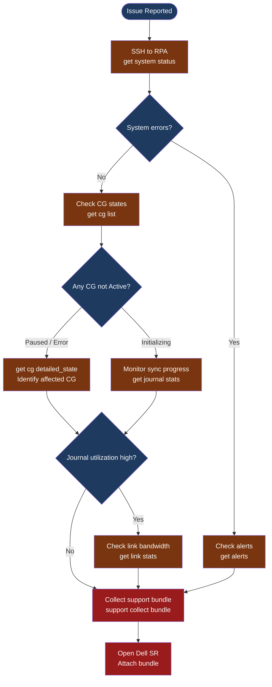

---
tags:
  - dell
  - troubleshooting
search:
  boost: 1.5
---
# RecoverPoint — Diagnostics

<div class="kb-summary">
RecoverPoint diagnostic commands: RPA health, consistency group state, journal utilization, splitter status, and support bundle collection via SSH CLI and the management web interface.

*Applies to: Dell RecoverPoint 5.x / 6.x*
</div>

```text
┌──────────────────────────────────────── RecoverPoint — Diagnostics ───────────────────────────────────┐
│                                                                                                       │
│   ┌───────────────────────────────────────────────────────────────────────────────────────────────────┐│
│   │   Start here: SSH to RPA → check system status → check CG states → collect support bundle        ││
│   │   CG in "Initialization" = syncing; "Active" = healthy; "Paused" = suspended; "Error" = fault    ││
│   │   Journal utilization > 80% = writes not draining; check link bandwidth and RPO lag              ││
│   └───────────────────────────────────────────────────────────────────────────────────────────────────┘│
│                                                                                                       │
│   ┌────────────────────────────────┐  ┌────────────────────────────────┐  ┌────────────────────────┐  │
│   │         RPA Health             │  │      CG Diagnostics            │  │     Support Bundle     │  │
│   │   get system status            │  │   get cg list                  │  │  support collect       │  │
│   │   get rpa status               │  │   get cg detailed_state        │  │  bundle (CLI)          │  │
│   │   get network status           │  │   get journal stats            │  │  Admin UI → Support    │  │
│   │   get alerts                   │  │   get link stats               │  │  → Collect Bundle      │  │
│   └────────────────────────────────┘  └────────────────────────────────┘  └────────────────────────┘  │
│                                                                                                       │
│  Physical Infrastructure:                                                                             │
│  RPA virtual appliances on ESXi · Journal volumes on storage array · WAN link between sites           │
│                                                                                                       │
│  Key terms:                                                                                           │
│  RPA         = RecoverPoint Appliance; manages journal and replication for all CGs at a cluster       │
│  Splitter    = intercepts host I/O at hypervisor or array level; sends copy to RPA                    │
│  Journal     = write-order-consistent storage capturing all writes for point-in-time access           │
│  CG          = Consistency Group; set of volumes replicated together in write order                   │
│  Bookmark    = named marker in journal; enables deterministic recovery to a known state               │
│  Image Access= mounting a journal point-in-time image to a host for testing or recovery               │
│  RPO Lag     = delay between source write and journal commit at recovery site                         │
│  CDP         = Continuous Data Protection; every write journaled, not just scheduled snapshots        │
│                                                                                                       │
└───────────────────────────────────────────────────────────────────────────────────────────────────────┘
```



## Before you begin

- **Access:** SSH to the RecoverPoint management IP as `admin`; or log in to the RecoverPoint management web UI
- **Gather first:** which consistency group is affected, current RPO lag values, and the exact error shown in the management web UI
- **Scope:** confirm whether the issue affects a single CG, all CGs at one cluster, or all CGs across both clusters
- **Do not fail over:** do not initiate image access or failover without confirming the root cause — image access on a CG breaks the active replication link for that group
- **Logging:** run each diagnostic command and save the output before calling Dell support

---

## Step 1 — Check overall system status

```bash
# SSH to the RecoverPoint management appliance
ssh admin@<rpa-management-ip>

# System-wide health summary
get system status
# Expected output (healthy):
#   System health status: OK
#   Number of RPAs: 2
#   System alerts: 0 active

# Check active alerts
get alerts
# Output includes: Alert time, Severity (WARNING/ERROR), description
# Note the alert text verbatim — include in SR description

# Check each RPA appliance health
get rpa status
# Expected: all RPAs show STATUS=Active; no communication errors
```

**If output shows:**
- `System health status: ERROR` → check `get alerts` for the specific fault
- One RPA offline → check ESXi host where the RPA VM runs; verify power state and datastore access
- `Connectivity ERROR` between RPAs → network issue between sites; proceed to Step 4

---

## Step 2 — Check consistency group states

```bash
# List all CGs and their current state
get cg list
# Expected output columns: CG Name, Protection State, RPO, Lag
# Healthy state: Protection State = Active
# Problem states: Paused, Error, Initializing, Image Access

# Detailed state for a specific CG
get cg detailed_state "<cg-name>"
# Shows: R/W state per copy, journal utilization %, current lag, last bookmark time

# If the CG is in Error state — look for the error string in output
# Common errors:
#   "Journal utilization > 80%" = writes filling journal faster than draining to DR
#   "Splitter connectivity lost" = hypervisor/array splitter not delivering I/O to RPA
#   "Link communication error" = network path between sites is degraded
```

**Decision flow:**
- `Active` with high lag → proceed to journal and link diagnostics (Steps 3–4)
- `Paused` → identify who paused it; check for maintenance windows; resume only after confirming data is consistent
- `Error` → get the full error string and match to Common Issues
- `Initializing` → monitor sync progress with `get journal stats`

---

## Step 3 — Check journal utilization and lag

```bash
# Journal statistics for a specific CG
get journal stats "<cg-name>"
# Key fields to review:
#   Production journal utilization: should be < 20%
#   Remote journal utilization:     should be < 20%
#   Lag (seconds): acceptable < RPO; alert if > 50% of RPO target
#   Min/Avg RPO: actual RPO achieved; compare to required SLA

# All-CG journal summary
get all journal stats
# Review each CG row for utilization; highlight any > 50%
```

**If journal utilization is high (> 60%):**
1. Check if host I/O to the production LUNs is abnormally elevated
2. Check WAN link bandwidth in Step 4 — journal drains to DR over the replication link
3. Check RPA CPU utilization in `get rpa status` — if > 80%, RPA may not be processing the journal fast enough

---

## Step 4 — Check network connectivity between sites

```bash
# Network connectivity between clusters
get network status
# Expected: < 5ms latency, 0% packet loss (production); < 80ms for typical WAN

# Check replication link bandwidth and quality
get link stats
# Key fields:
#   Bandwidth (Mbps): current vs maximum
#   Packet loss %:    should be 0%
#   Round-trip time:  should be stable; spikes indicate congestion

# Reachability between all RPA nodes
get connectivity status
# Lists reachability of each RPA node from every other RPA node in the cluster pair
```

**If connectivity is degraded:**
- Contact the network team to check the WAN link quality between sites
- Verify QoS policy is applying the correct priority to RecoverPoint replication traffic

---

## Step 5 — Check splitter status

```bash
# Splitter health from the RPA CLI
get splitter status
# Lists each splitter by name, type (vRPA / array), and connectivity state
# Expected: all splitters show "Connected"
```

**If a vSphere splitter shows "Disconnected":**
1. Check network from RPA to ESXi management interface (TCP 7225)
2. On the ESXi host, verify the splitter VIB is installed:
   - vCenter → Hosts → `<host>` → Configure → Software → Installed VIBs → search for `rp`

**For array-side splitter (PowerMax/Unity):**
- Verify the SRDF relationship between production and journal LUNs is active via Solutions Enabler:
```bash
symrdf query -sid <SID> -rdfg <journal-rdfg>
```

---

## Step 6 — Collect support bundle

```bash
# Method 1: CLI
ssh admin@<rpa-management-ip>
support collect bundle
# Output file path is displayed after collection completes
# Download via SCP:
scp admin@<rpa-mgmt-ip>:/opt/rp/var/support/rp-*.zip /tmp/

# Method 2: Web UI
# Navigate to RecoverPoint Management UI → Administration → Support → Collect Support Bundle
# Click "Collect" → download the ZIP when complete
```

---

## Log locations

| Component | Path / Location | What to look for |
|---|---|---|
| RPA system log | Support bundle: `rp-system.log` | Connectivity errors, journal overflow events |
| vRPA service log | Support bundle: `vrpa-service.log` | Splitter communication errors |
| RecoverPoint events | Management UI → Events | Alerts with severity WARNING or ERROR |
| ESXi host log | ESXi: `/var/log/vmkwarning.log` | VIB/filter errors for the RP splitter |

---

## Quick all-in-one diagnostic snapshot

```bash
# Run from your workstation — saves output for SR attachment
ssh admin@<rpa-mgmt-ip> "
  get system status;
  get alerts;
  get cg list;
  get rpa status;
  get network status;
  get splitter status;
  get all journal stats
" > /tmp/rp-diag-$(date +%F-%H%M).txt
```

---

## See also

- [RecoverPoint — Common Issues](common-issues/)
- [RecoverPoint — Escalation](escalation/)
- [RecoverPoint — Health Checks](../operations/health-checks/)

## Verify resolution

- `get cg list` shows all CGs in `Active` state
- `get journal stats` shows production and remote journal utilization below 30%
- RPO lag values are within the configured RPO threshold for each CG
- `get alerts` shows 0 active alerts
- Monitor CG state for 15 minutes to confirm no re-occurrence
