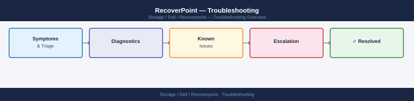

---
tags:
  - dell
  - troubleshooting
search:
  boost: 1.5
---
# RecoverPoint — Troubleshooting

Diagnosing RecoverPoint replication failures, consistency group errors, splitter connectivity, and RPO violations.

*Applies to: RecoverPoint 5.x*

<a class="kb-card" href="common-issues/">
  <strong>Common Issues</strong>
  CG errors, journal overflow, splitter failures, and RPO violations.
</a>

<a class="kb-card" href="diagnostics/">
  <strong>Diagnostics</strong>
  Log locations, support bundle collection, and diagnostic commands.
</a>

<a class="kb-card" href="escalation/">
  <strong>Escalation</strong>
  Dell support engagement, SR creation, and log collection.
</a>

