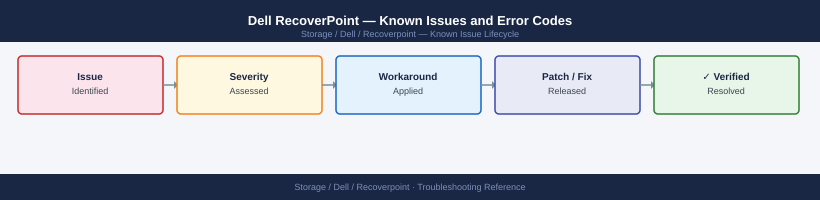

---
tags:
  - troubleshooting
  - recoverpoint
  - dell
  - known-issues
---
# Dell RecoverPoint — Known Issues and Error Codes

<div class="kb-summary">
Catalog of known RecoverPoint bugs, error codes, and workarounds covering RPA clustering, replication groups, and failover.

*Applies to: RecoverPoint for VMs (RP4VM) 5.x / RecoverPoint Classic 5.x*
</div>



```d2
direction: down

symptom: Identify Symptom {shape: diamond}
replication_groups: "Replication Groups" {shape: rectangle}
rpa_cluster: "RPA Cluster" {shape: rectangle}
failover: "Failover" {shape: rectangle}
resolution: Resolve or Escalate {shape: oval}

symptom -> replication_groups: investigate
symptom -> rpa_cluster: investigate
symptom -> failover: investigate
replication_groups -> resolution
rpa_cluster -> resolution
failover -> resolution
```

## Before you begin

- RecoverPoint errors appear in Unisphere for RecoverPoint → Alerts.
- `rpcheck` tool on the RPA for connectivity diagnostics.
- Most replication failures are WAN port (11111/7218) or storage splitter issues.

## Replication Groups

| Error / Symptom | Affected Versions | Cause | Workaround / Fix | Fixed In |
|---|---|---|---|---|
| Replication group `Error — link lost` | RecoverPoint 5.x | TCP 11111 or 7218 blocked between RPA clusters | Verify ports 11111/7218 between RPA management IPs cross-site | N/A |
| RPO violation alarm despite recent writes | RecoverPoint 5.x | WAN bandwidth saturated; replication behind | Reduce replication group bandwidth limit; or increase WAN capacity | N/A |
| `Splitter error` on vSphere with RP4VM | RP4VM 5.x | RP4VM vSphere plugin not registered on ESXi host | Re-register RP4VM splitter on affected ESXi hosts | N/A |

## RPA Cluster

| Error / Symptom | Affected Versions | Cause | Workaround / Fix | Fixed In |
|---|---|---|---|---|
| RPA cluster shows `Partial failure` | RecoverPoint 5.x | One RPA offline in HA pair | Check RPA hardware; cluster continues with degraded HA | N/A |
| `RPA cluster communication error` | RecoverPoint 5.x | Port 7225 blocked between RPAs within cluster | Verify TCP 7225 between all RPAs in the same cluster | N/A |

## Failover

| Error / Symptom | Affected Versions | Cause | Workaround / Fix | Fixed In |
|---|---|---|---|---|
| Test failover success but production failover fails | RecoverPoint 5.x | Production failover requires additional steps (enable access on copy) | Follow RecoverPoint failover procedure: `Enable Image Access` → `Failover` | N/A |
| `Cannot failover — consistency group not synchronized` | RecoverPoint 5.x | Group behind RPO; data may be lost | Accept data loss up to last consistent image; or wait for sync | N/A |

## See also

- [Dell RecoverPoint — Common Issues](common-issues/)
- [Dell VPLEX — Known Issues](../../vplex/troubleshooting/known-issues.md)
