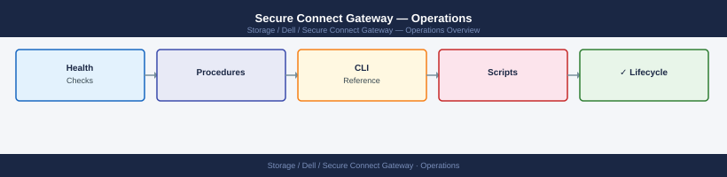

---
tags:
  - dell
  - operations
---
# Secure Connect Gateway — Operations


<div class="kb-summary">
SCG operations: device registration, connectivity health checks, firmware advisory review, SupportAssist case creation, and daily telemetry verification.

*Applies to: Secure Connect Gateway*
  <a class="kb-card" href="faq/"><strong>FAQ</strong><span>Frequently asked questions, common issues, and quick answers for day-to-day operations.</span></a>
</div>



---

```d2
direction: right

hub: "Secure Connect Gateway\nOperations" {shape: hexagon}
daily_checks: "Daily Checks" {shape: rectangle}
health_check: "Health Check" {shape: rectangle}
change_readiness: "Change Readiness" {shape: rectangle}
incident_triage: "Incident Triage" {shape: rectangle}
maintenance_window: "Maintenance Window" {shape: rectangle}
postchange_validation: "Post-Change Validation" {shape: rectangle}

hub -> daily_checks
hub -> health_check
hub -> change_readiness
hub -> incident_triage
hub -> maintenance_window
hub -> postchange_validation
```

## Before you begin

- **Access:** Storage admin credentials (cluster admin or equivalent)
- **Timing:** safe to run during business hours unless a step is marked ⚠ (causes interruption)
- **Dependencies:** no active upgrades or migrations on the same infrastructure
- **Logging:** capture command output — paste into the change record on completion

---

## Daily Checks


| Check | Command | Notes |
|---|---|---|
| [ ] Confirm SCG appliance service is running (`dsagw status` | `dsagw status` | expect `active (running)`) |
| [ ] Confirm all expected devices are listed and show a CONNECTED state | `dsagw list-devices` |  |
| [ ] Confirm no connectivity failures in the last 24 hours (review SCG |  |  |
| [ ] Confirm proactive alert forwarding is active |  | at least one SupportAssist test event should have forwarded successfully this week |

## Health Check

```bash
# SSH to the SCG appliance
ssh admin@<scg_appliance_ip>

# Check SCG gateway service status
dsagw status

# List all registered devices and their connectivity state
dsagw list-devices

# Show SCG version and build information
dsagw version

# Check recent SCG event log for errors or connectivity failures
dsagw log show --last 100

# Test connectivity to Dell backend (SupportAssist cloud)
dsagw connectivity-check

# Check TLS certificate validity (confirm cert is not near expiry)
dsagw certificate show

# Check proxy configuration (if SCG uses an outbound proxy)
dsagw proxy show
```

## Change Readiness

- [ ] Confirm all connected devices are currently sending telemetry (`dsagw list-devices` — all CONNECTED)
- [ ] Note which devices rely on SCG for SupportAssist auto-case creation (a restart will briefly interrupt forwarding for these)
- [ ] Confirm no active support cases are in a state where SCG telemetry is actively being collected
- [ ] Download and verify the SCG patch/upgrade file checksum before applying
- [ ] Confirm rollback procedure in case the SCG upgrade fails (snapshot the SCG VM before patching)

| Item | Status | Notes |
|---|---|---|
| All devices CONNECTED before window | | |
| Devices relying on SCG auto-case creation identified | | |
| No active support cases requiring live telemetry | | |
| Upgrade file checksum verified | | |
| SCG VM snapshot taken | | |

## Incident Triage

**On alert or issue:**
1. SSH to the SCG appliance and run `dsagw status` to confirm the service is running
2. Run `dsagw connectivity-check` to test connectivity to the Dell backend
3. Run `dsagw list-devices` to identify which devices are in a DISCONNECTED or ERROR state
4. Check recent logs with `dsagw log show --last 200` for error messages related to proxy, certificate, or network failures
5. If the SCG VM itself is unreachable, check the hypervisor layer (vSphere/ESXi) and VM power state
6. If a SupportAssist alert was not forwarded, check the alert forwarding log in CloudIQ Settings

| Symptom | Likely Cause | Action |
|---|---|---|
| Device stopped reporting to CloudIQ | SCG connectivity failure | Run `dsagw connectivity-check`, check proxy settings, check firewall rules for outbound HTTPS (443) to `*.dell.com` |
| SCG appliance unreachable via SSH | VM down or network issue | Check VM power state in vSphere, check management network, restart VM if powered off |
| `dsagw status` shows service stopped | SCG service crashed | Run `dsagw start`, check `dsagw log show --last 50` for crash reason |
| Certificate error in SCG logs | TLS cert expired or untrusted | Run `dsagw certificate show`, renew cert or update trust store |
| SupportAssist alert not forwarded | Alert forwarding misconfigured or backend unreachable | Run `dsagw connectivity-check`, verify alert routing in CloudIQ Settings > SupportAssist |
| Proxy authentication failure in logs | Proxy credentials changed | Update proxy credentials with `dsagw proxy set --user <user> --password <password>` |

## Maintenance Window

1. Take a VM snapshot of the SCG appliance before beginning
2. Notify stakeholders that SupportAssist auto-case creation will be briefly interrupted
3. Stop the SCG service gracefully if required by the patch:
   ```bash
   dsagw stop
   ```
4. Apply the SCG patch/upgrade using the offline or online update method:
   ```bash
   # Online update (if SCG has internet access)
   dsagw update

   # Offline update (upload update bundle first)
   dsagw update --bundle /path/to/scg_update_bundle.bin
   ```
5. Start the SCG service after the update:
   ```bash
   dsagw start
   dsagw status
   ```
6. Re-validate device connectivity:
   ```bash
   dsagw list-devices
   dsagw connectivity-check
   ```
7. Delete the VM snapshot once validation is complete

## Post-Change Validation

- [ ] `dsagw status` confirms service is `active (running)`
- [ ] `dsagw list-devices` shows all previously CONNECTED devices are CONNECTED again
- [ ] `dsagw connectivity-check` confirms successful connectivity to Dell backend
- [ ] CloudIQ shows all systems reporting (no "Not Reporting" or "No Data" states)
- [ ] SupportAssist test event forwarded successfully after restart
- [ ] VM snapshot deleted after successful validation

---

## Verify

- Confirm the operation completed without errors in the log or management UI
- Verify the expected state change is visible (service running, object created, config applied)
- Document the outcome in the change record

## See also

- [Cli Reference](../cli-reference/)
- [Scripts](../scripts/)
- [Secure Connect Gateway — Overview](../)
