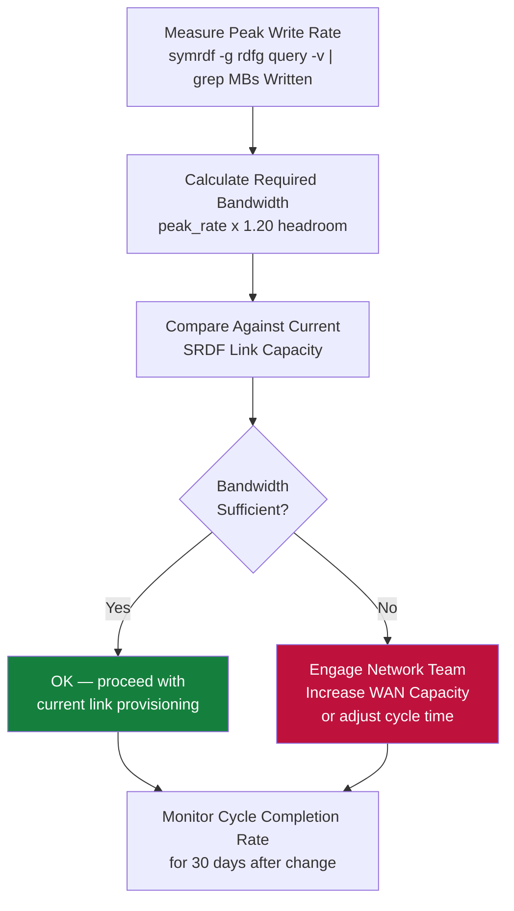

---
tags:
  - architecture
  - dell
---
# SRDF/A — Design Standards


```bash
symrdf -g <rdfg> query -v | grep "Minimum Cycle Time"
```

```bash
symrdf -g <rdfg> query -v | grep "MBs Written"
```
```bash
symdev show -sid <target_SID> <dev_id> | grep -E "Size|Track"
```


---

## See also

- [Srdf A — How It Works](how-it-works/)
- [Srdf A — Integrations](integrations/)
- [Srdf A — Deploy](../deploy/)
