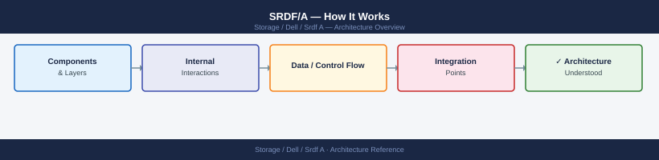
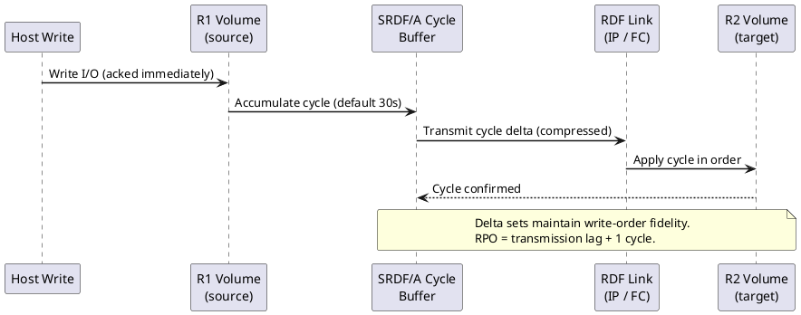
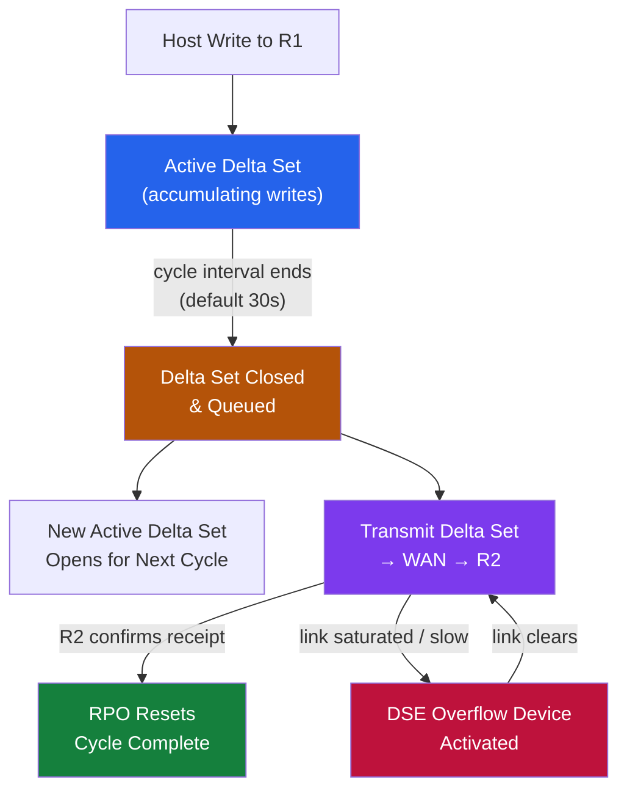

---
tags:
  - architecture
  - dell
---
# SRDF/A — How It Works


<div class="kb-summary">
How It Works reference covering Overview, Delta Set Mechanics, Lag Reference, Connectivity.

*Applies to: SRDF/A*
</div>



```d2
direction: right

center: "SRDF/A" {shape: hexagon}
delta_set_mechanics: "Delta Set Mechanics" {shape: rectangle}
lag_reference: "Lag Reference" {shape: rectangle}
connectivity: "Connectivity" {shape: rectangle}

center -> delta_set_mechanics
center -> lag_reference
center -> connectivity
```



## Overview

SRDF/A (Asynchronous) replicates data from a source PowerMax to a target PowerMax by capturing writes into time-bounded delta sets (cycles) and transmitting them in order. The source array acknowledges writes to the host before transmission — host write latency is not affected by WAN latency. RPO is determined by cycle time (default 30 seconds). R1 is the source (production); R2 is the target (DR).

## Delta Set Mechanics

1. Host writes to R1 go into the **active delta set** for the current cycle.
2. At the end of the cycle interval, the active delta set is **closed** and queued for transmission.
3. A new delta set opens for the next cycle.
4. The closed delta set is transmitted to R2 in sequence — each delta set applied in order, maintaining consistency.
5. When R2 confirms receipt, the cycle is complete and RPO resets.




## Lag Reference

| Lag Range | Assessment | Action |
|---|---|---|
| ≤ configured cycle time | Healthy — RPO is met | None — monitor |
| 2–5× cycle time | Warning — investigate link or write rate | Check link utilization and write rate |
| > 5× cycle time | Critical — RPO SLA breached | Immediate escalation; consider suspending non-critical groups |

## Connectivity

| Link Type | Use Case |
|---|---|
| FCIP (FC over IP) | Most common — FC-to-IP gateway over WAN |
| Dark fibre (FC) | Short distances only — adds no additional latency |
| iSLR (IP Short Range) | Newer PowerMax connectivity via IP directors |

**Bandwidth sizing:** Required bandwidth = peak_change_rate_MB_per_cycle / cycle_time_s × 1.20 (20% headroom).

---

## See also

- [Srdf A — Design Standards](design-standards/)
- [Srdf A — Integrations](integrations/)
- [Srdf A — Deploy](../deploy/)
