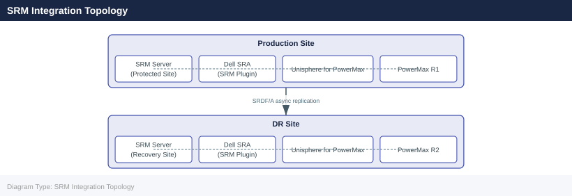

---
tags:
  - architecture
  - dell
---
# SRDF/A — Integrations

SRDF/A integrations: coexistence with TimeFinder snapshots, RecoverPoint on VMAX, EMC SRDF/EDP (extended distance), and Symmetrix DMX compatibility.

*Applies to: SRDF/A*

---

## SRM Integration Topology

---

## See also

- [Srdf A — How It Works](../how-it-works/)
- [Srdf A — Design Standards](../design-standards/)
