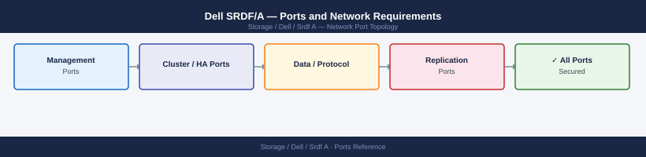

---
tags:
  - srdf
  - srdf-a
  - dell
  - powermax
  - networking
  - firewall
  - ports
  - replication
---
# Dell SRDF/A — Ports and Network Requirements

<div class="kb-summary">
Firewall port reference for Dell SRDF/A (Symmetrix Remote Data Facility / Asynchronous). SRDF replicates data between PowerMax/VMAX arrays. FC-based SRDF uses the FC fabric (no IP ports). IP-based SRDF/A uses iSCSI or GigE ports on the array.

*Applies to: PowerMax SRDF/A with GigE / iSCSI links*
</div>



```d2
direction: right

center: "SRDF/A" {shape: hexagon}
srdf_data_path_fc_no_ip_rules_needed: "SRDF Data Path — FC (No IP Rules Needed)" {shape: rectangle}
srdf_data_path_ip_gige_iscsi_links: "SRDF Data Path — IP (GigE / iSCSI Links)" {shape: rectangle}
unisphere_management: "Unisphere Management" {shape: rectangle}
firewall_zone_summary: "Firewall Zone Summary" {shape: rectangle}
verify: "Verify" {shape: rectangle}

center -> srdf_data_path_fc_no_ip_rules_needed
center -> srdf_data_path_ip_gige_iscsi_links
center -> unisphere_management
center -> firewall_zone_summary
center -> verify
```

## SRDF Data Path — FC (No IP Rules Needed)

When SRDF uses Fibre Channel ISL links between arrays (most common), no IP firewall rules are required. FC traffic flows through the FC fabric zoning.

## SRDF Data Path — IP (GigE / iSCSI Links)

For SRDF/A configured over IP links between PowerMax arrays:

| Port | Protocol | Between | Purpose |
|---|---|---|---|
| 3260 | TCP | Source PowerMax GigE port ↔ Target PowerMax GigE port | SRDF/A asynchronous replication over iSCSI/IP |

The specific port may vary depending on the GigE director configuration on the array — confirm with `symcfg list -rdfg all` output.

## Unisphere Management

| Port | Protocol | Source | Purpose |
|---|---|---|---|
| 8443 | TCP | Admin workstations | Unisphere for PowerMax — SRDF configuration and monitoring |

## Firewall Zone Summary

| From | To | Ports | Notes |
|---|---|---|---|
| PowerMax GigE port (source) | PowerMax GigE port (target) | 3260 | IP-based SRDF only; FC-based needs no IP rules |
| Admin clients | PowerMax mgmt | 8443 | SRDF group management |

## Verify

```bash
# From admin workstation — test Unisphere
curl -sk -o /dev/null -w "%{http_code}" https://<powermax-ip>:8443/univmax/restapi/version

# Check SRDF group replication status via symcli
symrdf -g <rdfg-number> query
```

## See also

- [Dell SRDF/A — Architecture](how-it-works/)
- [Dell SRDF/S — Ports](../../srdf-s/architecture/ports.md)
- [Dell PowerMax — Ports](../../powermax/architecture/ports.md)
