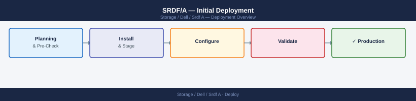

---
tags:
  - dell
  - deployment
search:
  boost: 1.5
---

## Before you begin

<!-- video-link -->
!!! tip "Video Walkthrough"
    [:fontawesome-brands-youtube: Dell PowerMax SRDF/MetroDR Demonstration](https://www.youtube.com/watch?v=IcyYmlOB0xg){ .md-button }
<!-- /video-link -->

- **Access:** admin credentials for the target system and any upstream dependencies (DNS, NTP, vCenter, directory services)
- **Timing:** safe to run during a scheduled maintenance window; allow 1-2 hours for initial deployment
- **Dependencies:** network connectivity verified; DNS resolvable; NTP configured; any licence keys available
- **Logging:** record every IP address, hostname, and credential set assigned during this deployment

---

# SRDF/A — Initial Deployment

## Prerequisites

Two PowerMax/VMAX arrays at separate sites, Fibre Channel or IP connectivity between arrays (SRDF WAN links), SRDF licences on both arrays, matching SRDF group numbers agreed between sites, Solutions Enabler or Unisphere for PowerMax on both sites.

## Zone the SRDF Ports

Configure Fibre Channel zoning or IP routing between the R1 (source) and R2 (target) SRDF director ports — each R1 port zones to corresponding R2 port.

## Create the SRDF Group

On R1 array: `symrdf createpair -sid <source-sid> -rdfg <group-num> -rdfgtype asynch -remote_sid <target-sid>` — define group type as SRDF/A.

## Add Devices to the SRDF Group

`symrdf addpair -sid <source-sid> -rdfg <group-num> -dev <R1-devices> -remote_dev <R2-devices>` — pair source and target LUNs.

## Start Replication

`symrdf -sid <source-sid> -rdfg <group-num> establish` — begins initial full copy from R1 to R2.

## Verify Initial Sync

`symrdf -sid <source-sid> -rdfg <group-num> query` — wait for RDF State to show Synchronized or Consistent; monitor tracks remaining.

## Configure DSE (Dynamic Synchronization Enabler)

Enable DSE for minimal I/O impact: `symrdf -sid <sid> -rdfg <group> dse enable` — throttles replication bandwidth to protect production.

## Validate the Deployment

Check RPO is within configured cycle time, verify `symrdf query` shows all pairs Consistent, test failover on a non-production device pair.

---

## See also

- [Srdf A — Procedures](../operations/procedures/)
- [Srdf A — Common Issues](../troubleshooting/common-issues/)
- [Srdf A — How It Works](../architecture/how-it-works/)
