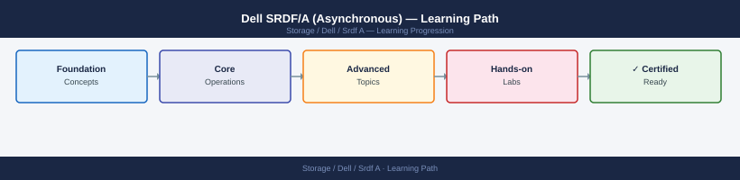

---
tags:
  - dell
  - learning-path
---
# Dell SRDF/A (Asynchronous) — Learning Path

<div class="kb-summary">
Recommended reading order for Dell SRDF/A. Follow these stages in order to build a complete mental model before working with it in production.

*Applies to: SRDF/A*
</div>



```d2
direction: right

stage_1_architecture: "Stage 1 — Architecture" {shape: rectangle}
stage_2_deployment: "Stage 2 — Deployment" {shape: rectangle}
stage_3_operations: "Stage 3 — Operations" {shape: rectangle}
stage_4_security: "Stage 4 — Security" {shape: rectangle}
stage_5_troubleshooting: "Stage 5 — Troubleshooting" {shape: rectangle}

stage_1_architecture -> stage_2_deployment: next
stage_2_deployment -> stage_3_operations: next
stage_3_operations -> stage_4_security: next
stage_4_security -> stage_5_troubleshooting: next
```

## Stage 1 — Architecture
**Goal**: Understand how SRDF/A buffers writes into delta sets, transmits them on a configurable cycle, and maintains consistency across RDF groups.

**Read in this order**:
- [How It Works](../architecture/how-it-works/) — Delta set mechanism: writes accumulate in one delta set while the previous delta set transmits asynchronously; cycle time configuration; adaptive copy write mode for WAN congestion; and how RDF groups pair source and target volumes on separate PowerMax arrays.
- [Design Standards](../architecture/design-standards/) — Cycle time tuning (RPO trade-off), delta set buffer sizing, WAN bandwidth requirements, consistency group membership rules, SRDF witness placement for automated failover, and multi-hop SRDF topologies.
- [Integrations](../architecture/integrations/) — Unisphere for PowerMax replication dashboard, Solutions Enabler (SYMCLI) for scripted failover, SRDF/A and RecoverPoint co-existence, and integration with VPLEX for metro+async three-site designs.

**Why first**: SRDF/A's delta set model is the key to understanding both its RPO characteristics and its failure modes. Without it, cycle time decisions and witness configuration are guesswork.

---

## Stage 2 — Deployment
**Goal**: Create RDF groups, pair volumes, and validate asynchronous replication is tracking before handing to operations.

**Read**:
- [Deploy](../deploy/) — RDF group creation (director port pairs, RDF type selection), volume pairing (symrdf establish), cycle time configuration, witness host configuration, and first-sync validation.
- [Install & Upgrade](../operations/install-upgrade/) — HYPERMAX OS upgrades across an active SRDF/A pair (non-disruptive sequence), director firmware updates, and post-upgrade SRDF pair re-validation.

**Why second**: RDF group director port selection determines available bandwidth and path redundancy. Changing this post-production requires suspending replication.

---

## Stage 3 — Operations
**Goal**: Monitor delta set lag, manage planned failovers, and recover from link failures without data loss beyond agreed RPO.

**Read in this order**:
- [Health Checks](../operations/health-checks/) — run the routine first on every shift; covers SRDF pair state (Synchronized, SyncInProg, Suspended), cycle time achieved vs configured, delta set transmit queue depth, and WAN link error rate.
- [CLI Reference](../operations/cli-reference/) — SYMCLI commands: symrdf query, symrdf failover, symrdf restore, symrdf resume, and Unisphere REST API equivalents for automation.
- [Procedures](../operations/procedures/) — Planned failover (symrdf failover -establish), failback, SRDF/A suspend and resume during planned maintenance, adding volumes to an existing consistency group, and adaptive copy write enable/disable.
- [Backup & Restore](../operations/backup-restore/) — TimeFinder SnapVX on the SRDF/A target (R2) for non-invasive backup copies, and coordinating snapshot timing with delta set cycle completion.
- [Scripts](../operations/scripts/) — Automation: SRDF pair state health polling, cycle time alerting, and automated failover scripting with pre/post application quiesce hooks.

**Why third**: SRDF/A failover is not instantaneous — the transmitting delta set must complete. Operators who do not monitor cycle state can initiate failover with data still in transit.

---

## Stage 4 — Security
**Goal**: Restrict SRDF operations to authorised personnel and secure the RDF replication channel.

**Read**:
- [Access Control](../security/access-control/) — Solutions Enabler gatekeeper LUN permissions, Unisphere for PowerMax RBAC roles for replication operations, and lockdown of SRDF failover commands to senior operators only.
- [Authentication](../security/authentication/) — SYMAPI authentication, Unisphere user account management, and certificate management for REST API clients.
- [Encryption](../security/encryption/) — RDF link encryption (requires compatible director ports), key exchange process, and performance impact assessment of link encryption at high cycle rates.
- [Hardening](../security/hardening/) — Audit logging for all SRDF state-change operations, SYMCLI command audit trail, and change control gate for RDF group modifications.

**Why fourth**: SRDF failover is a high-impact operation. Access controls must be in place before the platform is operationally mature.

---

## Stage 5 — Troubleshooting
**Goal**: Diagnose suspended SRDF/A pairs, delta set overflow, WAN link saturation, and witness connectivity failures.

**Read**:
- [Common Issues](../troubleshooting/common-issues/) — SRDF/A pair in Suspended state, delta set overflow causing RPO breach, WAN bandwidth insufficient for configured cycle time, and witness host unreachable blocking auto-failover.
- [Diagnostics](../troubleshooting/diagnostics/) — symrdf query -v output analysis, Solutions Enabler log review, Unisphere performance data for RDF group throughput, and WAN path diagnostics.
- [Escalation](../troubleshooting/escalation/) — When to engage Dell support, required SYMAPI log bundles, and escalation path for director port or RDF group hardware issues.

**Why last**: Troubleshooting makes most sense once you know the normal operating state.

---

## See also

- [Srdf A — Deploy](../deploy/)
- [Srdf A — Procedures](../operations/procedures/)
- [Srdf A — Common Issues](../troubleshooting/common-issues/)
