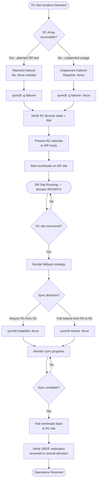

---
tags:
  - dell
  - operations
---
# SRDF/A — Backup & Restore


```bash
# Set the Symmetrix/VMAX SID (array serial number)
export SYMCLI_SID=000123456789

# Or use -sid flag on each command
symrdf -sid 000123456789 query -g <rdf_group>
```

```bash
# Re-establish SRDF from R2 (current production) back to R1 (recovered site)
# This syncs changes made on R2 back to R1
symrdf -g PROD_RDF_GROUP establish -force

# Monitor sync state
symrdf query -g PROD_RDF_GROUP
# Wait until: R1 St = WD, R2 St = WD (synchronized)
```
```bash
# Restore re-syncs R1 from R2 in full
symrdf -g PROD_RDF_GROUP restore -force

# Monitor
symrdf query -g PROD_RDF_GROUP
```
```bash
# 1. Ensure R1 site volumes are accessible and array is healthy
# 2. Perform a 'failover' back in the original direction (now R2→R1)
symrdf -g PROD_RDF_GROUP failover -force

# 3. Flip replication direction so R1 is again the source
symrdf -g PROD_RDF_GROUP establish

# 4. Monitor until synchronized
symrdf query -g PROD_RDF_GROUP
```

```bash
# Detailed query — shows RPO, link state, device state
symrdf query -g PROD_RDF_GROUP -detail

# Check RDF group information
symrdf list -rdfg <rdfg_number> -detail

# Verify RDF director status on the array
symcfg list -rdfg all

# Check RPO for async groups
symrdf -g PROD_RDF_GROUP verify -consistent

# Alert if RPO exceeds threshold
symrdf -g PROD_RDF_GROUP query | grep -E "RPO|Mode"
```

## Before you begin

- **Access:** Storage admin credentials (cluster admin or equivalent)
- **Timing:** safe to run during business hours unless a step is marked ⚠ (causes interruption)
- **Dependencies:** no active upgrades or migrations on the same infrastructure
- **Logging:** capture command output — paste into the change record on completion

---

---

## Verify

- Confirm the operation completed without errors in the log or management UI
- Verify the expected state change is visible (service running, object created, config applied)
- Document the outcome in the change record

---

## See also

- [Srdf A — Procedures](../procedures/)
- [Srdf A — Health Checks](../health-checks/)
- [Srdf A — Common Issues](../../troubleshooting/common-issues/)
