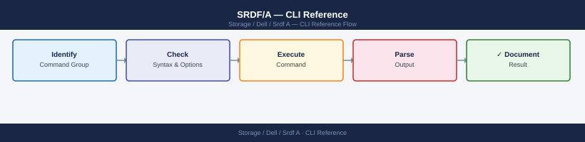

---
tags:
  - dell
  - operations
---
# SRDF/A — CLI Reference

<div class="kb-summary">
SRDF/A CLI reference: `symrdf list`, `symrdf query`, `symrdf establish`, `symrdf resume`, `symrdf suspend`, and cycle time monitoring commands.

*Applies to: SRDF/A*
</div>


---

## Before you begin

- **Access:** Storage admin credentials (cluster admin or equivalent)
- **Timing:** safe to run during business hours unless a step is marked ⚠ (causes interruption)
- **Dependencies:** no active upgrades or migrations on the same infrastructure
- **Logging:** capture command output — paste into the change record on completion

---

## Overview

SRDF/A (Asynchronous) is managed via SYMCLI on a Solutions Enabler (SE) host that has access to the PowerMax/VMAX gatekeeper devices. All commands require `-sid <SymmID>` and typically `-rdfg <rdfg_number>`.

Run `symcfg list` to identify your SID. Run `symrdf -sid <sid> list` to identify RDF group numbers.

---

## SRDF/A Command Decision Map

```d2
direction: right

need: "What do you need?" {shape: rectangle}
checkHealth: "Check health / pair state" {shape: rectangle}
checkLag: "Check lag / cycle time" {shape: rectangle}
maintain: "Planned maintenance" {shape: rectangle}
drOps: "DR failover / failback" {shape: rectangle}
addRemove: "Add or remove devices" {shape: rectangle}
cmdHealth: "symrdf -sid sid -rdfg rdfg list -type srdf_a\nsymrdf -sid sid -rdfg rdfg queryall\nsymcfg -sid sid list -rdfgrp" {shape: rectangle}
cmdLag: "symrdf -sid sid -rdfg rdfg list -delta\nsymstat -sid sid -type rdfg -rdfg rdfg" {shape: rectangle}
cmdSuspend: "symrdf -sid sid -rdfg rdfg -cg cg suspend\n(then resume after maintenance" {shape: rectangle}
cmdFailover: "symrdf -sid sid -rdfg rdfg -cg cg failover\nor failover -nop for unplanned" {shape: rectangle}
cmdEstablish: "symrdf -g dgname -sid sid establish -noprompt\nMonitor SyncInProg → Consistent" {shape: rectangle}

need -> checkHealth
need -> checkLag
need -> maintain
need -> drOps
need -> addRemove
checkHealth -> cmdHealth
checkLag -> cmdLag
maintain -> cmdSuspend
drOps -> cmdFailover
addRemove -> cmdEstablish
```

---

## Device-Level Operations

For per-device inspection or scripted operations:

```bash
# List devices in an RDF group with their state
symdev -sid 000123456789 list -rdfg 10 -rdf

# Show specific device SRDF/A detail
symdev -sid 000123456789 show 00B5 -rdf

# Query a specific device pair
symrdf -sid 000123456789 -rdfg 10 query dev 00B5

# Verify device states match expected (exits non-zero on mismatch)
symrdf -sid 000123456789 -rdfg 10 verify dev 00B5

# Device group operations (legacy — prefer SG-based operations above)
symdg show cg_oracle_prod
symrdf -g cg_oracle_prod -sid 000123456789 query
```

---

## SRDF/A Consistency Protection

SRDF/A uses transmit idle to ensure consistency. Monitor with:

```bash
# Show SRDF/A consistency state per group
symrdf -sid 000123456789 -rdfg 10 list -v | grep -E "Consistency|SRDF/A|Mode"

# Check if any devices are in "Not Ready" or "Failed Over" state
symrdf -sid 000123456789 -rdfg 10 queryall | grep -v "Synchronized\|SyncInProg"
```

---

## Unisphere REST API

Base URL: `https://<unisphere-host>:8443/univmax/restapi`  
Authentication: HTTP Basic.

```bash
UNISPHERE="https://unisphere.example.com:8443/univmax/restapi"
SID="000123456789"
AUTH="-u smc:password --insecure"

# List all RDF groups for an array
curl -s $AUTH "$UNISPHERE/100/replication/symmetrix/${SID}/rdf_group" | \
  python3 -m json.tool

# Get details of a specific RDF group
RDFG=10
curl -s $AUTH "$UNISPHERE/100/replication/symmetrix/${SID}/rdf_group/${RDFG}" | \
  python3 -m json.tool

# List replication volumes (SRDF device pairs) in a group
curl -s $AUTH "$UNISPHERE/100/replication/symmetrix/${SID}/rdf_group/${RDFG}/volume" | \
  python3 -m json.tool

# SRDF/A group state summary
curl -s $AUTH "$UNISPHERE/100/replication/symmetrix/${SID}/rdf_group/${RDFG}" | \
  python3 -c "
import sys, json
data = json.load(sys.stdin)
print('Mode:        ', data.get('remoteSymmetrix','?'))
print('SRDF/A State:', data.get('states','?'))
print('Label:       ', data.get('label','?'))
"

# StorageGroup-level replication details
SG="sg_oracle_prod"
curl -s $AUTH "$UNISPHERE/100/replication/symmetrix/${SID}/storagegroup/${SG}/rdf_group" | \
  python3 -m json.tool

# Performance metrics for an RDF group (KPIs)
curl -s $AUTH "$UNISPHERE/performance/RDFGroup/metrics" \
  -H "Content-Type: application/json" \
  -d "{
    \"symmetrixId\": \"${SID}\",
    \"rdfgNumber\": ${RDFG},
    \"dataFormat\": \"Average\",
    \"metrics\": [\"MBSentPerSec\",\"MBReceivedPerSec\",\"AvgCycleTime\",\"CyclesPerSec\"]
  }" | python3 -m json.tool
```

---

## Verify

- Confirm the operation completed without errors in the log or management UI
- Verify the expected state change is visible (service running, object created, config applied)
- Document the outcome in the change record

---

## See also

- [Srdf A — Procedures](../procedures/)
- [Srdf A — Scripts](../scripts/)
- [Srdf A — Health Checks](../health-checks/)
