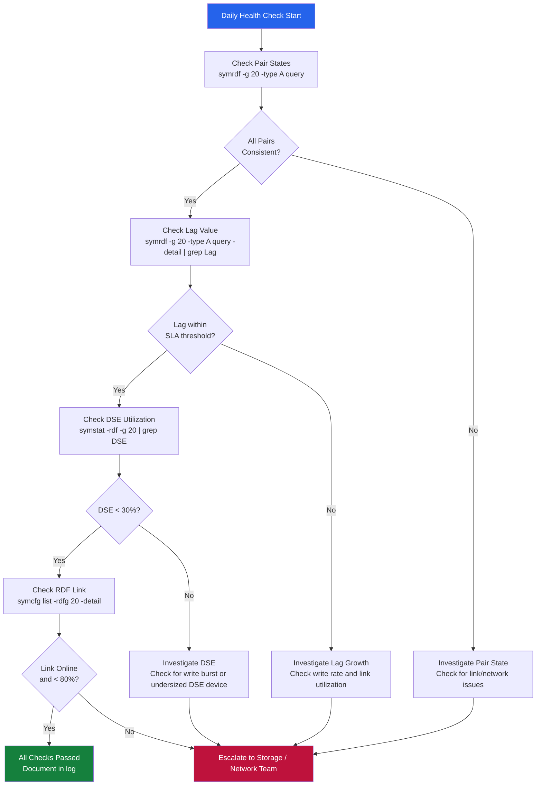

---
tags:
  - dell
  - operations
---
# SRDF/A — Health Checks

```bash
# Show cycle state and lag for all devices in group 20
symrdf -g 20 -type A query -detail

# Quick summary — look for Consistent state on all devices
symrdf -g 20 -type A query

# Check lag value specifically
symrdf -g 20 -type A query -detail | grep -E "Lag|Cycle Age"

# Compare lag against SLA threshold (example: alert if > 60 seconds)
LAG=$(symrdf -g 20 -type A query -detail | grep "Lag" | awk '{print $NF}')
echo "Current lag: ${LAG} seconds"
```

## Before you begin

- **Access:** Storage admin credentials (cluster admin or equivalent)
- **Timing:** safe to run during business hours unless a step is marked ⚠ (causes interruption)
- **Dependencies:** no active upgrades or migrations on the same infrastructure
- **Logging:** capture command output — paste into the change record on completion

---

## Run This Routine

1. **SRDF group state:** `symrdf -g <group> query` — all pairs should show RDF State: Synchronized or Consistent
2. **Cycle time:** `symrdf -g <group> query -detail | grep -i cycle` — verify within RPO target
3. **Delta sets:** `symrdf -g <group> dset show` — check no delta set is accumulating unexpectedly
4. **Link health:** `symrdf -g <group> verifylink` — verify physical paths are all healthy
5. **DSE (Dynamic Synchronization Enabler) status:** `symrdf -g <group> dse query` — check DSE mode active if configured
6. **WAN latency impact:** `symrdf -g <group> perf` — check cycle time trend vs WAN latency
7. **SRDF director health:** `symmaskdb -sid <array-sid> list -dir` — all RDF directors should show Status: Online
8. **Emulation (if synchronous fallback configured):** `symrdf -g <group> query | grep -i mode` — note current mode
9. **Consistency protection:** `symrdf -g <group> query | grep -i protect` — verify consistency protection active
10. **Open replication tracks:** `symrdf -g <group> query | grep -i tracks` — should approach 0 for healthy async

```bash
# Full health check — save output with timestamp
symrdf -g 20 -type A query -detail > /tmp/srdf_a_health_$(date +%Y%m%d_%H%M%S).txt

# Check for any non-Consistent devices
symrdf -g 20 -type A query | grep -iv "consistent\|transmitting\|await"

# Check cycle completion statistics across all type-A groups
for rdfg in 20 21 22; do
  echo "=== RDFG ${rdfg} ===" 
  symrdf -g ${rdfg} -type A query | tail -5
done
```


---

## Verify

- Confirm the operation completed without errors in the log or management UI
- Verify the expected state change is visible (service running, object created, config applied)
- Document the outcome in the change record

---

## See also

- [Srdf A — Procedures](../procedures/)
- [Srdf A — CLI Reference](../cli-reference/)
- [Srdf A — Common Issues](../../troubleshooting/common-issues/)
