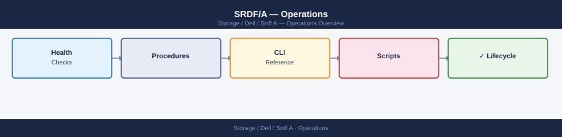

---
tags:
  - dell
  - operations
---
# SRDF/A — Operations

SRDF/A day-to-day operations — cycle monitoring, delta set management, STAR mode, and async replication health checks.

*Applies to: SRDF/A*

<a class="kb-card" href="cli-reference/">
  <strong>CLI Reference</strong>
  SYMCLI command reference by category with syntax and examples.
</a>

<a class="kb-card" href="health-checks/">
  <strong>Health Checks</strong>
  Daily checks, cycle and lag status, DSE health, and validation steps.
</a>

<a class="kb-card" href="procedures/">
  <strong>Procedures</strong>
  Change readiness, maintenance window, failover, and incident triage.
</a>

<a class="kb-card" href="install-upgrade/">
  <strong>Install & Upgrade</strong>
  Firmware upgrades, adding/removing devices, EOL tracking, and migration.
</a>

<a class="kb-card" href="backup-restore/">
  <strong>Backup & Restore</strong>
  Backup and restore procedures for SRDF/A environments.
</a>

<a class="kb-card" href="scripts/">
  <strong>Scripts</strong>
  Automation scripts for daily checks, health, incident triage, and validation.
</a>

  <a class="kb-card" href="faq/"><strong>FAQ</strong>Frequently asked questions, common issues, and quick answers for day-to-day operations.</a>

