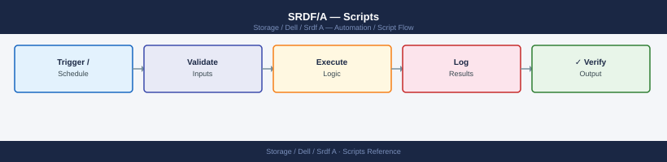

---
tags:
  - dell
  - operations
---
# SRDF/A — Scripts



```bash
#!/usr/bin/env bash
# srdf-cycle-time-monitor.sh
# Usage: SID=<symm_id> RDF_GROUP=<group_num> ./srdf-cycle-time-monitor.sh
# Optional: WARN_THRESHOLD=30 CRIT_THRESHOLD=60

set -euo pipefail

SID="${SID:?SID (Symmetrix serial) is required}"
RDF_GROUP="${RDF_GROUP:?RDF_GROUP is required}"
WARN_THRESHOLD="${WARN_THRESHOLD:-30}"
CRIT_THRESHOLD="${CRIT_THRESHOLD:-60}"
SAMPLES=10

echo ""
echo "=== SRDF/A Cycle Time Monitor ==="
echo "SID         : ${SID}"
echo "RDF Group   : ${RDF_GROUP}"
echo "Warn > ${WARN_THRESHOLD}s  |  Crit > ${CRIT_THRESHOLD}s"
echo "Time        : $(date '+%Y-%m-%d %H:%M:%S')"
echo ""

# Collect current cycle time data
RAW_OUTPUT=$(symrdf -sid "${SID}" -rdfg "${RDF_GROUP}" queryall -detail 2>&1) || {
    echo "ERROR: symrdf command failed:"
    echo "${RAW_OUTPUT}"
    exit 2
}

# Parse cycle time (seconds) and delta set processing time
CYCLE_TIME=$(echo "${RAW_OUTPUT}" | grep -i "Cycle Time" | awk '{print $NF}' | head -1)
DELTA_PROC=$(echo "${RAW_OUTPUT}" | grep -i "Delta Set Processing" | awk '{print $NF}' | head -1)

CYCLE_TIME=${CYCLE_TIME:-0}
DELTA_PROC=${DELTA_PROC:-0}

echo "Current Cycle Time             : ${CYCLE_TIME}s"
echo "Current Delta Set Proc Time    : ${DELTA_PROC}s"
echo ""

# Determine status
EXIT_CODE=0
STATUS="OK"

if (( $(echo "${CYCLE_TIME} > ${CRIT_THRESHOLD}" | bc -l) )); then
    STATUS="CRITICAL"
    EXIT_CODE=2
elif (( $(echo "${CYCLE_TIME} > ${WARN_THRESHOLD}" | bc -l) )); then
    STATUS="WARNING"
    EXIT_CODE=1
fi

echo "Status: ${STATUS}"
echo ""

# Collect trend: run symrdf query multiple times (for cron-driven trend use a file cache)
TREND_FILE="/tmp/srdf_cycle_trend_${SID}_${RDF_GROUP}.log"
TIMESTAMP="$(date '+%Y-%m-%d %H:%M:%S')"

# Append current sample
echo "${TIMESTAMP} cycle=${CYCLE_TIME}s delta=${DELTA_PROC}s status=${STATUS}" >> "${TREND_FILE}"

# Print last N samples
echo "Last ${SAMPLES} samples (from ${TREND_FILE}):"
echo "---------------------------------------------------"
if [[ -f "${TREND_FILE}" ]]; then
    tail -n "${SAMPLES}" "${TREND_FILE}"
else
    echo "(no history yet)"
fi

echo ""
exit ${EXIT_CODE}
```

```bash
#!/usr/bin/env bash
# srdf-resync-after-dr-test.sh
# Usage: SID=<sid> RDF_GROUP=<rdfg> CG_NAME=<cg> ./srdf-resync-after-dr-test.sh
#
# Run ONLY after DR hosts have confirmed they have stopped I/O and unmounted R2 volumes.

set -euo pipefail

SID="${SID:?SID is required}"
RDF_GROUP="${RDF_GROUP:?RDF_GROUP is required}"
CG_NAME="${CG_NAME:?CG_NAME is required}"
MODE="${MODE:-cg}"
LOGFILE="/var/log/srdf-resync-$(date +%Y%m%d-%H%M%S).log"
SYNC_POLL_INTERVAL=30
SYNC_TIMEOUT=3600

log() {
    local msg="[$(date '+%Y-%m-%d %H:%M:%S')] $*"
    echo "${msg}"
    echo "${msg}" >> "${LOGFILE}"
}

run_cmd() {
    log "CMD: $*"
    "$@" 2>&1 | tee -a "${LOGFILE}"
}

log "=== SRDF Resync After DR Test ==="
log "SID=${SID}  RDFG=${RDF_GROUP}  CG=${CG_NAME}  MODE=${MODE}"

# --- Step 1: Confirm host acknowledgement ---
log "Step 1: Verifying preconditions..."
echo ""
echo "IMPORTANT: This script will re-establish SRDF replication."
echo "           R2 volumes will become READ-ONLY / Write Disabled."
echo ""
read -r -p "Confirm DR hosts have stopped I/O and unmounted R2 LUNs? [yes/no]: " CONFIRM
if [[ "${CONFIRM}" != "yes" ]]; then
    log "Aborted by operator. Please ensure DR hosts are off R2 volumes before resyncing."
    exit 1
fi

# --- Step 2: Establish SRDF relationships ---
log "Step 2: Establishing SRDF relationships (R1->R2 direction)..."
if [[ "${MODE}" == "cg" ]]; then
    run_cmd symrdf -sid "${SID}" -rdfg "${RDF_GROUP}" -cg "${CG_NAME}" establish -noprompt
else
    run_cmd symrdf -sid "${SID}" -rdfg "${RDF_GROUP}" establish -noprompt
fi

log "Establish command submitted. Starting sync progress monitor..."

# --- Step 3: Wait for sync to complete ---
ELAPSED=0
while [[ $ELAPSED -lt $SYNC_TIMEOUT ]]; do
    SYNC_STATUS=$(symrdf query -sid "${SID}" -rdfg "${RDF_GROUP}" 2>&1)

    SYNC_COUNT=$(echo "${SYNC_STATUS}" | grep -c "Synchronized" || true)
    SYNCING_COUNT=$(echo "${SYNC_STATUS}" | grep -c "Syncing" || true)
    TOTAL=$(echo "${SYNC_STATUS}" | grep -cE "^[0-9A-Fa-f]{4}" || true)

    log "Progress: ${SYNC_COUNT}/${TOTAL} Synchronized, ${SYNCING_COUNT} still Syncing..."

    if [[ "${SYNCING_COUNT}" -eq 0 ]] && [[ "${SYNC_COUNT}" -gt 0 ]]; then
        log "All devices appear Synchronized."
        break
    fi

    sleep "${SYNC_POLL_INTERVAL}"
    ELAPSED=$((ELAPSED + SYNC_POLL_INTERVAL))
done

if [[ $ELAPSED -ge $SYNC_TIMEOUT ]]; then
    log "WARNING: Sync timed out after ${SYNC_TIMEOUT}s. Check manually with:"
    log "  symrdf query -sid ${SID} -rdfg ${RDF_GROUP}"
    exit 1
fi

# --- Step 4: Final state verification ---
log "Step 4: Final state verification..."
FINAL_STATE=$(symrdf query -sid "${SID}" -rdfg "${RDF_GROUP}" 2>&1 | \
    grep -E "Synchronized|Consistent" | wc -l || true)

if [[ "${FINAL_STATE}" -eq 0 ]]; then
    log "WARNING: Final verification failed — no Synchronized devices found."
    log "Review output of: symrdf query -sid ${SID} -rdfg ${RDF_GROUP}"
    exit 1
fi

log "Step 4: Verified. ${FINAL_STATE} device pair(s) confirmed Synchronized."

log ""
log "=== RESYNC COMPLETE ==="
log "Production SRDF replication is restored."
log "Log: ${LOGFILE}"
```
```bash
chmod +x srdf-resync-after-dr-test.sh
SID=000123456789 RDF_GROUP=1 CG_NAME=MyAppCG ./srdf-resync-after-dr-test.sh
```
```powershell
# srdf-a-state-check-windows.ps1
# Usage: .\srdf-a-state-check-windows.ps1 -UnisphereHost <IP> -UnisphereUser <user> -UnispherePass <pass> -SID <array_serial> -RdfGroup <group_num>
# Requires: PowerShell 5.1 or later
# Unisphere REST API: https://<UnisphereHost>:8443/univmax/restapi/
# Note: Use the Unisphere server hostname/IP, not the array directly.

param(
    [Parameter(Mandatory)][string]$UnisphereHost,
    [Parameter(Mandatory)][string]$UnisphereUser,
    [Parameter(Mandatory)][string]$UnispherePass,
    [Parameter(Mandatory)][string]$SID,
    [Parameter(Mandatory)][string]$RdfGroup
)

# Suppress SSL errors for self-signed certificates
if (-not ([System.Management.Automation.PSTypeName]'TrustAllCertsPolicy').Type) {
    Add-Type @"
    using System.Net;
    using System.Security.Cryptography.X509Certificates;
    public class TrustAllCertsPolicy : ICertificatePolicy {
        public bool CheckValidationResult(
            ServicePoint srvPoint, X509Certificate certificate,
            WebRequest request, int certificateProblem) { return true; }
    }
"@
    [System.Net.ServicePointManager]::CertificatePolicy = New-Object TrustAllCertsPolicy
}
[System.Net.ServicePointManager]::SecurityProtocol = [System.Net.SecurityProtocolType]::Tls12

$BaseUrl = "https://${UnisphereHost}:8443/univmax/restapi/100"
$Auth    = [Convert]::ToBase64String([Text.Encoding]::ASCII.GetBytes("${UnisphereUser}:${UnispherePass}"))
$Headers = @{
    Authorization  = "Basic $Auth"
    "Content-Type" = "application/json"
    "Accept"       = "application/json"
}

function Get-Unisphere {
    param([string]$Endpoint)
    return Invoke-RestMethod -Uri "$BaseUrl$Endpoint" -Headers $Headers -Method GET
}

Write-Host ""
Write-Host "=== SRDF/A State Check (Windows) ===" -ForegroundColor Cyan
Write-Host "Unisphere : $UnisphereHost"
Write-Host "Array SID : $SID"
Write-Host "RDF Group : $RdfGroup"
Write-Host "Date      : $(Get-Date -Format 'yyyy-MM-dd HH:mm:ss')"
Write-Host ""

# --- List RDF groups to confirm the group exists ---
try {
    $rdfGroups = Get-Unisphere "/replication/symmetrix/$SID/rdf_group"
    $groupList = $rdfGroups.rdfGroupID
    if ($groupList -notcontains [int]$RdfGroup) {
        Write-Host "WARNING: RDF group $RdfGroup not found in array $SID." -ForegroundColor Yellow
        Write-Host "Available groups: $($groupList -join ', ')"
    } else {
        Write-Host "RDF group $RdfGroup confirmed on array $SID." -ForegroundColor Green
    }
} catch {
    Write-Host "WARNING: Could not retrieve RDF group list: $_" -ForegroundColor Yellow
}

Write-Host ""

# --- Get SRDF/A volumes in the RDF group ---
try {
    $volumeData = Get-Unisphere "/replication/symmetrix/$SID/rdf_group/$RdfGroup/volume"
    $volumes    = $volumeData.name

    if (-not $volumes -or $volumes.Count -eq 0) {
        Write-Host "No volumes found in RDF group $RdfGroup." -ForegroundColor Yellow
        exit 0
    }

    Write-Host "Volumes in RDF group $RdfGroup : $($volumes.Count)"
    Write-Host ""
    Write-Host ("{0,-12} {1,-15} {2,-15} {3,-12} {4}" -f "Volume", "R1 State", "R2 State", "Mode", "Delta Mark / Notes")
    Write-Host ("-" * 75)

    $problemVolumes = 0
    $goodStates     = @("Synchronized", "Consistent")

    foreach ($vol in $volumes) {
        try {
            $volDetail = Get-Unisphere "/replication/symmetrix/$SID/rdf_group/$RdfGroup/volume/$vol"
            $r1State   = $volDetail.rdfpairState
            $r2State   = $volDetail.remoteRdfpairState
            $mode      = $volDetail.rdfMode
            $deltaMark = $volDetail.deltaMark

            $isGood = ($r1State -in $goodStates) -and ($r2State -in $goodStates)
            $color  = if ($isGood) { "Green" } else { "Red" }
            if (-not $isGood) { $problemVolumes++ }

            $notes = if ($deltaMark) { "DeltaMark=$deltaMark" } else { "" }
            Write-Host ("{0,-12} {1,-15} {2,-15} {3,-12} {4}" -f $vol, $r1State, $r2State, $mode, $notes) -ForegroundColor $color
        } catch {
            Write-Host ("{0,-12} ERROR: Could not retrieve volume detail: $_" -f $vol) -ForegroundColor Yellow
        }
    }

    Write-Host ""
    if ($problemVolumes -gt 0) {
        Write-Host "RESULT: $problemVolumes volume(s) are NOT in Consistent/Synchronized state (shown in red)." -ForegroundColor Red
        exit 1
    } else {
        Write-Host "RESULT: All $($volumes.Count) volume(s) are Consistent or Synchronized." -ForegroundColor Green
        exit 0
    }
} catch {
    Write-Host "ERROR retrieving volume data: $_" -ForegroundColor Red
    exit 1
}
```
```powershell
Set-ExecutionPolicy -Scope Process -ExecutionPolicy Bypass
```
```bash
cd C:\Users\YourName\Desktop
.\srdf-a-state-check-windows.ps1 -UnisphereHost 192.168.1.200 -UnisphereUser smc -UnispherePass MyPassword -SID 000123456789 -RdfGroup 1
```
```batch
@echo off
REM srdf-a-cycle-check.bat — SRDF/A state check via SSH to SYMCLI host (plink)
REM Uses plink.exe (from PuTTY) for SSH. Download: https://www.putty.org
REM
REM NOTE: This script SSH's to the SYMCLI Linux management server (not directly
REM       to the PowerMax array). SYMCLI must be installed on SYMCLI_HOST.
REM
REM FIRST-TIME SETUP — Accept SSH fingerprint (run once):
REM   plink.exe -ssh admin@YOUR_SYMCLI_HOST
REM   Type 'y' to accept the fingerprint, then Ctrl+C.

set SYMCLI_HOST=192.168.1.50
set SSH_USER=symadmin
set SID=000123456789
set RDF_GROUP=1
set PLINK=plink.exe

echo.
echo === SRDF/A State Check (via SYMCLI host) ===
echo SYMCLI Host : %SYMCLI_HOST%
echo Array SID   : %SID%
echo RDF Group   : %RDF_GROUP%
echo.

echo ----------------------------------------
echo SRDF/A PAIR LIST
echo ----------------------------------------
%PLINK% -ssh -l %SSH_USER% -batch %SYMCLI_HOST% "symrdf list -sid %SID% -rdfg %RDF_GROUP% -type srdf_a"
if %ERRORLEVEL% neq 0 (
    echo ERROR: Could not connect to %SYMCLI_HOST% or symrdf command failed.
    echo Check: 1) SYMCLI_HOST is reachable, 2) SYMCLI is installed on that host,
    echo        3) SSH fingerprint has been accepted (run plink manually once),
    echo        4) SSH_USER has permission to run symrdf commands.
    exit /b 1
)

echo.
echo ----------------------------------------
echo SRDF/A PAIR STATE VERIFICATION
echo ----------------------------------------
%PLINK% -ssh -l %SSH_USER% -batch %SYMCLI_HOST% "symrdf verify -sid %SID% -rdfg %RDF_GROUP%"

echo.
echo ----------------------------------------
echo SRDF/A CYCLE TIME QUERY
echo ----------------------------------------
%PLINK% -ssh -l %SSH_USER% -batch %SYMCLI_HOST% "symrdf -sid %SID% -rdfg %RDF_GROUP% queryall -detail"

echo.
echo Done.
```
```text
plink.exe -ssh symadmin@192.168.1.50
```
```bash
cd C:\Users\YourName\Desktop
srdf-a-cycle-check.bat
```
```bash
#!/bin/bash
# srdf_daily_check.sh
# Usage: SYMCLI_HOST=<ip> SSH_USER=<user> SID=<sid> RDF_GROUP=<rdfg> ./srdf_daily_check.sh

SYMCLI_HOST="${SYMCLI_HOST:?SYMCLI_HOST is required}"
SSH_USER="${SSH_USER:-symadmin}"
SID="${SID:?SID is required}"
RDF_GROUP="${RDF_GROUP:?RDF_GROUP is required}"
SYMCLI_PATH="${SYMCLI_PATH:-/usr/symcli/bin}"
SSH_OPTS="-o BatchMode=yes -o StrictHostKeyChecking=no -o ConnectTimeout=10"
FAIL=0

ssh_cmd() { ssh $SSH_OPTS "$SSH_USER@$SYMCLI_HOST" "$1" 2>/dev/null; }

echo "=== SRDF/A Daily Check: SID=$SID RDFG=$RDF_GROUP — $(date) ==="

PAIRS=$(ssh_cmd "$SYMCLI_PATH/symrdf list -sid $SID -rdfg $RDF_GROUP")

# Count pairs not in Consistent/Synchronized
NOT_GOOD=$(echo "$PAIRS" | grep -vE "Consistent|Synchronized|^-|^ *$|^Sym|^Local|^RDF|^Dev" | grep -c "[0-9A-Fa-f]" || true)
if [ "$NOT_GOOD" -gt 0 ]; then
  echo "[FAIL] $NOT_GOOD pair(s) not in Consistent/Synchronized state"; FAIL=$((FAIL+1))
else
  echo "[OK]   All pairs Consistent/Synchronized"
fi

# Flag Transmit_Idle, Split, or Mixed
for BAD_STATE in "Transmit_Idle" "Split" "Mixed"; do
  COUNT=$(echo "$PAIRS" | grep -ic "$BAD_STATE" || true)
  if [ "$COUNT" -gt 0 ]; then
    echo "[FAIL] $COUNT pair(s) in $BAD_STATE state"; FAIL=$((FAIL+1))
  fi
done

echo ""
echo "Daily check: $FAIL failure(s)"
[ "$FAIL" -gt 0 ] && exit 2 || exit 0
```
```bash
#!/bin/bash
# srdf_triage.sh
# Usage: SYMCLI_HOST=<ip> SSH_USER=<user> SID=<sid> RDF_GROUP=<rdfg> ./srdf_triage.sh

SYMCLI_HOST="${SYMCLI_HOST:?SYMCLI_HOST is required}"
SSH_USER="${SSH_USER:-symadmin}"
SID="${SID:?SID is required}"
RDF_GROUP="${RDF_GROUP:?RDF_GROUP is required}"
SYMCLI_PATH="${SYMCLI_PATH:-/usr/symcli/bin}"
SSH_OPTS="-o BatchMode=yes -o StrictHostKeyChecking=no -o ConnectTimeout=10"
OUTFILE="/tmp/srdf_triage_${SID}_${RDF_GROUP}_$(date +%Y%m%d_%H%M%S).txt"

ssh_cmd() { ssh $SSH_OPTS "$SSH_USER@$SYMCLI_HOST" "$1" 2>/dev/null; }

{
  echo "=== SRDF/A Incident Triage: SID=$SID RDFG=$RDF_GROUP — $(date) ==="
  echo ""
  echo "--- symrdf list -sid $SID ---"
  ssh_cmd "$SYMCLI_PATH/symrdf list -sid $SID"
  echo ""
  echo "--- symrdf queryall -sid $SID -rdfg $RDF_GROUP ---"
  ssh_cmd "$SYMCLI_PATH/symrdf queryall -sid $SID -rdfg $RDF_GROUP"
  echo ""
  echo "--- symcfg -sid $SID list -license ---"
  ssh_cmd "$SYMCLI_PATH/symcfg -sid $SID list -license"
  echo ""
  echo "--- SRDF link utilization ---"
  ssh_cmd "$SYMCLI_PATH/symrdf -sid $SID -rdfg $RDF_GROUP queryall -detail" | grep -iE "util|bandwidth|cycle|delta"
} > "$OUTFILE" 2>&1

echo "Triage data saved to: $OUTFILE"
```
```bash
#!/bin/bash
# srdf_precheck.sh
# Usage: SYMCLI_HOST=<ip> SSH_USER=<user> SID=<sid> RDF_GROUP=<rdfg> ./srdf_precheck.sh

SYMCLI_HOST="${SYMCLI_HOST:?SYMCLI_HOST is required}"
SSH_USER="${SSH_USER:-symadmin}"
SID="${SID:?SID is required}"
RDF_GROUP="${RDF_GROUP:?RDF_GROUP is required}"
SYMCLI_PATH="${SYMCLI_PATH:-/usr/symcli/bin}"
SSH_OPTS="-o BatchMode=yes -o StrictHostKeyChecking=no -o ConnectTimeout=10"
FAIL=0

ssh_cmd() { ssh $SSH_OPTS "$SSH_USER@$SYMCLI_HOST" "$1" 2>/dev/null; }

echo "=== SRDF/A Pre-Change Check: SID=$SID RDFG=$RDF_GROUP — $(date) ==="

PAIRS=$(ssh_cmd "$SYMCLI_PATH/symrdf list -sid $SID -rdfg $RDF_GROUP")

# All pairs in Consistent state
NOT_CONSISTENT=$(echo "$PAIRS" | grep -vE "Consistent|^-|^ *$|^Sym|^Local|^RDF|^Dev" | grep -c "[0-9A-Fa-f]" || true)
if [ "$NOT_CONSISTENT" -gt 0 ]; then
  echo "[FAIL] $NOT_CONSISTENT pair(s) not in Consistent state"; FAIL=$((FAIL+1))
else
  echo "[OK]   All pairs Consistent"
fi

# No pairs in degraded state
for BAD in "Transmit_Idle" "Split" "Suspended" "Failed"; do
  CNT=$(echo "$PAIRS" | grep -ic "$BAD" || true)
  if [ "$CNT" -gt 0 ]; then
    echo "[FAIL] $CNT pair(s) in degraded state: $BAD"; FAIL=$((FAIL+1))
  fi
done

# SRDF link bandwidth < 70% (parse from queryall)
DETAIL=$(ssh_cmd "$SYMCLI_PATH/symrdf -sid $SID -rdfg $RDF_GROUP queryall -detail")
UTIL=$(echo "$DETAIL" | grep -iE "util" | awk '{print $NF}' | tr -d '%' | head -1)
if [ -n "$UTIL" ] && [ "$UTIL" -gt 70 ] 2>/dev/null; then
  echo "[FAIL] SRDF link utilisation at ${UTIL}% — above 70%"; FAIL=$((FAIL+1))
else
  echo "[OK]   SRDF link utilisation: ${UTIL:-N/A}%"
fi

echo ""
echo "Pre-check: $FAIL failure(s)"
[ "$FAIL" -gt 0 ] && exit 2 || exit 0
```
```bash
#!/bin/bash
# srdf_postcheck.sh
# Usage: SYMCLI_HOST=<ip> SSH_USER=<user> SID=<sid> RDF_GROUP=<rdfg> ./srdf_postcheck.sh

SYMCLI_HOST="${SYMCLI_HOST:?SYMCLI_HOST is required}"
SSH_USER="${SSH_USER:-symadmin}"
SID="${SID:?SID is required}"
RDF_GROUP="${RDF_GROUP:?RDF_GROUP is required}"
SYMCLI_PATH="${SYMCLI_PATH:-/usr/symcli/bin}"
SSH_OPTS="-o BatchMode=yes -o StrictHostKeyChecking=no -o ConnectTimeout=10"
FAIL=0

ssh_cmd() { ssh $SSH_OPTS "$SSH_USER@$SYMCLI_HOST" "$1" 2>/dev/null; }

echo "=== SRDF/A Post-Change Validation: SID=$SID RDFG=$RDF_GROUP — $(date) ==="

PAIRS=$(ssh_cmd "$SYMCLI_PATH/symrdf list -sid $SID -rdfg $RDF_GROUP")

# All pairs back to Consistent
NOT_CONSISTENT=$(echo "$PAIRS" | grep -vE "Consistent|^-|^ *$|^Sym|^Local|^RDF|^Dev" | grep -c "[0-9A-Fa-f]" || true)
if [ "$NOT_CONSISTENT" -gt 0 ]; then
  echo "[FAIL] $NOT_CONSISTENT pair(s) still not in Consistent state"; FAIL=$((FAIL+1))
else
  echo "[OK]   All pairs Consistent"
fi

# Delta mark count stable
DETAIL=$(ssh_cmd "$SYMCLI_PATH/symrdf -sid $SID -rdfg $RDF_GROUP queryall -detail")
DELTA=$(echo "$DETAIL" | grep -i "delta" | awk '{print $NF}' | head -1)
echo "[INFO] Delta mark count: ${DELTA:-N/A}"

# Link utilization back to baseline
UTIL=$(echo "$DETAIL" | grep -iE "util" | awk '{print $NF}' | tr -d '%' | head -1)
echo "[INFO] SRDF link utilisation: ${UTIL:-N/A}%"

echo ""
echo "Post-change validation: $FAIL failure(s)"
[ "$FAIL" -gt 0 ] && exit 2 || exit 0
```
```bash
#!/bin/bash
# srdf_health_check.sh
# Cron: */5 * * * * SYMCLI_HOST=<ip> SSH_USER=<user> SID=<sid> RDF_GROUP=<rdfg> /opt/scripts/srdf_health_check.sh

SYMCLI_HOST="${SYMCLI_HOST:?SYMCLI_HOST is required}"
SSH_USER="${SSH_USER:-symadmin}"
SID="${SID:?SID is required}"
RDF_GROUP="${RDF_GROUP:?RDF_GROUP is required}"
SYMCLI_PATH="${SYMCLI_PATH:-/usr/symcli/bin}"
SSH_OPTS="-o BatchMode=yes -o StrictHostKeyChecking=no -o ConnectTimeout=10"

ssh_cmd() { ssh $SSH_OPTS "$SSH_USER@$SYMCLI_HOST" "$1" 2>/dev/null; }

PAIRS=$(ssh_cmd "$SYMCLI_PATH/symrdf list -sid $SID -rdfg $RDF_GROUP")
TOTAL=$(echo "$PAIRS" | grep -c "[0-9A-Fa-f]\{4\}" || true)
CONSISTENT=$(echo "$PAIRS" | grep -ic "Consistent" || true)
DEGRADED=$(echo "$PAIRS" | grep -icE "Transmit_Idle|Split|Suspended|Failed" || true)

DETAIL=$(ssh_cmd "$SYMCLI_PATH/symrdf -sid $SID -rdfg $RDF_GROUP queryall -detail")
DELTA=$(echo "$DETAIL" | grep -i "delta" | awk '{print $NF}' | head -1)
UTIL=$(echo "$DETAIL" | grep -iE "util" | awk '{print $NF}' | tr -d '%' | head -1)

echo "sid=$SID rdfg=$RDF_GROUP total_pairs=$TOTAL consistent=$CONSISTENT degraded=$DEGRADED delta_marks=${DELTA:-N/A} link_util_pct=${UTIL:-N/A}"

if [ "${DEGRADED:-0}" -gt 5 ]; then
  exit 2
elif [ "${DEGRADED:-0}" -gt 0 ]; then
  exit 1
fi
exit 0
```

```d2
direction: right

hub: "SRDF/A\nOperations" {shape: hexagon}
verify: "Verify" {shape: rectangle}

hub -> verify
```

## Before you begin

- **Access:** Storage admin credentials (cluster admin or equivalent)
- **Timing:** safe to run during business hours unless a step is marked ⚠ (causes interruption)
- **Dependencies:** no active upgrades or migrations on the same infrastructure
- **Logging:** capture command output — paste into the change record on completion

---

---

## Verify

- Confirm the operation completed without errors in the log or management UI
- Verify the expected state change is visible (service running, object created, config applied)
- Document the outcome in the change record

---

## See also

- [Srdf A — Procedures](procedures/)
- [Srdf A — CLI Reference](cli-reference/)
- [Srdf A — Health Checks](health-checks/)
