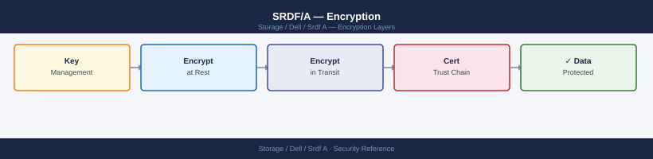

---
tags:
  - dell
  - security
---
# SRDF/A — Encryption


<div class="kb-summary">
SRDF/A encryption: in-flight data encryption over FCIP using GigE Encryption Module (GEM), certificate management, and encryption status verification commands.

*Applies to: SRDF/A*
</div>



---

```d2
direction: down

external: External / Untrusted {shape: rectangle}
perimeter_controls: "Perimeter Controls" {shape: rectangle}
identity_access: "Identity & Access" {shape: rectangle}
audit_logging: "Audit & Logging" {shape: rectangle}
core: "SRDF/A Core" {shape: hexagon}

external -> perimeter_controls: traffic in
perimeter_controls -> identity_access
identity_access -> audit_logging
audit_logging -> core: secured path
```

## Before you begin

- **Access:** Storage admin credentials (cluster admin or equivalent)
- **Change management:** security changes require CAB approval in most environments
- **Rollback plan:** document current state before any security control change
- **Testing:** validate in a non-production environment first where possible

---

## Notes

- SRDF/E applies to data transmitted over FCIP links; dark fibre (native FC) does not traverse the WAN and does not require SRDF/E, though physical security of the fibre path should be assured.
- Enabling encryption on a live SRDF group requires no downtime but may briefly increase CPU overhead on the SRDF directors.
- Verify encryption status after any firmware upgrade or RDF group reconfiguration.

---

## See also

- [Srdf A — Hardening](hardening/)
- [Srdf A — Authentication](authentication/)
- [Srdf A — Access Control](access-control/)
