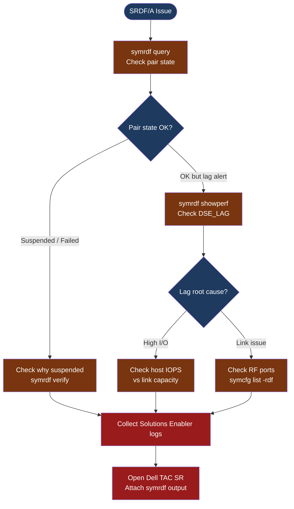

---
tags:
  - dell
  - troubleshooting
search:
  boost: 1.5
---
# SRDF/A — Diagnostics

<div class="kb-summary">
SRDF/A diagnostic commands: check pair state with symrdf query, identify lag and cycle time with showperf, diagnose RF link health, and collect Solutions Enabler logs before opening a Dell TAC case.

*Applies to: Dell PowerMax / SRDF/A (Asynchronous)*
</div>




## Before you begin

- **Access:** Storage admin credentials with Solutions Enabler (`symcli`) access; Solutions Enabler installed on a host with SE gatekeeper LUNs or via Unisphere REST API
- **Gather first:** the array SID(s) for both production and DR arrays, the RDFG (SRDF group) number, and the exact lag alert value or error message from Unisphere
- **Scope:** confirm whether the issue affects a single SRDF group, all groups on one array, or all replication across both sites
- **Do not suspend unless instructed:** suspending SRDF/A stops replication and increases RPO — only do this with Dell TAC guidance or during a confirmed maintenance window
- **Logging:** capture the full output of each `symrdf` command before and after any changes

---

## Step 1 — Query SRDF pair state

```bash
# List all SRDF groups for a given array SID
symrdf -sid <SID> list -rdfg all
# Output: RDFG number, mode (A = Async), pair count, state

# Query detailed state for a specific RDFG
symrdf query -sid <SID> -rdfg <rdfg-number>
# Output columns:
#   R1_ST:      R1 state — should be "Ready"
#   R2_ST:      R2 state — should be "Write Disabled"
#   R2_PAIR_ST: pair consistency state — should be "Consistent"
#   MODE:       should be "A" (Async) for SRDF/A
#   LINK_ST:    RF link state — should be "Ready"
#   R2_CAPACITY: should match R1_CAPACITY

# Common problem states:
#   R2_PAIR_ST = "Partitioned"   → link was interrupted; data may be inconsistent
#   LINK_ST    = "Not Ready"     → RF port or WAN link problem
#   R1_ST      = "Suspended"     → replication manually paused; R2 is frozen
#   R2_PAIR_ST = "Transmitting"  → large initial sync or re-sync in progress
```

**Decision flow:**
- All fields healthy but lag alert firing → proceed to Step 2 (performance check)
- `LINK_ST = Not Ready` → proceed to Step 4 (RF link diagnostics)
- `R2_PAIR_ST = Partitioned` → replication was interrupted; check WAN connectivity between sites; contact Dell TAC before resuming
- `R1_ST = Suspended` → confirm who suspended it; check for planned maintenance; resume with `symrdf resume -sid <SID> -rdfg <rdfg-number>` only after confirming consistency

---

## Step 2 — Check lag and cycle performance

```bash
# SRDF/A performance and lag metrics (sample over 60 seconds)
symrdf showperf -sid <SID> -rdfg <rdfg-number> -a -delta_t 60
# Key fields:
#   DSE_LAG:      Delta Set Extension lag in seconds — current RPO exposure
#   CYCLE_TIME:   Configured cycle time in seconds (15–60 typical)
#   HOST_MBS:     MB/s from hosts to R1 — high write rate = higher lag risk
#   LINK_MBS:     MB/s sent over SRDF link — compare to HOST_MBS; gap = queuing
#   RDFG_LAG:     Current total lag — should be ≤ CYCLE_TIME × 2 under normal load

# Check lag across all SRDF/A groups on an array
symrdf showperf -sid <SID> -a -delta_t 60 | grep -E "RDFG|LAG|CYCLE"
```

**Interpreting lag:**
- `DSE_LAG` consistently above 2× `CYCLE_TIME` → link bandwidth is saturated; verify with Step 4
- `HOST_MBS` is 2× or more of `LINK_MBS` → production write rate exceeds link capacity; either throttle applications or upgrade link bandwidth
- `DSE_LAG` spikes during specific time windows → correlate with application batch jobs or backup jobs on production

---

## Step 3 — Verify pair consistency

```bash
# Verify SRDF pair consistency — non-disruptive check
symrdf verify -sid <SID> -rdfg <rdfg-number>
# If consistent: exits with no errors
# If inconsistent: output shows which tracks are diverged

# Show device group state (useful for named device groups used in automation)
symdg show <group-name> -detail
# Look for: SRDF state per device, pair type, mode

# Check configuration of the RDFG
symrdf list -sid <SID> -rdfg <rdfg-number> -v
# Shows: cycle time, number of RA groups, director config, port assignments
```

---

## Step 4 — Check RF ports and SRDF link health

```bash
# List RF directors and ports on the array
symcfg -sid <SID> list -rdf -v
# Shows:
#   DIRECTOR: RA director number
#   PORT:     RF port number
#   LINK_STATUS: should be "Online" for all ports used by the RDFG
#   SPEED:    link speed; verify matches expected (8G, 16G, 32G FC or GbE for FCIP)

# Show SRDF director port detail
syminq -sid <SID> rdf
# Lists all RA ports with their current utilization and state

# Check FCIP link statistics (if SRDF over IP)
# Navigate to Unisphere for PowerMax → System → SRDF → select RDFG → Port Statistics
# Key: Packet loss > 0% or Retransmit count > 0 = WAN link quality issue
```

**If RF port shows "Offline":**
1. Check the physical FC cable on the back-end RF director
2. Check the FC switch zone that includes the RF ports from both arrays
3. For FCIP: check the IP router or firewall between sites on the SRDF WAN port

---

## Step 5 — Collect Solutions Enabler and array logs

```bash
# Collect Solutions Enabler diagnostic output for the case
{
  echo "=== symrdf query ==="
  symrdf query -sid <SID> -rdfg <rdfg-number>
  echo "=== symrdf showperf ==="
  symrdf showperf -sid <SID> -rdfg <rdfg-number> -a -delta_t 60
  echo "=== symcfg rdf ==="
  symcfg -sid <SID> list -rdf -v
  echo "=== symrdf list ==="
  symrdf list -sid <SID> -rdfg <rdfg-number> -v
} > /tmp/srdf-diag-$(date +%F-%H%M).txt

# Solutions Enabler log location
# On Linux:   /var/symapi/log/
# On Windows: C:\Program Files\EMC\SYMAPI\log\
ls -lth /var/symapi/log/ | head -10
# Attach symapi.log and any core dumps to the Dell TAC case
```

---

## Log locations

| Component | Path | What to look for |
|---|---|---|
| Solutions Enabler | `/var/symapi/log/symapi.log` | SYMAPI errors, connection failures to arrays |
| Unisphere UI events | Unisphere → System → Events | SRDF state change events, link errors |
| FCIP router logs | Network router syslog | Packet loss, interface errors on WAN port |
| Dell array event log | Unisphere → System → Alerts | RF director faults, hardware errors |

---

## See also

- [SRDF/A — Common Issues](common-issues/)
- [SRDF/A — Escalation](escalation/)
- [SRDF/A — Health Checks](../operations/health-checks/)

## Verify resolution

- `symrdf query -sid <SID> -rdfg <rdfg-number>` shows `R1_ST=Ready`, `R2_PAIR_ST=Consistent`, `LINK_ST=Ready`
- `symrdf showperf` shows `DSE_LAG` consistently at or below the configured cycle time
- No active lag alerts in Unisphere for the RDFG
- Monitor `showperf` output for 15 minutes to confirm lag does not re-accumulate
