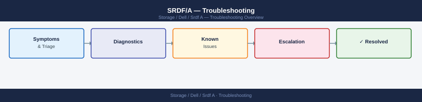

---
tags:
  - dell
  - troubleshooting
search:
  boost: 1.5
---
# SRDF/A — Troubleshooting

Diagnosing SRDF/A cycle failures, delta set overflow, link errors, and async RPO violations.

*Applies to: SRDF/A*

<a class="kb-card" href="common-issues/">
  <strong>Common Issues</strong>
  Link down, cycle time growth, suspended groups, capacity mismatches, and invalid pair state.
</a>

<a class="kb-card" href="diagnostics/">
  <strong>Diagnostics</strong>
  On-call triage steps, lag alert response, and diagnostic command reference.
</a>

<a class="kb-card" href="escalation/">
  <strong>Escalation</strong>
  Opening Dell support cases, required diagnostics, and SLA tiers.
</a>

