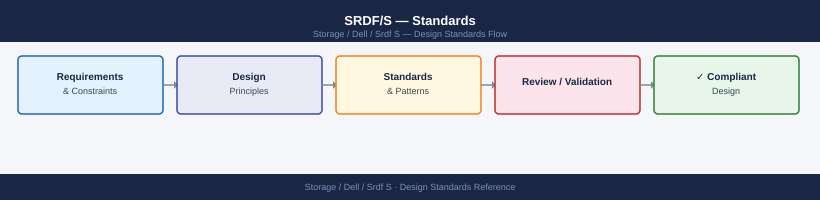
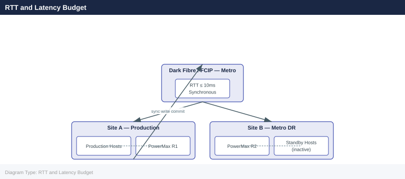

---
tags:
  - architecture
  - dell
---
# SRDF/S — Standards

<div class="kb-summary">
SRDF/S design standards: maximum distance and latency requirements for synchronous SRDF, RDF group sizing, and SRDF/S coexistence with Concurrent SRDF/A.

*Applies to: SRDF/S*
</div>


---

## RTT and Latency Budget

SRDF/S commits every host write synchronously across the replication link. The host write RTT equals local storage latency + 2× WAN latency. Document and enforce maximum RTT before production enablement.

| Site Distance | Typical RTT | Max Acceptable | Why | Notes |
|---|---|---|---|---|
| Campus / same campus | < 1ms | 2ms | Negligible WAN penalty on host write latency | Ideal for SRDF/S |
| Metro (≤ 100km dark fibre) | 1–5ms | 5ms | RTT within application tolerance for most workloads | Within spec |
| Metro (> 100km) | 5–10ms | ≤ 10ms | Latency penalty becomes noticeable on high-IOPS workloads | Borderline — test under peak load |
| WAN (> 200km) | > 10ms | Not recommended | Synchronous commit would add > 20ms to every write — use SRDF/A | Use SRDF/A instead |



Where 1.25 = 25% headroom for burst absorption.

Measure peak write throughput:
```bash
symstat -sid <SID> -type rdf -i 5 -c 12   # 5-second samples, 12 cycles = 1 minute
```


```text title="Expected output"
Symmetrix ID: 000123456789012
                                    RA Group Statistics
                                    
Time         Read_Reqs  Write_Reqs  Read_MB/s  Write_MB/s  Queue_Depth  Util%
12:34:56           1247        3891       156.2       287.4           8     72
12:35:01           1156        3654       148.9       271.3           6     68
12:35:06           1289        4012       162.1       298.7          11     78
12:35:11           1198        3745       151.4       279.2           7     71
12:35:16           1334        4156       168.5       309.1          13     82
12:35:21           1267        3923       159.8       292.4           9     75
12:35:26           1211        3812       152.3       284.6           8     73
12:35:31           1345        4089       169.2       304.8          12     80
12:35:36           1289        3967       162.7       296.1          10     76
12:35:41           1223        3834       154.1       286.3           7     72
12:35:46           1298        4124       163.9       307.2          14     81
12:35:51           1276        3901       160.5       290.7           9     74
```

!!! warning "Common errors"
    **`symstat: Error: Invalid SID <SID>`** — Replace `<SID>` with an actual Symmetrix ID (e.g., `000123456789012`).
    **`symstat: Error: RDF group not found or not configured`** — Verify the array has SRDF/S configured and the RDF group is online using `symcfg list -rdf`.
Sizing must be validated at peak (end-of-month batch, backup window) — not average load.

---

## Target Volume Standards

- R2 volumes must be identical in size to R1 — no thin over-subscription on R2
- R2 emulation and track format must match R1 exactly
- R2 volumes should not be presented to hosts except during planned failover or DR test

Verify before establishing:
```bash
symdev show -sid <target_SID> <dev_id> | grep -E "Size|Emulation|Track"
```


```text title="Expected output"
Device Name           : 000FA
        Size          : 1048576 tracks
        Emulation     : FBA
        Track Size    : 128 KB
```

!!! warning "Common errors"
    **`symdev: Command not found`** — Install the EMC Solutions Enabler package or ensure the Symmetrix management tools are in your PATH.
    **`symdev: Cannot connect to the Symmetrix array <target_SID>`** — Verify the target SID is correct and the Symmetrix engine is accessible via the management network.
---

## Test Frequency

| Test Type | Minimum Frequency | Why |
|---|---|---|
| Non-disruptive pair state verification | Monthly | Confirms Synchronized state and zero invalid tracks without impacting production |
| SRM recovery plan test (non-production) | Quarterly | Validates SRA discovery, protection group integrity, and recovery plan steps |
| Full failover test (maintenance window) | Annually | Confirms end-to-end RTO including host masking, VM startup, and application validation |
| RTT re-validation after WAN changes | After every network change affecting SRDF links | WAN routing changes can silently increase RTT beyond the SRDF/S tolerance |

---

## Recovery Time Standards

| RTO Category | Target | Notes |
|---|---|---|
| Planned failover (SRM automated) | < 15 minutes | Per recovery plan |
| Unplanned failover (manual) | < 30 minutes | DR runbook execution |
| Post-failover data validation | < 60 minutes | Application-level check |

---

## See also

- [Srdf S — How It Works](../how-it-works/)
- [Srdf S — Integrations](../integrations/)
- [Srdf S — Deploy](../../deploy/)
