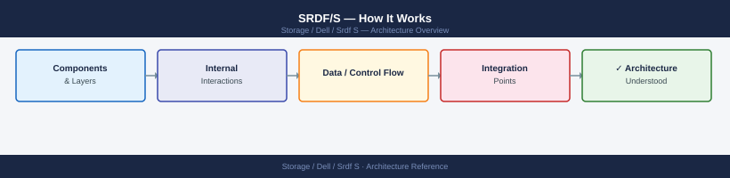
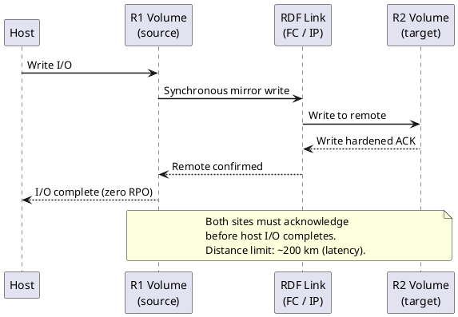
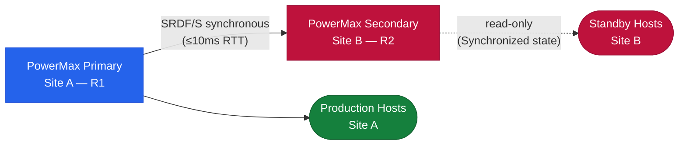

---
tags:
  - architecture
  - dell
---
# SRDF/S — How It Works

How It Works reference covering Overview, Write Commit Model, RTT Requirements, Recovery Time Standards.

*Applies to: SRDF/S*

## Overview

SRDF/S (Synchronous) provides zero-data-loss replication between two PowerMax arrays. Every host write is committed to both the source (R1) and target (R2) before an acknowledgement is returned to the host. This guarantees RPO = 0 at the cost of write latency, which is directly proportional to inter-site round-trip time (RTT). Use case: financial transaction systems, active-active cluster workloads, and DR configurations where RPO = 0 is contractually required.

## Write Commit Model

## RTT Requirements

| Site Distance | Typical RTT | Max Acceptable | Notes |
|---|---|---|---|
| Campus / same campus | < 1ms | 2ms | Ideal for SRDF/S |
| Metro (≤ 100km dark fibre) | 1–5ms | 5ms | Within spec |
| Metro (> 100km) | 5–10ms | ≤ 10ms | Borderline — test under peak load |
| WAN (> 200km) | > 10ms | Not recommended | Use SRDF/A instead |

## Recovery Time Standards

| RTO Category | Target |
|---|---|
| Planned failover (SRM automated) | < 15 minutes |
| Unplanned failover (manual) | < 30 minutes |
| Post-failover data validation | < 60 minutes |

---

## See also

- [Srdf S — Design Standards](design-standards/)
- [Srdf S — Integrations](integrations/)
- [Srdf S — Deploy](../deploy/)
