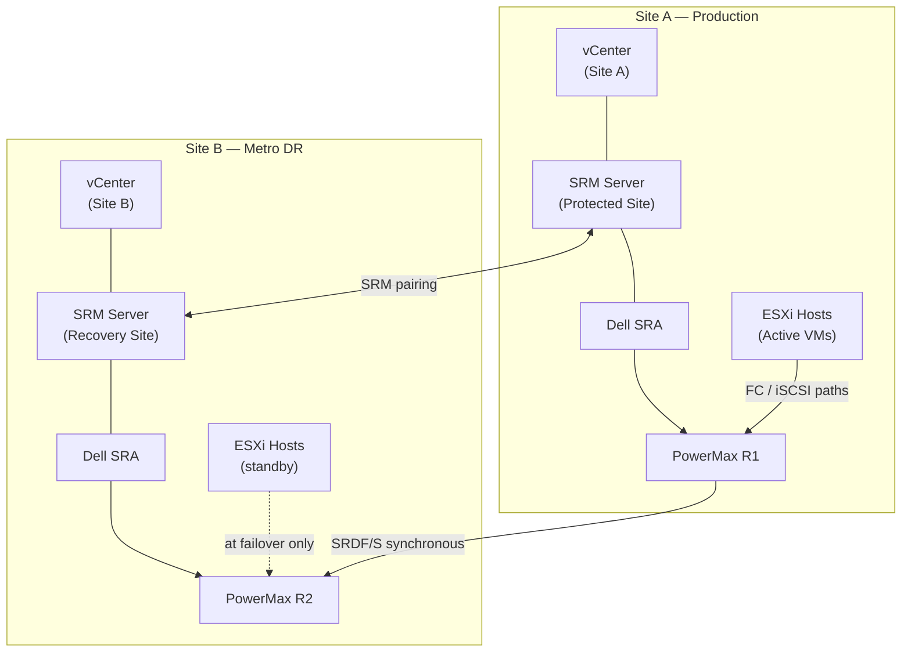

---
tags:
  - architecture
  - dell
---
# SRDF/S — Integrations

<div class="kb-summary">
SRDF/S integrations: SRDF/Star three-site topology, Microsoft Cluster Services with SRDF/S, Oracle RAC extended cluster, and VMware Metro Storage Cluster.

*Applies to: SRDF/S*
</div>


---

## vMSC and SRM Integration Topology



---

## Backup from R2

To offload backup I/O from production (R1), take SnapVX snapshots on the R2 side:

```bash
symsnap -sid <target_SID> -sg <sg_name> create -name BACKUP_$(date +%Y%m%d) -ttl 3
# Mount the linked copy to a backup proxy server
symsnap -sid <target_SID> -sg <sg_name> link -name BACKUP_$(date +%Y%m%d) -lnsg <proxy_sg>
```

Note: always snapshot the R2 while it is in `Synchronized` state to ensure consistency.

---

## See also

- [Srdf S — How It Works](../how-it-works/)
- [Srdf S — Design Standards](../design-standards/)
