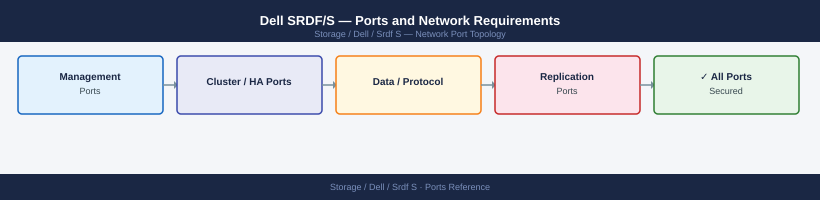

---
tags:
  - srdf
  - srdf-s
  - dell
  - powermax
  - networking
  - firewall
  - ports
  - replication
---
# Dell SRDF/S — Ports and Network Requirements

<div class="kb-summary">
Firewall port reference for Dell SRDF/S (Symmetrix Remote Data Facility / Synchronous). SRDF/S provides zero-RPO synchronous replication between PowerMax arrays. Port requirements are identical to SRDF/A — the protocol and timing differ, not the network ports.

*Applies to: PowerMax SRDF/S with FC or GigE links*
</div>



## SRDF Data Path — FC (No IP Rules Needed)

FC-based SRDF/S (most deployments) uses Fibre Channel ISL links — no IP firewall rules required.

## SRDF Data Path — IP (GigE Links)

For SRDF/S over IP links (less common — synchronous replication is latency-sensitive; low-latency WAN required):

| Port | Protocol | Between | Purpose |
|---|---|---|---|
| 3260 | TCP | Source PowerMax GigE port ↔ Target PowerMax GigE port | SRDF/S synchronous replication over IP |

Maximum tolerable latency for SRDF/S: typically ≤5 ms RTT. Higher latency causes I/O queue stall on the host.

## Unisphere Management

| Port | Protocol | Source | Purpose |
|---|---|---|---|
| 8443 | TCP | Admin workstations | Unisphere for PowerMax — SRDF/S configuration and monitoring |

## Firewall Zone Summary

| From | To | Ports | Notes |
|---|---|---|---|
| PowerMax GigE port (source) | PowerMax GigE port (target) | 3260 | IP-based SRDF/S only; ≤5 ms RTT required |
| Admin clients | PowerMax mgmt | 8443 | SRDF group management |

## Verify

```bash
# Check SRDF/S pair state
symrdf -g <rdfg-number> query | grep -E "State|Mode|Status"

# Verify link latency is within tolerance
# From PowerMax management system:
symcfg list -rdfg all -detail | grep -i latency
```

## See also

- [Dell SRDF/S — Architecture](how-it-works/)
- [Dell SRDF/A — Ports](../../srdf-a/architecture/ports.md)
- [Dell PowerMax — Ports](../../powermax/architecture/ports.md)
