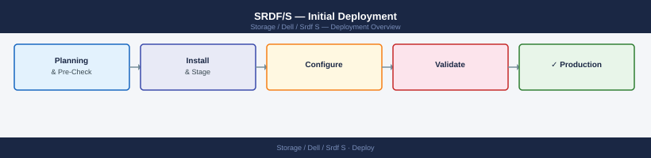

---
tags:
  - dell
  - deployment
search:
  boost: 1.5
---

## Before you begin

- **Access:** admin credentials for the target system and any upstream dependencies (DNS, NTP, vCenter, directory services)
- **Timing:** safe to run during a scheduled maintenance window; allow 1-2 hours for initial deployment
- **Dependencies:** network connectivity verified; DNS resolvable; NTP configured; any licence keys available
- **Logging:** record every IP address, hostname, and credential set assigned during this deployment

---

# SRDF/S — Initial Deployment

## Prerequisites

Two PowerMax/VMAX arrays within low-latency WAN (<10ms RTT between SRDF ports), Fibre Channel or IP SRDF links, SRDF synchronous licence on both arrays, capacity on R2 equal to R1 devices being protected.

## Zone SRDF Director Ports

FC zoning between R1 SRDF ports and R2 SRDF ports — each director port on source zones to matching port on target.

## Create the SRDF/S Group

`symrdf createpair -sid <source-sid> -rdfg <group-num> -rdfgtype synchronous -remote_sid <target-sid>`

## Add Devices

`symrdf addpair -sid <source-sid> -rdfg <group-num> -dev <R1-devices> -remote_dev <R2-devices>`

## Establish Synchronous Replication

`symrdf -sid <source-sid> -rdfg <group-num> establish` — full initial copy; all writes to R1 must be acknowledged by R2 before returning to host.

## Verify Synchronization

`symrdf -sid <source-sid> -rdfg <group-num> query` — all pairs must show RDF State: Synchronized. WAN RTT should be stable <10ms.

## Test Write Latency Impact

Measure host write latency before and after establishing SRDF/S — expect additional RTT delay. Confirm acceptable for workloads.

## Validate the Deployment

Verify `symrdf query` shows all Synchronized, confirm no write latency SLA breach, test failover on non-production pair, document RTO achieved.

---

## See also

- [Srdf S — Procedures](../operations/procedures/)
- [Srdf S — Common Issues](../troubleshooting/common-issues/)
- [Srdf S — How It Works](../architecture/how-it-works/)
