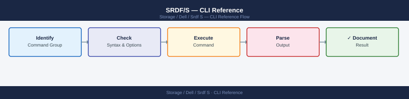
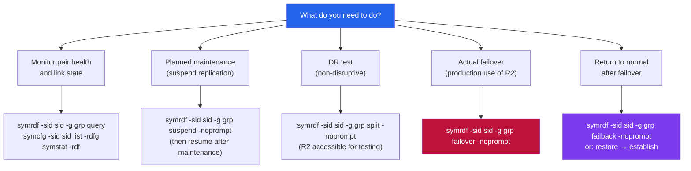

---
tags:
  - dell
  - operations
---
# SRDF/S — CLI Reference


<div class="kb-summary">
SRDF/S CLI reference: `symrdf establish`, `symrdf query -synchronous`, `symrdf suspend`, `symrdf resume`, `symrdf failover -establish`, and link status commands.

*Applies to: SRDF/S*
</div>



> Part of the [SRDF/S Operations](index.md) reference.

All SRDF/S management is performed via SYMCLI (Solutions Enabler). Commands require appropriate RBAC permissions and must be run from a Solutions Enabler host with connectivity to the array. Always specify `-g <group>` to scope operations to the correct SRDF group and `-sid <sid>` to target the correct array.

```d2
direction: right

hub: "SRDF/S\nOperations" {shape: hexagon}
srdfs_operation_decision_map: "SRDF/S Operation Decision Map" {shape: rectangle}
failover_failback: "Failover & Failback" {shape: rectangle}
swap_metro_operations: "Swap & Metro Operations" {shape: rectangle}
common_health_check_sequence: "Common Health Check Sequence" {shape: rectangle}
verify: "Verify" {shape: rectangle}

hub -> srdfs_operation_decision_map
hub -> failover_failback
hub -> swap_metro_operations
hub -> common_health_check_sequence
hub -> verify
```

## Before you begin

- **Access:** Storage admin credentials (cluster admin or equivalent)
- **Timing:** safe to run during business hours unless a step is marked ⚠ (causes interruption)
- **Dependencies:** no active upgrades or migrations on the same infrastructure
- **Logging:** capture command output — paste into the change record on completion

---

## SRDF/S Operation Decision Map




---

## Failover & Failback

Failover makes R2 the new production side. Always run in a maintenance window except during a real DR event.

```bash
# Planned failover (splits pairs, R2 becomes R/W)
symrdf -sid <sid> -g <group> failover -noprompt

# Verify R2 is now active
symrdf -sid <sid> -g <group> query

# Failback to original R1 (after restoring R1 site)
symrdf -sid <sid> -g <group> failback -noprompt

# Resynchronise after failover or split
symrdf -sid <sid> -g <group> resync -noprompt
```

---

## Swap & Metro Operations

For SRDF/Metro or swap operations on bidirectional configurations.

```bash
# Swap R1/R2 roles
symrdf -sid <sid> -g <group> swap -noprompt

# Set SRDF mode to synchronous
symrdf -sid <sid> -g <group> setmode -sync -noprompt

# Set SRDF mode to asynchronous (temporary degraded mode)
symrdf -sid <sid> -g <group> setmode -acp_disk -noprompt
```

---

## Common Health Check Sequence

```bash
# Full SRDF/S pre-change health check
symcfg -sid <sid> list -rdfg
symrdf -sid <sid> -g <group> query
symrdf -sid <sid> list -v
symdg show <group_name>
```

---

## Verify

- Confirm the operation completed without errors in the log or management UI
- Verify the expected state change is visible (service running, object created, config applied)
- Document the outcome in the change record

---

## See also

- [Srdf S — Procedures](procedures/)
- [Srdf S — Scripts](scripts/)
- [Srdf S — Health Checks](health-checks/)
