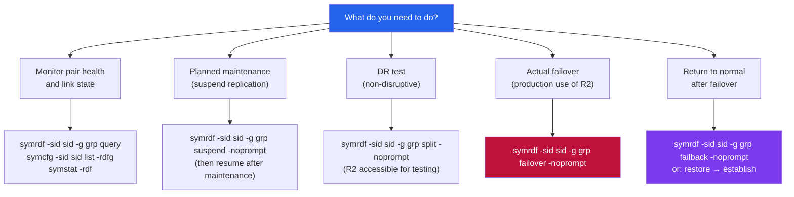

---
tags:
  - dell
  - operations
---
# SRDF/S — CLI Reference


<div class="kb-summary">
Part of the [SRDF/S Operations](../index.md) reference. All SRDF/S management is performed via SYMCLI (Solutions Enabler). Commands require appropriate RBAC permissions and must be run from a Solutions Enabler host with connectivity to the array.
</div>

> Part of the [SRDF/S Operations](../index.md) reference.

All SRDF/S management is performed via SYMCLI (Solutions Enabler). Commands require appropriate RBAC permissions and must be run from a Solutions Enabler host with connectivity to the array. Always specify `-g <group>` to scope operations to the correct SRDF group and `-sid <sid>` to target the correct array.

## Before you begin

- **Access:** Storage admin credentials (cluster admin or equivalent)
- **Timing:** safe to run during business hours unless a step is marked ⚠ (causes interruption)
- **Dependencies:** no active upgrades or migrations on the same infrastructure
- **Logging:** capture command output — paste into the change record on completion

---

## SRDF/S Operation Decision Map


```text
┌─────────────────────────────────────── SRDF/S — CLI Reference ────────────────────────────────────────┐
│                                                                                                       │
│   ┌───────────────────────────────────────────────────────────────────────────────────────────────┐   │
│   │                                   SRDF/S — Command Reference                                  │   │
│   │           Use these commands for routine operations, scripting, and troubleshooting           │   │
│   │                                     symrdf establish -type s                                  │   │
│   │                                         symrdf failover                                       │   │
│   │                                           symrdf query                                        │   │
│   │                                        symrdf -rdfg list                                      │   │
│   │                                          symrdf restore                                       │   │
│   └───────────────────────────────────────────────────────────────────────────────────────────────┘   │
│                                                                                                       │
│    Ports: Dark fiber FC (< 5 ms RTT) · DWDM long-haul FC · 9443 (Unisphere)                           │
│                                                                                                       │
│   ┌───────────────────────────────────────────────────────────────────────────────────────────────┐   │
│   │                                       Command Categories                                      │   │
│   │                  Status / Query  — check current state, list jobs, show config                │   │
│   │                  Operations      — start, stop, failover, restore, sync, expire               │   │
│   │                Configuration   — add/modify policies, schedules, storage targets              │   │
│   │               Diagnostics     — collect logs, run health checks, test connectivity            │   │
│   │                  Scripting       — REST API or CLI for automation and reporting               │   │
│   └───────────────────────────────────────────────────────────────────────────────────────────────┘   │
│                                                                                                       │
│  Physical Infrastructure:                                                                             │
│  Two PowerMax arrays · Dark fiber / DWDM FC link · Low-latency network (< 200 km) · RF director ports │
│  Key terms:                                                                                           │
│                                                                                                       │
│  SRDF/S        = Synchronous SRDF; every R1 write is mirrored to R2 before host acknowledgment        │
│  R1            = source volume; write is held pending R2 confirmation — adds WAN RTT to latency       │
│  R2            = target volume; must acknowledge each write; acts as synchronous mirror               │
│  RTT           = Round-Trip Time between R1 and R2 arrays; directly added to host write latency       │
│  RPO=0         = zero recovery point objective; no data loss possible under normal operation          │
│  RTO           = Recovery Time Objective; SRDF/S failover typically < 5 minutes manual, < 1 min       │
│  symrdf        = CLI for all SRDF operations: establish, split, suspend, failover, restore, ver       │
│  Pair State    = Synchronized | Consistent | Suspended | Failed Over | Split                          │
│  Consistent    = transient state where R1 write is in transit but not yet confirmed on R2             │
│  Failover      = makes R2 read-write; production continues from DR site after R1 failure              │
│  Restore       = re-synchronises after failover; direction is reversed until R1 catches up            │
│  RDFG          = RDF Group: logical grouping of SRDF pairs sharing same link and parameters           │
│  FA Port       = Front-End Adapter port on PowerMax; used for host connectivity (non-SRDF)            │
│  RF Port       = Remote Fabric port on PowerMax; used exclusively for SRDF replication traffic        │
│                                                                                                       │
└───────────────────────────────────────────────────────────────────────────────────────────────────────┘
```

---

## Failover & Failback

Failover makes R2 the new production side. Always run in a maintenance window except during a real DR event.

```bash
# Planned failover (splits pairs, R2 becomes R/W)
symrdf -sid <sid> -g <group> failover -noprompt

# Verify R2 is now active
symrdf -sid <sid> -g <group> query

# Failback to original R1 (after restoring R1 site)
symrdf -sid <sid> -g <group> failback -noprompt

# Resynchronise after failover or split
symrdf -sid <sid> -g <group> resync -noprompt
```

---

## Swap & Metro Operations

For SRDF/Metro or swap operations on bidirectional configurations.

```bash
# Swap R1/R2 roles
symrdf -sid <sid> -g <group> swap -noprompt

# Set SRDF mode to synchronous
symrdf -sid <sid> -g <group> setmode -sync -noprompt

# Set SRDF mode to asynchronous (temporary degraded mode)
symrdf -sid <sid> -g <group> setmode -acp_disk -noprompt
```

---

## Common Health Check Sequence

```bash
# Full SRDF/S pre-change health check
symcfg -sid <sid> list -rdfg
symrdf -sid <sid> -g <group> query
symrdf -sid <sid> list -v
symdg show <group_name>
```
