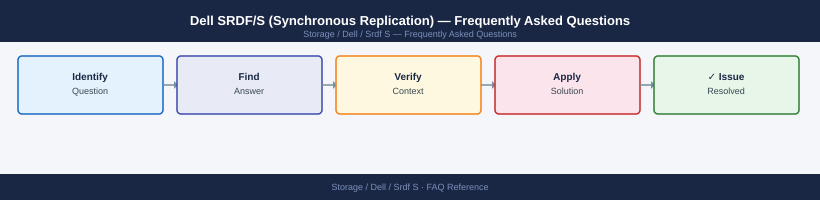

---
tags:
  - dell-srdf-s
  - faq
  - operations
---
# Dell SRDF/S (Synchronous Replication) — Frequently Asked Questions

<div class="kb-summary">
Common questions about Dell SRDF/S (Synchronous Replication) operations, configuration, and troubleshooting. For step-by-step procedures, see the <a href="index.md">Operations</a> section.
</div>



```d2
direction: right

hub: "SRDF/S\nOperations" {shape: hexagon}
general: "General" {shape: rectangle}
configuration: "Configuration" {shape: rectangle}
operations: "Operations" {shape: rectangle}
troubleshooting: "Troubleshooting" {shape: rectangle}
backup_and_recovery: "Backup and Recovery" {shape: rectangle}

hub -> general
hub -> configuration
hub -> operations
hub -> troubleshooting
hub -> backup_and_recovery
```

## General

**Q: How do I verify SRDF/S replication is synchronised?**
A: Via Unisphere: Storage → SRDF → SRDF Groups → check pair state is 'Synchronized'. Via SYMCLI: `symrdf -g <rdf_group> query` — R1 and R2 should show '==' (synchronized). Any other state indicates a problem.

**Q: How do I check the current Dell SRDF/S (Synchronous Replication) version?**
A: `symrdf -g <rdf_group> query`

## Configuration

**Q: What is the maximum recommended RTT for SRDF/S and when should SRDF/A be used instead?**
A: SRDF/S requires RTT < 10ms for acceptable host I/O latency (every write waits for R2 acknowledgement). For RTT > 10ms, use SRDF/A (asynchronous) instead. Use `ping -c 100 <R2-ip>` to measure RTT.

**Q: How do I enable SRDF/S Adaptive Copy mode for planned maintenance?**
A: Switch to Adaptive Copy: `symrdf -g <rdf_group> set mode adaptivecopy`. This allows R2 to fall slightly behind R1 during heavy write activity. Switch back to Synchronous: `symrdf -g <rdf_group> set mode sync` when complete.

## Operations

**Q: How do I suspend SRDF/S for array maintenance without data loss?**
A: Switch to SRDF/A mode temporarily: `symrdf -g <rdf_group> set mode async`. Perform maintenance. Switch back: `symrdf -g <rdf_group> set mode sync`. Verify synchronisation before switching back.

**Q: What is the correct procedure to add new volumes to an SRDF/S group?**
A: Create the R2 device on the target array. Add pair to the RDF group: `symrdf -g <rdf_group> addpair -dev <devid> -rdfg <rdf_group> -type sync`. Monitor initial copy with `symrdf -g <rdf_group> query`.

## Troubleshooting

**Q: SRDF/S shows 'R2 Not Ready'. What does it mean?**
A: The R2 volume is not accepting host I/O (expected in normal operation — R2 is write-protected). If this appears during a failover scenario, run `symrdf -g <rdf_group> failover` to make R2 read/write. Do not force-write to R2 without failing over.

**Q: SRDF/S is adding significant write latency — where do I start?**
A: Measure RTT to the R2 array (`ping`). SRDF/S adds approximately 2x RTT to every write. If RTT is >5ms, consider switching to SRDF/A. Check RDF port utilisation — congested ports increase latency. Review WAN QoS configuration.

## Backup and Recovery

**Q: How often should I back up SRDF/S RDF group configuration?**
A: Weekly SYMCLI export. The R2 array itself serves as a synchronous copy — it is both the DR target and effectively a real-time backup for recent changes. Supplement with application-consistent snapshots on R2.

**Q: How do I perform a planned failover to the SRDF/S replica site?**
A: 1) Quiesce applications. 2) `symrdf -g <rdf_group> failover`. 3) Mount R2 volumes on target hosts. 4) Start applications on target site. For failback: `symrdf -g <rdf_group> failback` after re-synchronisation.

## See Also

- [Dell SRDF/S (Synchronous Replication) Operations](index.md)
- [Dell SRDF/S (Synchronous Replication) Troubleshooting](../../../troubleshooting/index.md)
