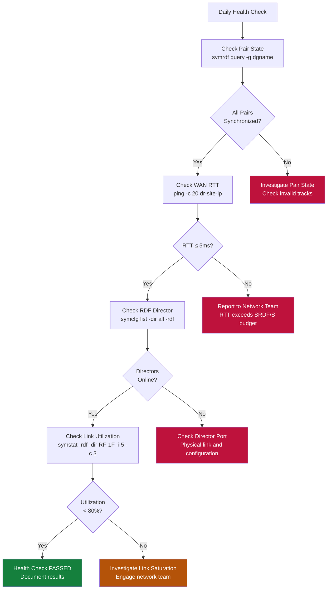
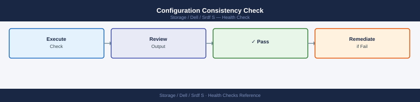
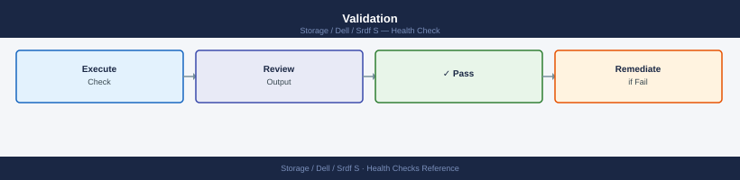
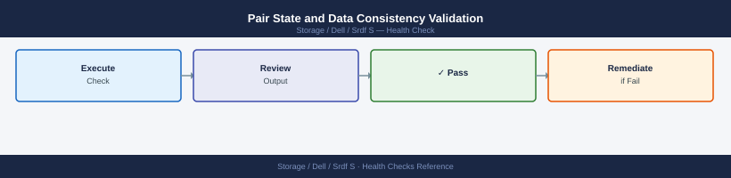
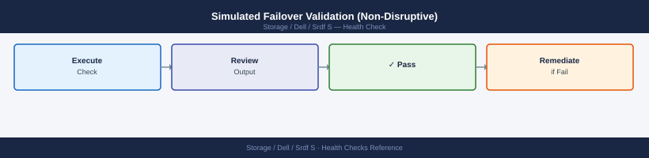
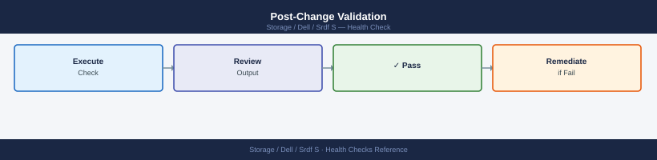

---
tags:
  - dell
  - operations
---
# SRDF/S — Health Checks

<div class="kb-summary">
SRDF/S health checks: `symrdf query -synchronous` link status, invalid track count review, SRDF pair consistency validation, and RDF group hop count check.

*Applies to: SRDF/S*
</div>

> Part of the [SRDF/S Operations](index.md) reference.

Regular health checks on SRDF/S replication confirm that all device pairs are synchronized, RDF directors and links are operational, and no track backlogs exist. These checks should run daily as part of infrastructure monitoring and immediately before any planned failover or maintenance activity.

Health checks cover four layers: pair state, link/director status, performance metrics, and array-level configuration consistency.



```vegalite
{
  "$schema": "https://vega.github.io/schema/vega-lite/v5.json",
  "title": {
    "text": "Health Checks \u2014 Thresholds",
    "fontSize": 13,
    "fontWeight": "normal"
  },
  "width": 480,
  "height": {
    "step": 26
  },
  "data": {
    "values": [
      {
        "metric": "Link utilization",
        "zone": "Safe",
        "val": 80
      },
      {
        "metric": "Link utilization",
        "zone": "Alert",
        "val": 20
      }
    ]
  },
  "mark": {
    "type": "bar",
    "cornerRadiusEnd": 3
  },
  "encoding": {
    "y": {
      "field": "metric",
      "type": "nominal",
      "axis": {
        "title": null,
        "labelLimit": 200
      },
      "sort": null
    },
    "x": {
      "field": "val",
      "type": "quantitative",
      "stack": "normalize",
      "axis": {
        "title": "Threshold boundary",
        "format": ".0%"
      }
    },
    "color": {
      "field": "zone",
      "type": "nominal",
      "scale": {
        "domain": [
          "Safe",
          "Alert"
        ],
        "range": [
          "#15803d",
          "#dc2626"
        ]
      },
      "legend": {
        "title": "Zone"
      }
    },
    "order": {
      "field": "zone",
      "sort": [
        "Safe",
        "Alert"
      ]
    },
    "tooltip": [
      {
        "field": "metric",
        "type": "nominal",
        "title": "Metric"
      },
      {
        "field": "zone",
        "type": "nominal",
        "title": "Zone"
      },
      {
        "field": "val",
        "type": "quantitative",
        "title": "Segment %",
        "format": ".0f"
      }
    ]
  }
}
```

## Before you begin

- **Access:** Storage admin credentials (cluster admin or equivalent)
- **Timing:** safe to run during business hours unless a step is marked ⚠ (causes interruption)
- **Dependencies:** no active upgrades or migrations on the same infrastructure
- **Logging:** capture command output — paste into the change record on completion

---

## Run This Routine

1. **SRDF group state:** `symrdf -g <group> query` — all pairs must show RDF State: Synchronized
2. **Write latency overhead:** `symstat -sid <sid> -rdfg <group> -type rdf` — check write penalty vs threshold (<10ms addition)
3. **WAN RTT:** measure round-trip to DR site — SRDF/S requires <10ms RTT for acceptable performance
4. **Link health:** `symrdf -g <group> verifylink` — all paths healthy, no single-path warning
5. **Director status:** `symmaskdb -sid <sid> list -dir` — all RDF directors Online
6. **Pair count:** `symrdf -g <group> query | grep -c Synchronized` — should equal total device count
7. **Failed over pairs (none expected in normal ops):** `symrdf -g <group> query | grep -v Synchronized` — should be empty
8. **SRDF/Star check (if 3-site configured):** `symrdf -star -g <group> query` — all hops synchronized
9. **Bias setting (for split-brain protection):** `symrdf -g <group> query | grep -i bias` — verify correct site has bias
10. **PowerPath multipath status on hosts:** `powermt display dev=all | grep -i dead` — should return empty

**WAN Latency Impact on Write Performance:**

SRDF/S adds one WAN round trip to every host write. The relationship is approximately:

```text
Effective write latency = local array write time + (WAN RTT / 2) + remote commit time
```

```bash
# Continuous WAN RTT check from primary site to DR site storage port
ping -i 5 -c 60 <dr_storage_port_ip> | tee /tmp/srdf_rtt_$(date +%Y%m%d).log

# Check SRDF link bandwidth utilisation via Unisphere REST API
UNISPHERE="https://unisphere.example.com:8443/univmax/restapi"
SID="000123456789"
RDFG=10
AUTH="-u smc:password --insecure"

curl -s $AUTH \
  "$UNISPHERE/performance/RDFGroup/metrics" \
  -H "Content-Type: application/json" \
  -d "{
    \"symmetrixId\": \"${SID}\",
    \"rdfgNumber\": ${RDFG},
    \"dataFormat\": \"Average\",
    \"metrics\": [\"MBSentPerSec\",\"MBReceivedPerSec\",\"WriteResponseTime\",\"AvgIOServiceTime\"]
  }" | python3 -m json.tool

# From SE host: check SRDF group statistics
symstat -sid 000123456789 -type rdfg -rdfg 10

# Monitor write latency continuously at 60-second intervals
watch -n 60 'symrdf -sid 000123456789 -rdfg 10 list -v | grep -E "Latency|WriteResp|State"'
```

**Thresholds:**

| Metric | Normal | Investigate | Escalate | Why |
|---|---|---|---|---|
| WAN RTT (ping) | ≤5 ms | 5–10 ms | >10 ms | Every 1ms of RTT adds ~2ms to host write latency |
| Write response time vs baseline | ±10% | +10–25% | >25% or application SLA breach | SRDF/S latency penalty is directly visible to application users |
| SRDF link utilisation | <70% | 70–85% | >85% | Saturation causes write pending buildup and possible Write Disabled state |

A sustained WAN RTT increase of more than 2 ms above baseline should be reported to the network team before it impacts application SLAs.

---

## Configuration Consistency Check




```bash
# Confirm RDFG group membership matches expected device list
symrdf -g 10 list -v

# Verify OLPAIRS (Online Pair) configuration
symrdf -g 10 query -detail | grep OLPAIRS

# Check SRDF/S mode is correctly set (not accidentally changed to /A)
symcfg list -rdfg 10 -detail | grep "SRDF Mode"

# Confirm both arrays have matching group numbers
symcfg list -rdfg all
```

---

## Health Check Summary Table


| Check | Command | Healthy Result | Alert Threshold |
|---|---|---|---|
| Pair state | `symrdf -g <rdfg> query` | All Synchronized | Any non-Synchronized |
| Invalid tracks | `symrdf -g <rdfg> query -detail` | 0 tracks | > 0 tracks |
| RDF director | `symcfg list -dir all -rdf` | Online | Any Offline/Failed |
| Link utilization | `symstat -rdf` | < 80% sustained | > 80% for > 5 min |
| Remote connectivity | `symcfg list -rdfg <n> -detail` | Link Online | Link Offline/Partitioned |

---

## Known Issues and Field Notes


- **Intermittent "Transmit Idle" during off-peak hours**: Normal behaviour when there are no writes to replicate. Does not indicate a problem. Confirm by checking that track count remains 0.
- **Director shows Online but link shows Partitioned**: Usually a transient WAN interruption. Wait 2 minutes and re-query. If it persists, escalate to network team to check the dark fibre or IP WAN path.
- **Health check script timeouts on large arrays**: If `symcfg list -rdfg all` takes > 60 seconds, break queries into per-group calls and parallelize across RDFG groups using a shell loop.
- **Mismatched device counts between R1 and R2**: Investigate immediately — indicates a pairing configuration error. Use `symrdf -g <rdfg> list -v` on both arrays to compare device lists.

---

## Validation




Validation confirms that SRDF/S replication is protecting data as designed, that pair states are correct, and that a failover would succeed if required. Validation runs are performed after configuration changes, after DR tests, after link maintenance, and on a scheduled basis (typically monthly). Validation differs from health checks in that it actively verifies end-to-end data integrity and failover readiness rather than just checking operational status.

### Pre-Validation Inventory


Before running validation, capture a baseline state snapshot:

```bash
# Save current pair state for all RDFG groups
symcfg list -rdfg all > /tmp/rdfg_inventory_$(date +%Y%m%d).txt

# Capture device-level state for each group
symrdf -g 10 query -detail >> /tmp/rdfg_inventory_$(date +%Y%m%d).txt
symrdf -g 11 query -detail >> /tmp/rdfg_inventory_$(date +%Y%m%d).txt

# Confirm RDF director status
symcfg list -dir all -rdf >> /tmp/rdfg_inventory_$(date +%Y%m%d).txt

# Record SRDF group configuration
symcfg list -rdfg 10 -detail >> /tmp/rdfg_inventory_$(date +%Y%m%d).txt
```

### Pair State and Data Consistency Validation



```bash
# Confirm all pairs are Synchronized (0 invalid tracks)
symrdf -g 10 query -detail | grep -E "Pair State|Invalid Tracks"

# Verify SRDF/S mode (not accidentally switched to /A)
symcfg list -rdfg 10 -detail | grep "SRDF Mode"

# Check for any devices in non-protected states
symrdf -g 10 query | grep -iv "synchronized\|transmit idle"

# Validate device count matches expected configuration
symrdf -g 10 list -v | grep -c "R1"

# Cross-check R2 array shows matching device count
symrdf -sid 0002 -g 10 list -v | grep -c "R2"
```

### Simulated Failover Validation (Non-Disruptive)



A non-disruptive test verifies that the failover command succeeds without actually transferring production I/O. Use `symrdf -testmode` where available, or perform a suspend/resume cycle to confirm link responsiveness:

```bash
# Suspend all pairs (simulates loss of sync link — non-destructive)
symrdf -g 10 -type S suspend -noprompt

# Confirm Suspended state
symrdf -g 10 query

# Resume and verify re-synchronization completes
symrdf -g 10 -type S resume -noprompt

# Wait for Synchronized and confirm 0 tracks
symrdf -g 10 query -detail | grep "Invalid Tracks"
```

For a full DR test failover, follow the DR test runbook and use the SRM test failover workflow to isolate impact to the test bubble network.

### Post-Change Validation



After any SRDF configuration change (adding devices, changing RDFG membership, link maintenance):

```bash
# Confirm new devices appear in group query
symrdf -g 10 list -v

# Confirm all devices reach Synchronized within SLA window
symrdf -g 10 query -detail

# Check no unexpected devices are in Suspended or Split state
symrdf -g 10 query | grep -iv "synchronized\|syncInProg"

# Confirm OLPAIRS configuration is intact
symrdf -g 10 query -detail | grep OLPAIRS
```

### Validation Checklist Table


| Validation Item | Command | Pass Criteria |
|---|---|---|
| All pairs Synchronized | `symrdf -g <rdfg> query` | State = Synchronized |
| Zero invalid tracks | `symrdf -g <rdfg> query -detail` | Invalid Tracks = 0 |
| SRDF mode is /S | `symcfg list -rdfg <n> -detail` | Mode = Synchronous |
| RDF directors Online | `symcfg list -dir all -rdf` | All directors Online |
| Device count matches design | `symrdf -g <rdfg> list -v` | Count matches CMDB |
| Remote array reachable | `symcfg list -rdfg <n> -detail` | Link Online |
| Resync completes within SLA | Monitor `SyncInProg` duration | < agreed RTO window |

### Known Issues and Field Notes (Validation)


- **Validation script shows false positives during scheduled snapshots**: TimeFinder/SnapVX operations on R1 devices can briefly increase track counts. Schedule validation runs outside snapshot windows.
- **Device count mismatch between arrays**: If R1 and R2 show different device counts, the RDFG was likely modified on one array without the corresponding change on the other. Open a Dell support case immediately — do not attempt manual corrections.
- **SRDF mode shows "Adaptive Copy" instead of "Synchronous"**: This indicates the array temporarily switched to adaptive copy mode due to link congestion. Review link utilization history and correct mode with `symrdf -g <rdfg> -type S set mode synchronous`.
- **Post-DR-test validation shows Suspended pairs**: SRM test failover with array-based replication uses a test bubble snapshot, not a real failover. If pairs appear Suspended after cleanup, run `symrdf -g <rdfg> -type S resume -noprompt` and verify they return to Synchronized.

---

## Verify

- `symrdf query` shows all devices in `Synchronized` state (not `Suspended` or `SyncInProg`)
- `symstat -type rdf -i 5 -c 3` shows 0 KB invalid tracks under normal load
- No RDFG-related critical alerts in Unisphere
- Link utilisation is within expected baseline — no sustained spikes above 80%

---

## See also

- [Srdf S — Procedures](../procedures/)
- [Srdf S — CLI Reference](../cli-reference/)
- [Srdf S — Common Issues](../troubleshooting/common-issues/)
