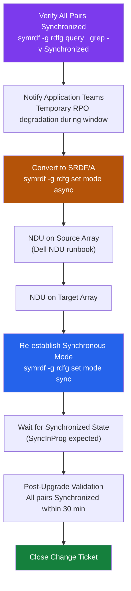

---
tags:
  - dell
  - operations
---
# SRDF/S — Install & Upgrade

```bash
symcfg list -v | grep "Microcode"
```
```text
┌───────────────────────────────────── SRDF/S — Install & Upgrade ──────────────────────────────────────┐
│                                                                                                       │
│   ┌───────────────────────────────────────────────────────────────────────────────────────────────┐   │
│   │                              SRDF/S — Installation Prerequisites                              │   │
│   │             OS: supported Linux or Windows Server (see vendor compatibility matrix)           │   │
│   │      Network: Dark fiber FC (< 5 ms RTT) · DWDM long-haul FC — ensure firewall allows these   │   │
│   │        Auth: Symmetrix admin credentials; Solutions Enabler; Unisphere role-based access      │   │
│   │        Storage: Two PowerMax arrays · Dark fiber / DWDM FC link · Low-latency (< 200 km)      │   │
│   └───────────────────────────────────────────────────────────────────────────────────────────────┘   │
│                                                                                                       │
│                                                   ▼                                                   │
│                                                                                                       │
│   ┌───────────────────────────────────────────────────────────────────────────────────────────────┐   │
│   │                                        Install Sequence                                       │   │
│   │                  1  Deploy control plane component and configure network access               │   │
│   │                          2  Configure storage and network connectivity                        │   │
│   │                        3  Install agent/proxy/splitter on protected hosts                     │   │
│   │                      4  Register sources and configure protection policies                    │   │
│   │                        5  Run first job; verify completion; test restore                      │   │
│   └───────────────────────────────────────────────────────────────────────────────────────────────┘   │
│                                                                                                       │
│   ┌───────────────────────────────────────────────────────────────────────────────────────────────┐   │
│   │                                        Upgrade Sequence                                       │   │
│   │                 1  Review release notes and compatibility matrix before upgrade               │   │
│   │                   2  Snapshot or backup the control plane VM before upgrading                 │   │
│   │                  3  Upgrade control plane first, then proxies/agents/appliances               │   │
│   │                       4  Validate jobs resume automatically after upgrade                     │   │
│   │                        5  Document version change and update CMDB record                      │   │
│   └───────────────────────────────────────────────────────────────────────────────────────────────┘   │
│                                                                                                       │
│  Physical Infrastructure:                                                                             │
│  Two PowerMax arrays · Dark fiber / DWDM FC link · Low-latency network (< 200 km) · RF director ports │
│  Key terms:                                                                                           │
│                                                                                                       │
│  SRDF/S        = Synchronous SRDF; every R1 write is mirrored to R2 before host acknowledgment        │
│  R1            = source volume; write is held pending R2 confirmation — adds WAN RTT to latency       │
│  R2            = target volume; must acknowledge each write; acts as synchronous mirror               │
│  RTT           = Round-Trip Time between R1 and R2 arrays; directly added to host write latency       │
│  RPO=0         = zero recovery point objective; no data loss possible under normal operation          │
│  RTO           = Recovery Time Objective; SRDF/S failover typically < 5 minutes manual, < 1 min       │
│  symrdf        = CLI for all SRDF operations: establish, split, suspend, failover, restore, ver       │
│  Pair State    = Synchronized | Consistent | Suspended | Failed Over | Split                          │
│  Consistent    = transient state where R1 write is in transit but not yet confirmed on R2             │
│  Failover      = makes R2 read-write; production continues from DR site after R1 failure              │
│  Restore       = re-synchronises after failover; direction is reversed until R1 catches up            │
│  RDFG          = RDF Group: logical grouping of SRDF pairs sharing same link and parameters           │
│  FA Port       = Front-End Adapter port on PowerMax; used for host connectivity (non-SRDF)            │
│  RF Port       = Remote Fabric port on PowerMax; used exclusively for SRDF replication traffic        │
│                                                                                                       │
└───────────────────────────────────────────────────────────────────────────────────────────────────────┘
```


## Before you begin

- **Access:** Storage admin credentials (cluster admin or equivalent)
- **Timing:** safe to run during business hours unless a step is marked ⚠ (causes interruption)
- **Dependencies:** no active upgrades or migrations on the same infrastructure
- **Logging:** capture command output — paste into the change record on completion

---

---

## Verify

- Confirm the operation completed without errors in the log or management UI
- Verify the expected state change is visible (service running, object created, config applied)
- Document the outcome in the change record
