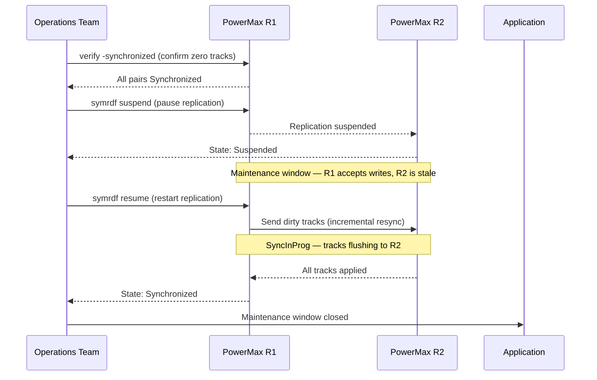

---
tags:
  - dell
  - operations
---
# SRDF/S — Procedures

```bash
# Capture baseline state before the window
symrdf query -g <dgname> > /tmp/srdf_s_prechange_$(date +%Y%m%d_%H%M).txt
symcfg -sid <r1_sid> list -rdfg <rdf_group_number> >> /tmp/srdf_s_prechange_$(date +%Y%m%d_%H%M).txt
symrdf -sid <r1_sid> -rdfg <rdf_group_number> verify -synchronized
echo "Baseline captured at $(date)"
```

```bash
# Planned failover (site still accessible — reverses replication after split)
symrdf -g 10 -type S failover -establish -noprompt

# Failover a single device instead of the full group
symrdf -sid 0001 -dev 0A1 failover -noprompt

# Verify R2 devices are now in Failed Over state
symrdf -g 10 query
```
```bash
# Step 1: Confirm primary site is unreachable and an outage decision has been made
# -- Management authorisation required before proceeding --

# Step 2: From the DR site SE host, check R2 pair state
symrdf query -g <dgname> -sid <r2_sid>

# Expected state: Invalid or Suspended (link dropped; R2 data is consistent)

# Step 3: Initiate failover from R2 side (force flag required without R1 connectivity)
symrdf -sid <r2_sid> -rdfg <rdf_group_number> -g <dgname> failover -force

# Step 4: Confirm R2 pairs are now Write Disabled → R2 side should be writable
symrdf -sid <r2_sid> -rdfg <rdf_group_number> query -g <dgname>

# Step 5: Present R2 volumes to DR hosts and start applications
# -- Storage and application teams confirm --

# Step 6: Document the failover time, last known sync state, and any data exposure window
```
```bash
# Confirm Failed Over state on all devices
symrdf -g 10 query | grep -E "R2|Pair State"

# Check for any devices still in inconsistent state
symrdf -g 10 query | grep -iv "Failed Over"

# Confirm no residual tracks needing flush
symrdf -g 10 query -detail | grep "Tracks"

# Verify host I/O at DR site (run from DR host)
dd if=/dev/sdX of=/dev/null bs=1M count=100 iflag=direct
```

```bash
# Confirm current pair state before deciding resync direction
symrdf -g 10 query -detail

# Check how many invalid tracks need to be copied
symrdf -g 10 query -detail | grep -E "Invalid|Tracks"

# Confirm the RDF link is healthy before initiating
symcfg list -rdfg 10 -detail

# Estimate resync duration based on track count and link bandwidth
symstat -rdf -dir RF-1F -i 5 -c 2
```
```bash
# Resume from Suspended (incremental resync R1 -> R2)
symrdf -g 10 -type S resume -noprompt

# Establish from Split or after manual intervention (R1 -> R2 full/incremental)
symrdf -g 10 -type S establish -noprompt

# Restore after Failed Over (copy R2 data back to R1)
symrdf -g 10 -type S restore -noprompt

# Monitor resync progress in real time
watch -n 10 'symrdf -g 10 query -detail | grep -E "Pair State|Tracks|SyncInProg"'

# Resume a single device rather than the full group
symrdf -sid 0001 -dev 0A1 -type S resume -noprompt
```
```bash
# Poll pair state until all pairs show Synchronized
symrdf -g 10 query | grep -v Synchronized

# Track percentage complete (shown in SyncInProg state)
symrdf -g 10 query -detail

# Check link throughput during resync
symstat -rdf -i 10 -c 6

# Confirm completion: all pairs Synchronized, 0 tracks
symrdf -g 10 query -detail | grep "Invalid Tracks"
```
```bash
# Step 1: Confirm R1 is the current active side and both arrays are accessible
symcfg list
symrdf query -g <dgname>

# Step 2: Initiate resync (re-establish synchronous pairing from R1 to R2)
symrdf -sid <r1_sid> -rdfg <rdf_group_number> -g <dgname> establish

# Alternative if pairs are in Split state:
symrdf -sid <r1_sid> -rdfg <rdf_group_number> -g <dgname> resume

# Step 3: Monitor progress — pairs will show SyncInProg until dirty tracks are cleared
watch -n 30 'symrdf query -g <dgname>'

# Check the number of invalid tracks remaining (decreasing count = progress)
symrdf -sid <r1_sid> -rdfg <rdf_group_number> list -v | grep -i "invalid\|track"

# Step 4: Confirm all pairs are Synchronized
symrdf -sid <r1_sid> -rdfg <rdf_group_number> verify -synchronized

# Step 5: Record resync completion time in the change ticket
echo "Resync completed at $(date)"
```
```bash
# Step 1: Confirm all pairs are Synchronized before suspending
symrdf -sid <r1_sid> -rdfg <rdf_group_number> verify -synchronized

# Step 2: Suspend SRDF/S replication for the device group
symrdf -sid <r1_sid> -rdfg <rdf_group_number> -g <dgname> suspend

# Confirm pairs are now Suspended (R1 continues I/O; R2 is held)
symrdf query -g <dgname>

# -- Perform maintenance --

# Step 3: Resume replication after maintenance
symrdf -sid <r1_sid> -rdfg <rdf_group_number> -g <dgname> resume

# Step 4: Monitor resync — SyncInProg expected; watch until Synchronized
watch -n 30 'symrdf query -g <dgname>'

# Step 5: Verify full synchronisation before closing the change ticket
symrdf -sid <r1_sid> -rdfg <rdf_group_number> verify -synchronized
```
```bash
# Step 1: Confirm current mode and capture baseline
symcfg -sid <r1_sid> show -rdfgrp <rdf_group_number>

# Step 2: Suspend the SRDF group cleanly before mode change
symrdf -sid <r1_sid> -rdfg <rdf_group_number> -g <dgname> suspend

# Confirm pairs are Suspended
symrdf query -g <dgname>

# Step 3: Set the RDF group mode to Asynchronous (SRDF/A)
# Note: mode change is performed via Unisphere GUI or SE set command
# Via SYMCLI (SE 9.x+):
symrdf -sid <r1_sid> -rdfg <rdf_group_number> set mode async

# Step 4: Resume replication in async mode
symrdf -sid <r1_sid> -rdfg <rdf_group_number> -g <dgname> resume

# Confirm pairs are now replicating in Asynchronous mode
symcfg -sid <r1_sid> show -rdfgrp <rdf_group_number> | grep -i mode
symrdf query -g <dgname>
```
```bash
# Step 1: Suspend async replication cleanly
symrdf -sid <r1_sid> -rdfg <rdf_group_number> -g <dgname> suspend

# Step 2: Set mode back to Synchronous (SRDF/S)
symrdf -sid <r1_sid> -rdfg <rdf_group_number> set mode sync

# Step 3: Resume — replication will resync and return to Synchronized state
symrdf -sid <r1_sid> -rdfg <rdf_group_number> -g <dgname> resume

# Step 4: Monitor resync progress (SyncInProg is expected until complete)
watch -n 30 'symrdf query -g <dgname> | grep -v Synchronized'

# Step 5: Confirm all pairs are Synchronized before declaring maintenance complete
symrdf -sid <r1_sid> -rdfg <rdf_group_number> verify -synchronized
```
```bash
# Step 1: Quiesce DR site applications
# -- DR application team confirms quiesce --

# Step 2: From DR SE host — confirm current pair state (should be Failed Over)
symrdf -sid <r2_sid> -rdfg <rdf_group_number> query -g <dgname>

# Step 3: Initiate failback (resync R1 from R2, then restore original direction)
symrdf -sid <r2_sid> -rdfg <rdf_group_number> -g <dgname> failback

# Step 4: Monitor until pairs reach Synchronized state in original direction
watch -n 30 'symrdf query -g <dgname> -sid <r1_sid>'

# Step 5: Confirm R1 is now the active R1 side (Synchronized, not Write Disabled)
symrdf -sid <r1_sid> -rdfg <rdf_group_number> verify -synchronized

# Step 6: Re-present R1 volumes to primary site hosts and restart applications
# -- Application team confirms production is running at primary site --

# Step 7: Confirm R2 is again the synchronous DR target (Write Disabled on R2)
symrdf query -g <dgname> -sid <r2_sid>
```
```bash
# After primary site recovery: restore R1 devices (accepts R2 data back)
symrdf -g 10 -type S restore -noprompt

# Confirm Synchronized state restored
symrdf -g 10 query

# Switch back to R1 (optional planned failback)
symrdf -g 10 -type S failover -establish -noprompt
```
```bash
# 1. Failover SRDF/S group
symrdf -sid <r1_sid> -rdfg <rdf_group_number> -g <dgname> failover

# 2. Present R2 LUNs to ESXi hosts at DR site (zoning / masking)
# -- Storage team action --

# 3. Resignature VMFS datastores at DR site (if not SRM-managed)
# esxcli storage vmfs snapshot list
# esxcli storage vmfs snapshot resignature -l <label>

# 4. Register and power on VMs manually in vCenter at DR site
# -- VMware team action --
```
```bash
# Step 1: Identify current pair states
symrdf query -g <dgname>

# Step 2: Check SRDF group port and link state
symcfg -sid <r1_sid> list -rdfg <rdf_group_number>

# Step 3: Check WAN RTT to DR site
ping -c 10 <dr_site_ip>

# Step 4: Check for any pairs that are not Synchronized
symrdf -sid <r1_sid> -rdfg <rdf_group_number> list -v | grep -v Synchronized

# Step 5: Pull write latency metrics from Unisphere for the past hour
# (Unisphere GUI: Performance > RDF Group > select group > Write Response Time)
```
```bash
# Confirm all pairs are Synchronized
symrdf -sid <r1_sid> -rdfg <rdf_group_number> verify -synchronized

# Confirm group port states are Online
symcfg -sid <r1_sid> list -rdfg <rdf_group_number>

# Confirm WAN RTT is within baseline
ping -c 10 <dr_site_ip>

# Capture post-change state for the change ticket
symrdf query -g <dgname> > /tmp/srdf_s_postchange_$(date +%Y%m%d_%H%M).txt
```

## Before you begin

- **Access:** Storage admin credentials (cluster admin or equivalent)
- **Timing:** safe to run during business hours unless a step is marked ⚠ (causes interruption)
- **Dependencies:** no active upgrades or migrations on the same infrastructure
- **Logging:** capture command output — paste into the change record on completion

---

## Query SRDF/S Group Status

`symrdf -sid <sid> -rdfg <group> query` — shows all device pairs, RDF State (Synchronized/Failed Over/etc.), and track counts.

```bash
symrdf -sid <sid> -rdfg <group> query
```

## Verify WAN Latency Acceptability

Measure RTT between SRDF director ports; target <10ms. `symrdf -sid <sid> -rdfg <group> verifylink` — all paths healthy.

```bash
symrdf -sid <sid> -rdfg <group> verifylink
```

## Perform a Planned Failover (Failover)

`symrdf -sid <sid> -rdfg <group> failover` — suspends writes to R1, finalizes R2, makes R2 read-write. Used for planned maintenance.

```bash
symrdf -sid <sid> -rdfg <group> failover
```

## Perform a Disaster Recovery Failover (Failover Force)

`symrdf -sid <sid> -rdfg <group> failover -force` — forces R2 to become R/W without R1 acknowledgement. Use when R1 is unavailable.

```bash
symrdf -sid <sid> -rdfg <group> failover -force
```

## Fail Back After Recovery

`symrdf -sid <sid> -rdfg <group> failback` — re-synchronizes from R2 back to R1 and resumes normal synchronous replication.

```bash
symrdf -sid <sid> -rdfg <group> failback
```

## Suspend Replication (Planned Maintenance)

`symrdf -sid <sid> -rdfg <group> suspend` — temporarily halts replication while keeping pairs intact. Resume with `symrdf resume`.

```bash
# Suspend
symrdf -sid <sid> -rdfg <group> suspend

# Resume after maintenance
symrdf -sid <sid> -rdfg <group> resume
```

## Check Bias Setting

`symrdf -sid <sid> -rdfg <group> query | grep -i bias` — identifies which site has preferred access during a split-brain scenario.

```bash
symrdf -sid <sid> -rdfg <group> query | grep -i bias
```

## Add Devices to an Existing SRDF/S Group

`symrdf addpair -sid <source-sid> -rdfg <group> -dev <new-R1-devices> -remote_dev <new-R2-devices>` then `symrdf establish` for the new pairs.

```bash
symrdf addpair -sid <source-sid> -rdfg <group> -dev <new-R1-devices> -remote_dev <new-R2-devices>
symrdf -sid <source-sid> -rdfg <group> -dev <new-R1-devices> establish
```

## Remove Devices from SRDF/S Group

`symrdf deletepair -sid <sid> -rdfg <group> -dev <devices>` — removes pair relationship. Data on R2 becomes independent.

```bash
symrdf deletepair -sid <sid> -rdfg <group> -dev <devices>
```

## Collect SRDF Performance Metrics

`symstat -sid <sid> -rdfg <group> -type rdf` — shows throughput, write pending count, and latency metrics for capacity planning.

```bash
symstat -sid <sid> -rdfg <group> -type rdf
```

---

## See also

- [Srdf S — Health Checks](health-checks/)
- [Srdf S — CLI Reference](cli-reference/)
- [Srdf S — Common Issues](../troubleshooting/common-issues/)
