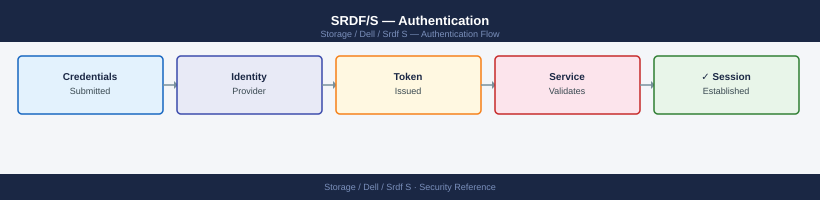

---
tags:
  - dell
  - security
---
# SRDF/S — Authentication


<div class="kb-summary">
SRDF/S authentication: Solutions Enabler RBAC role assignment, `symauth` command, Unisphere for VMAX admin account management, and session audit logging.

*Applies to: SRDF/S*
</div>



```d2
direction: down

external: External / Untrusted {shape: rectangle}
perimeter_controls: "Perimeter Controls" {shape: rectangle}
identity_access: "Identity & Access" {shape: rectangle}
audit_logging: "Audit & Logging" {shape: rectangle}
core: "SRDF/S Core" {shape: hexagon}

external -> perimeter_controls: traffic in
perimeter_controls -> identity_access
identity_access -> audit_logging
audit_logging -> core: secured path
```

## Before you begin

- **Access:** Storage admin credentials (cluster admin or equivalent)
- **Change management:** security changes require CAB approval in most environments
- **Rollback plan:** document current state before any security control change
- **Testing:** validate in a non-production environment first where possible

---

---

## See also

- [Srdf S — Access Control](access-control/)
- [Srdf S — Hardening](hardening/)
- [Srdf S — Encryption](encryption/)
