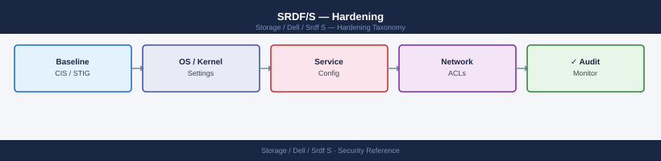

---
tags:
  - dell
  - security
---
# SRDF/S — Hardening

Hardening reference covering Management API Security, Operational Hardening Checklist.

*Applies to: SRDF/S*

---

## Before you begin

- **Access:** Storage admin credentials (cluster admin or equivalent)
- **Change management:** security changes require CAB approval in most environments
- **Rollback plan:** document current state before any security control change
- **Testing:** validate in a non-production environment first where possible

---

## Operational Hardening Checklist

| Item | Guidance |
|---|---|
| SYMCLI confirmation prompts | Set `SYMCLI_CONFIRM=prompt` on all production SE hosts |
| Break-glass account for full resync | Restrict `symrdf establish -full` to a named break-glass account only |
| Two-person rule for failover | All production SRDF failovers require peer approval before execution |
| Monitoring accounts | Never assign `StorageAdmin` to automated monitoring or backup accounts |
| SRDF zones | Hard-zone SRDF director ports; no other initiators/targets in SRDF zones |
| API HTTP | Disable HTTP on port 8080; enforce HTTPS only on Unisphere |
| Audit log forwarding | Forward SRDF events to SIEM via Unisphere syslog integration |
| Certificate rotation | Rotate service account certificates annually |

---

## See also

- [Srdf S — Authentication](../authentication/)
- [Srdf S — Access Control](../access-control/)
- [Srdf S — Encryption](../encryption/)
